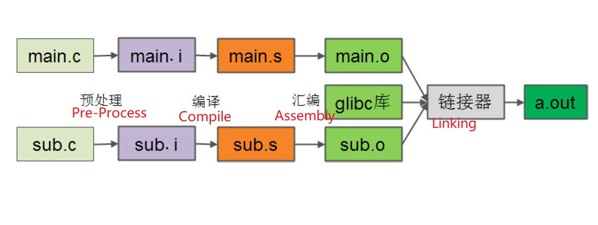
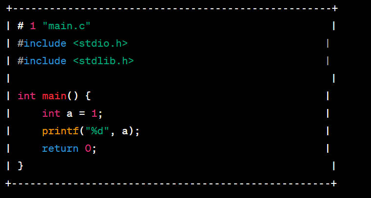
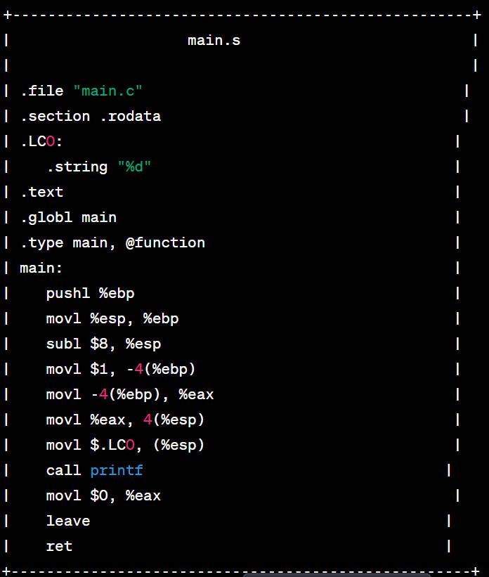
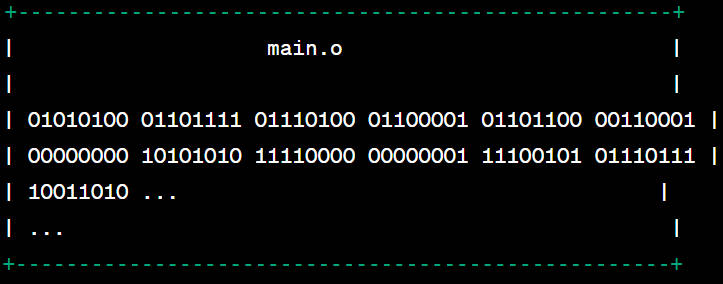
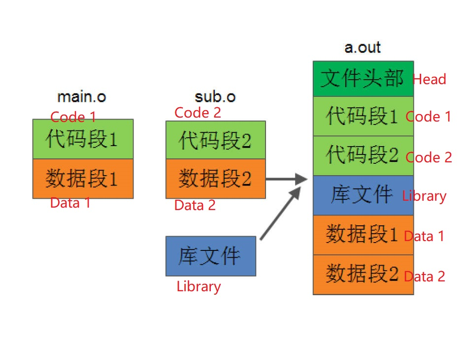
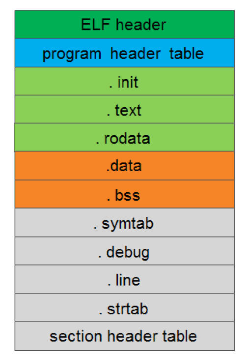
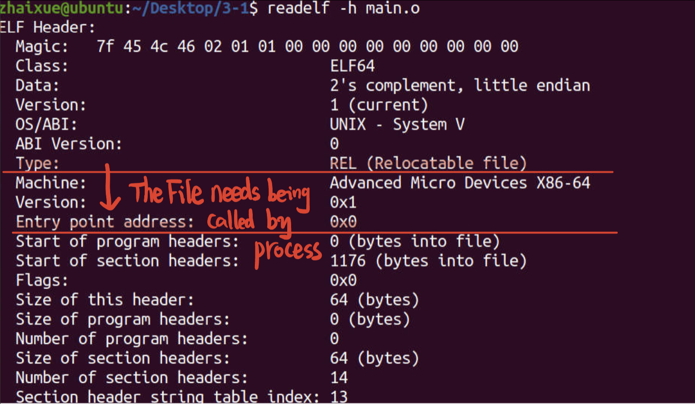

# 3.1 Program Compilation and Executable Files

## Program Compilation and Linking

**main.i**: The "main.i" file is the preprocessed source file. It includes the content of the "main.c" file after preprocessing, where the preprocessor has expanded any macros, included header files, and handled conditional compilation directives.

**main.s**: The "main.s" file is the assembly file. It contains the assembly code generated by the compiler from the preprocessed source code. The assembly code represents the low-level instructions that can be directly understood by the CPU.

**main.o**: The "main.o" file is the object file. It contains the binary representation of the compiled machine code generated by the assembler from the assembly file. The object file contains machine code specific to the target architecture and is not human-readable. **main.o:** machine code, unreadable by human.

## Assembly the Executable Obj Files

linking the all obj together, adding up the functions to an entity software. This is good for Software Engineer test and debug the software.

## From Source Code to Executable Object (ELF)

## Object Files

### Object file:

• the object file type: $ file main.o a.out test.so test.a

### Classification:

relocatable files
executable files
shared object file **(gcc -shared -fPIC -o libmath.so)** every important ideology as **Dynamic Library**

### Executable files (ELF):

Executable and linking format

## The Structure of ELF files

## file composition

1. Composed of sections, a series of section collections described by the section header table
2. View the section header table: $ readelf -S main.o
3. .text : executable instruction code
4. .data : initialized global variables and static local variables
5. .bss : Uninitialized global variables
6. .rodata: strings, constants and string constants printed by printf, etc.
7.  ELF header: describes the file type, the processor platform to run and other information
8. Program header table: Describes which segments are in a file. A segment usually consists of several sections, which are used by the loader.
9. .Section header table: Describes which sections are in the file, and the section is used by the linker
10. .strtab: string table, storing function names and variable names, used for debugging and disassembly
11. .symtab: symbol table, the address where symbols are stored, etc.

## Command Line:  $readelf 

