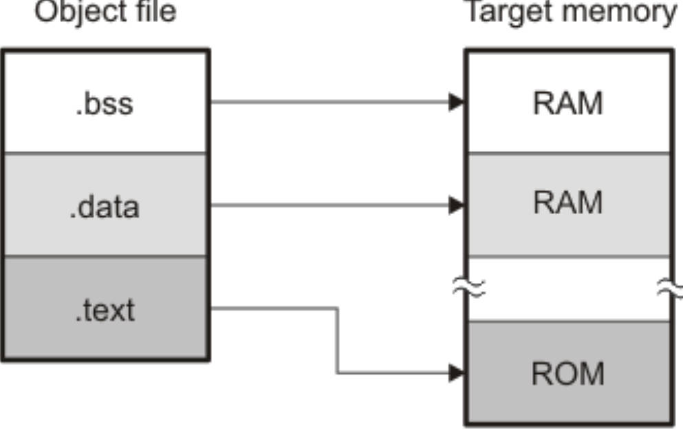
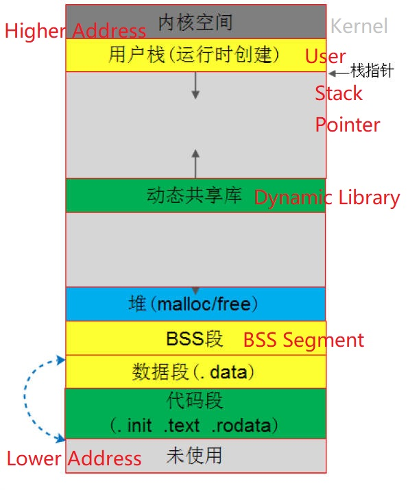
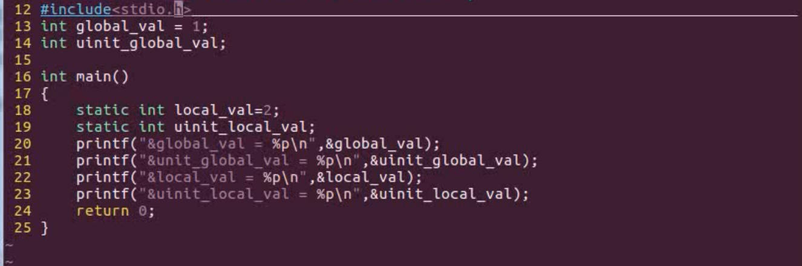

# 3.11 BSS


## BSS segment

### Feature

• **Uninitialized global variables and static local variables are placed in the BSS segment**
• The BSS segment does not occupy the space of the object file
• When the executable file is running, allocate space for the BSS segment in memory
• The purpose of setting up the BBS segment: early computer storage resources were expensive, saving disk space

### BSS Size

• Record the total size of the BSS segment in the section header table
•Record the size and address of each variable in the symbol table


## Run to Process BSS Segment



### Allocate Space

• The loader loads the code segment and data segment into the specified memory space
• The loader will allocate memory space immediately after the data segment according to the total size of the BSS segment in the section header table, and clear it
• The address of each variable in the BSS segment is specified by the symbol table

### Compile Instruction

• Assembly-level code implementation of the BSS segment
•.comm: apply for a section of buffer space in the BSS section

### When BSS in the Memory




## BSS Section in Different Object Files

• The relocatable object file has not been linked, and the uninitialized global variables are not placed in the BSS segment, but placed in the COMMON block.
• The executable object file has been linked, the size of the weak symbol has been determined, and a maximum space is allocated in the memory for the BSS segment.
• The BSS segment does not take up file storage space, only when it is loaded and running, it will open up space in the memory
• The address of each symbol in BSS space is stored in the symbol table


## Examples




```
$ readelf -s a.out | grep var
```

