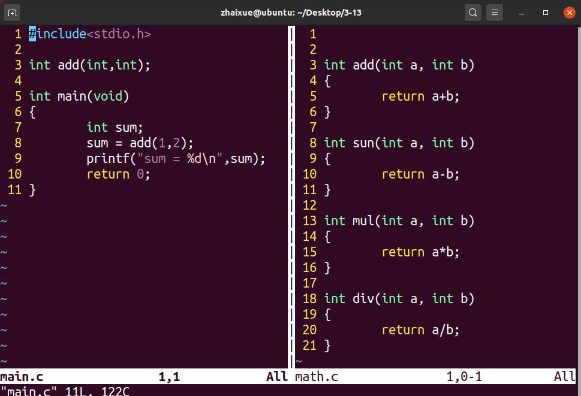
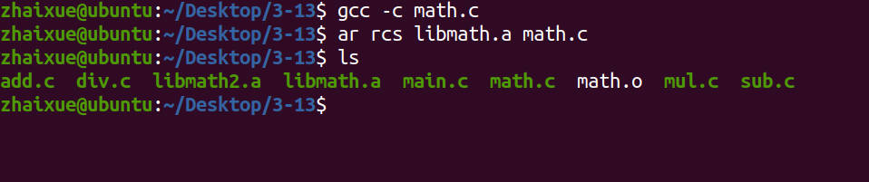
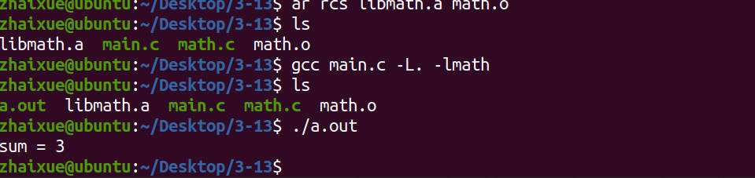
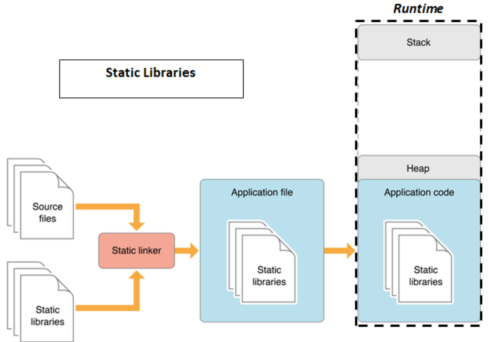
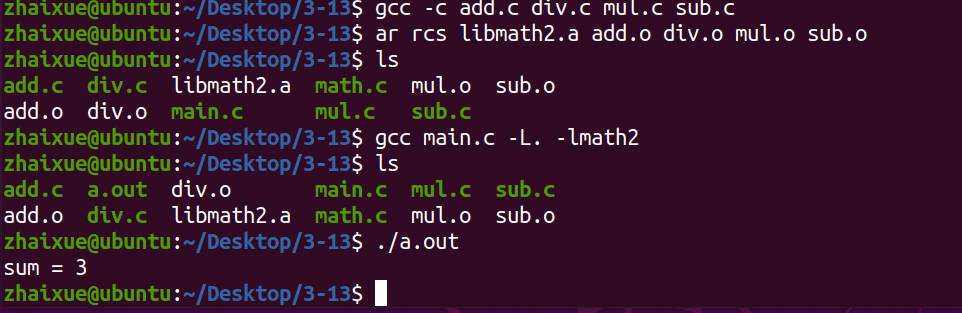
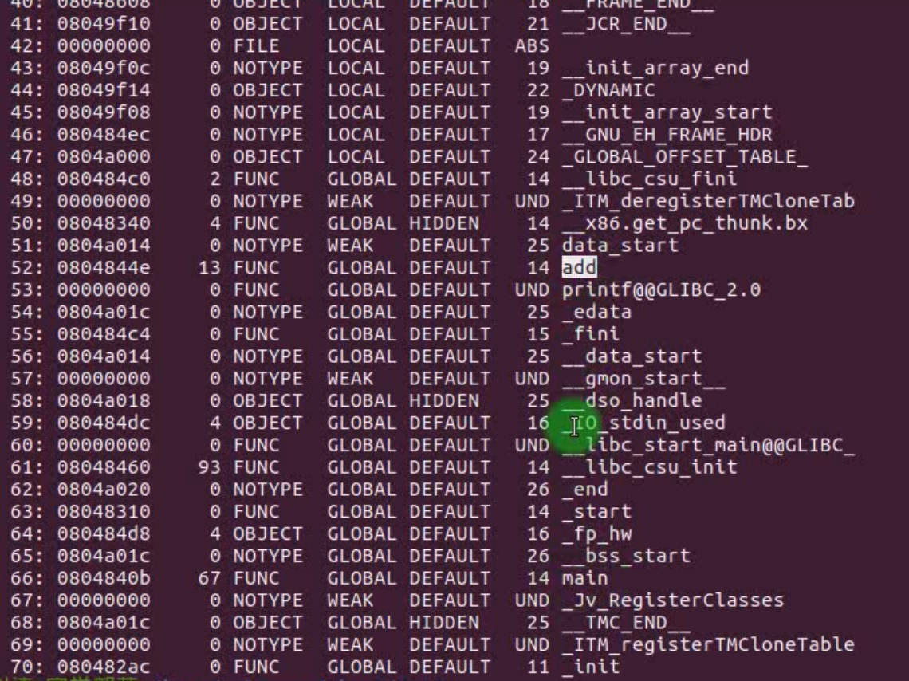

# 3.13 Link the Static Library


## Static Library

**Archive the object files**

### Manufacture the Static Library

```
$ar rcs libtest.a x.o xx.o // Compressing the x.o and xx.o object files together to libtest.a
```

### Link the Static Library

```
$gcc main.c -I ./include -L./lib -ltest // the test name is libtest.a
```

### Example

**main.c has a function named add is defined in the file math.c. Make math.c into a static library libmath.a, then link it into object file to form a executable file.**



Make the libmath.a static library.



$ gcc main.c -L. -l**math** 

the **math** is the real name for the static library **libmath.a**




## Problems with linking static libraries

### C Static Library

Using the static library of C language can conveniently encapsulate the implementation of multiple functions in a separate file, so as to realize code reuse. But since all function implementations of the static library are included in the final executable, it may cause the size of the executable to increase, especially if the static library is large. Eg, For using a Printf Function in program, the compiler link the whole c static library into executable file, making the executable file enormous with many useless functions.

## Solve

### Principle

**• The basic unit of compiling are source files, and the basic unit of linking are object files**    
• Refer to a symbol of an object file that the function needed by program, then the linker will link the entire object file



## Solution

• The implementation of each function uses a source file to generate a corresponding object file  
• Archive all object files together to form a static library  
• This is how Glibc implements...  

### Eg:



Now we use the readelf -s a.out to check the symbol table, there only exit one symbol that we used is the fuction add, no mul, div, sub. Making the Executable file size smaller due to I made four independent objects "add.o, div.o mul.o sub.o".



Make Functions' objects separately and then archive them together into a static library. Compile will decompress the static library to find the function that program needs. 