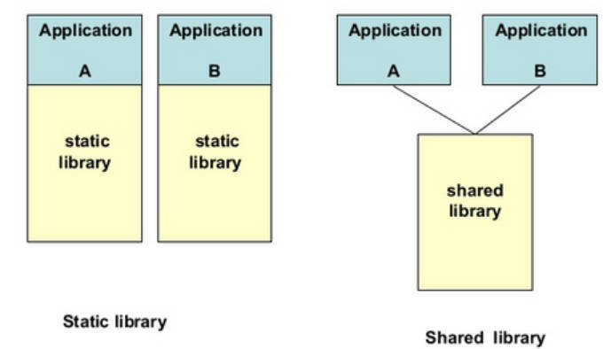
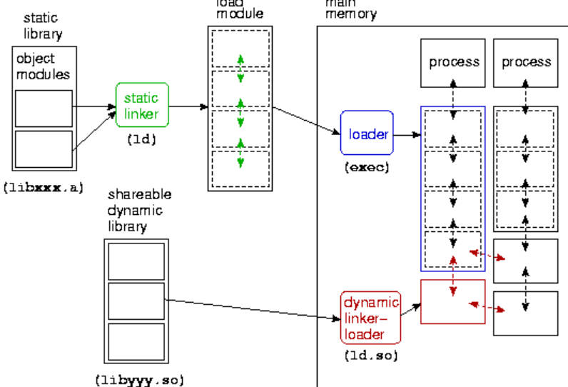
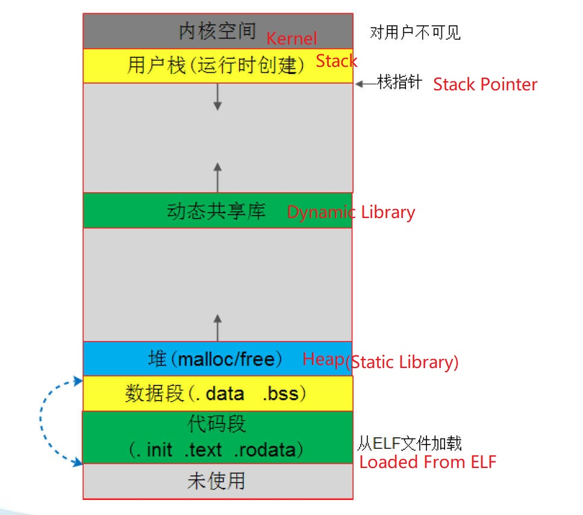
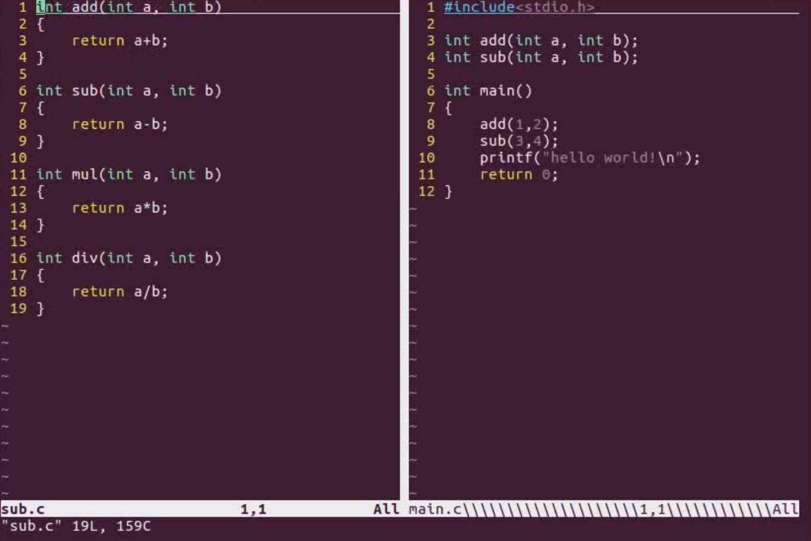
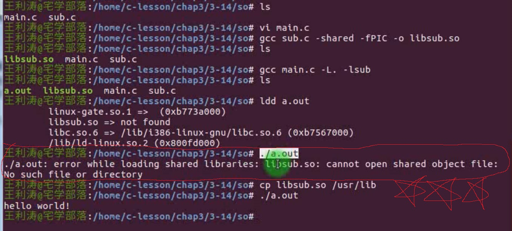
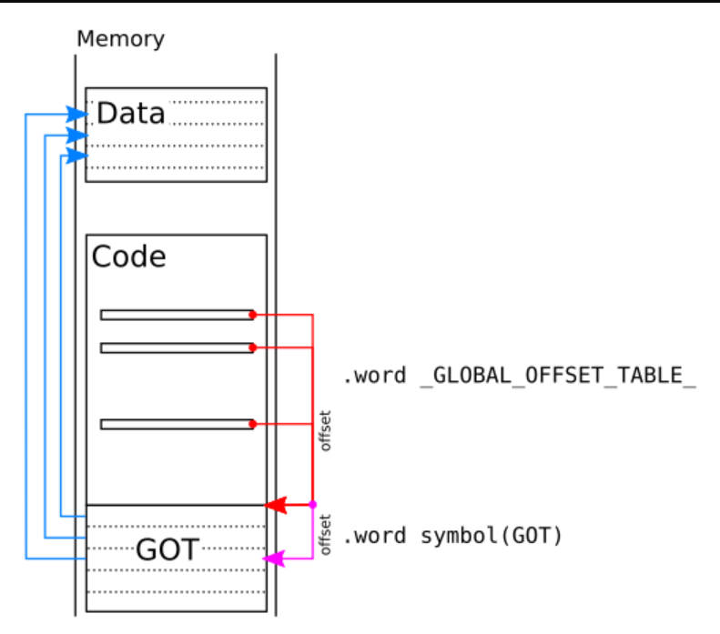
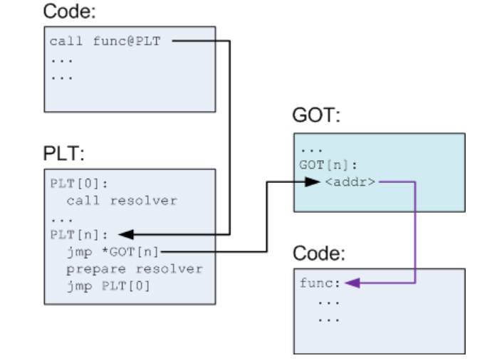

# 3.14 Dynamic Linking fPIC


fPIC: free Position Code


## The Default of Static Library

The generated executable file is large in size and contains the same common code, which wastes storage space and occupies a large amount of memory at runtime

When the program is running, static library must be loaded into memory all at once



## Dynamic Linking

• **Static linking** occurs during the linking process, and **dynamic linking** occurs when the program is running  
• Dynamic link object files are called dynamic link libraries. In addition to executable files, these libraries should also be loaded into memory for relocation during program runtime.

## Dynamic Linking Process

• Run a program under the Linux command line, and the operating system starts a process for the program  
• The dynamic linker is mapped into the program address space, and the OS passes control to the dynamic linker  
• The dynamic linker resolves undetermined symbols in executable files and dynamic libraries that need to be linked  
**• Load the corresponding dynamic library, perform relocation, etc.**  
• The dynamic linker transfers control to the executable program, which runs the program  




## The Process Memory After Dynamic Linking




## Example: Self-Make Dynamic Library



make the sub.c becomes a shared dynamic library.

```
gcc main.c -shared -fPIC -o libsub.so
```

1. `-shared`: This flag tells GCC to produce a shared library instead of an executable. Shared libraries allow multiple programs to share the same code in memory, reducing memory consumption and allowing code reuse.  
2. `-fPIC`: This flag stands for "Position Independent Code." It is required when creating a shared library because it ensures that the code can be loaded and executed from any memory address. This is necessary for shared libraries because **they can be loaded into different parts of the memory for each process that uses them.**  



**在运行时报错，体现了动态库和静态库最大的区别。在gcc通过-L-l告诉编译器动态库位置后，编译器认为语法合法，但并没有将动态库的内容添加进生成的可执行文件。所以将libsub.so拷贝进官方路径中，等待程序运行时，将动态库内容调用到内存中。**

**An error is reported at runtime, reflecting the biggest difference between a dynamic library and a static library. After gcc tells the compiler the location of the dynamic library through -L-l, the compiler thinks that the syntax is legal, but it does not add the contents of the dynamic library to the generated executable file. So copy libsub.so into the official library path, and when the program is running, call the content of the dynamic library into the memory.** 


## Relocate When Loading

• Similar to relocation at static link time, but deferred until runtime  
• References to all absolute addresses in the executable file. Waiting for the dynamic library to be loaded into the memory, and after the address is determined, relocate the absolute address references in the executable file  
• Implementation: GCC compiles using the **--shared** parameter to generate a shared dynamic link library      

### Default of Dynamic Library

For each process, the shared library is relocated to a different address, resulting in the dynamic library cannot be shared among multiple processes, and memory cannot be saved, which violates the original design intention of the dynamic library  


# Position Independent Code

### Features

​	• It can be executed wherever it is placed, without relocation or change  

### Ideology 

​	• Separate the part of the instruction that needs to be modified then put it together with the data  
​	• **The remaining unchangeable instructions can be independent of address (PIC) and shared by multiple processes**   
​	• Data and instructions that need to be modified have a copy in each process, independent with each other  

### How to achieve

​	•Address independent code technology (**PIC: position-independent code**)  
​	• Compile: **$ gcc -fPIC -c main.c**



## PIC Underlying Logics

|              | Call Instructions            | Call Data               |
| ------------ | ---------------------------- | ----------------------- |
| Inner Module | Relative jumps and calls     | relative address access |
| Outer Module | Indirect Jump and Call (GOT) | Indirect access (GOT)   |

## Inner Module

ARM relative addressing  
	• PC is used as the base address, and the address code segment in the instruction is used as the offset  
	• The address obtained by adding PC and offsets is the effective address of the operand  
	• Corresponding assembly instructions: B/BL, ADR/ADRL  

```
...
• B LOOP
• ...
•LOOP MOV R0,#1
• MOV R1,R0
• ...
// now B Loop equals ADD PC, PC, #offset
```

• Where OFFSET is the offset between the B LOOP instruction address and the LOOP label address  
• B's forward and backward jump range: [0,32M]  

## Outer Module

• When the main program loads the shared library, the system will relocate the symbols at runtime, and relocate the references to the symbols in the shared library in the main program to the correct address, so that the program can correctly call the functions and access in the shared library Global variables, regardless of their exact location in memory  
•Core idea: store the referenced external module symbols in the table, look up the table when referencing, and indirect jump  
• When linking, the GOT (**global offset table**) position has been determined, so the solution is feasible



Picture 6 and Picture7's Code is the remaining unchangeable instruction (PIC), Compiler independents these instructions and make them can be shared between multiple processes.