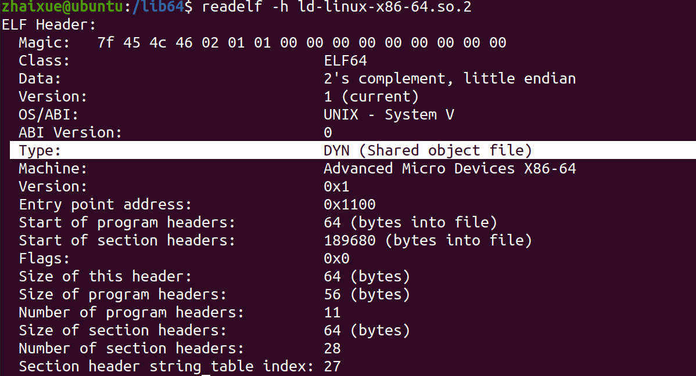
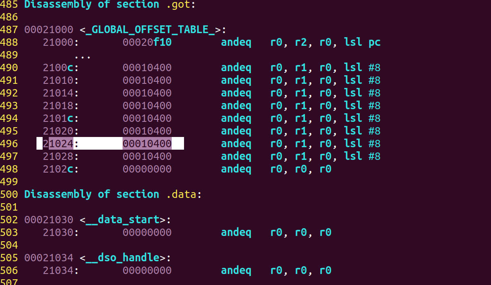

# 3.15 Dynamic Linking: Global Offset Table


## Related Symbol Table and Structure

• Dynamic Linker (.interp)   
• Required Linking Information: .dynamic Section   
• Dynamic Symbol Table (.dynsyms)   
• Dynamic Linking Relocation Table  
• Procedure Linkage Table (PLT)   
• Global Offset Table (GOT)  

## Dynamic Linker

### .interp Section

• This section stores a string that specifies the path of the dynamic linker  
• View the contents of the .interp section: **$ arm-linux-gnueabi-objdump –s a.out**  

### Dynamic Linker

• Like the dynamic link library, it is essentially a shared library  
• Before running, you must first relocate yourself: bootstrap  
• Implemented in the C standard library, part of Glibc  

### Example: Check out the Dynamic Linker


Create the Dynamic Library for the ARM Platform


Add Dynamic Library into Object File


Check out the Dynamic Linker

```
$ arm-linux-gnueabi-objdump -s a.out
```

"-s": This is an option (flag) passed to the "arm-linux-gnueabi-objdump" command. The "-s" option tells the objdump utility to display the contents of sections in the specified file.




Checkout the Dynamic Linker for ARM


## .dynamic Segment

The basic information required by the dynamic linker is saved:
• Which shared libraries depend on  
• Dynamic link symbol table location  
• The location of the dynamically linked string table  
• Dynamic link relocation table location  
• Shared library initialization code location    

The content of the segment is multiple structures, defined in /usr/include/elf.h  
View the contents of the .dynamic section: **$ readelf –d xx.so**  


## Dynamic Linking Symbols Table

### .dynsyms section

•The statically linked symbol table saves all symbol definitions and references of the file  
• The dynamically linked symbol table holds only dynamically linked symbols  
• View dynamic link symbol table: **$ readelf –s a.out**

### Dynamic Link String Table

• Auxiliary table for dynamically linked symbol tables, storing file names  
• dynsym, dynstr


### Symbol Hash Table

• Dynamic link files, improve the speed of program running to find symbols  
• Static link does not have this section  
• View the string table: **$ readelf –sD a.out/xx.so**


## Dynamic Link Relocation Table

• Consists of two parts: .rel.dyn and .rel.plt  
• **.rel.dyn** is used to describe the relocation information of the **.data segment**  
• **.rel.plt** is used for the relocation information of the **.txt segment (function)**  
• The address offset in the relocation table is the address of each undefined symbol in the GOT table  
• View the relocation table: **$ readelf -r xx.so**  


## Procedure Linkage Table

• Use .plt suffix, the content is a jump command, jump to the corresponding item of GOT  
• The process linkage table cannot work alone, it is associated with GOT  
• When a symbol is referenced, it will jump from the PLT table to the GOT table  


## Lazy Binding PLT

## 延迟绑定PLT

*Lazy binding* (also known as *lazy linking* or on-demand symbol resolution) is the process by which symbol resolution isn't done until a symbol is actually used at the runtime.

### Impact of dynamic linking on performance

• Register indirect addressing 寄存器间接寻址  
• Dynamic link and relocation before the program runs  
• Binding when the function is the first time to use  
• ELF is realized by PLT


  

## Global Offset Table

### .got table

• GOT: Global Offset Table  
• Each symbol that references an external module definition has a corresponding entry in the GOT table  
•.got: The compiler separates all symbols for external references (absolute addresses) and puts them in this table.  

## Relocate GOT Table

•第一次调用使用PLT表跳转，跳到GOT，再跳到动态链接器  
•动态链接器链接共享库、重定位、修改GOT表符号真实地址  
•第二次调用，直接从GOT表中跳转到符号真实地址，执行函数  

• The first call uses the PLT table to jump, jump to GOT, and then jump to the dynamic linker  
• The dynamic linker links the shared library, relocates, and modifies the real address of the GOT table symbol  
• The second call, jump directly from the GOT table to the real address of the symbol, and execute the function  


### Example:

```
$ arm-linux-gnueabi-objdump -D a.out > a.s
$ vi a.s
```


Jump Directly to the GOT Table when we look to the address 21024



Go to the address 00010400 to find out .


1. Initial PC value is 0x10400.  
2. The first instruction "push {lr}" does not change the PC value.  
3. The second instruction "ldr lr, [pc, #4]" loads a value from the memory address (PC + 4) into LR. The value loaded is at address 0x10408 (0x10404 + 4).  
4. The third instruction "add lr, pc, lr" adds the current PC value (0x10408) to the LR register (0x10408), and the result is 0x20810 (0x10408 + 0x10408).  
5. The fourth instruction "ldr pc, [lr, #8]!" loads a value from the memory address (LR + 8), which is 0x20818 (0x20810 + 8), into the PC register.  

Therefore, the final PC value in hexadecimal is 0x20818.  

Go to the Address 20818

**(Not Found, maybe somewhere is wrong)**


