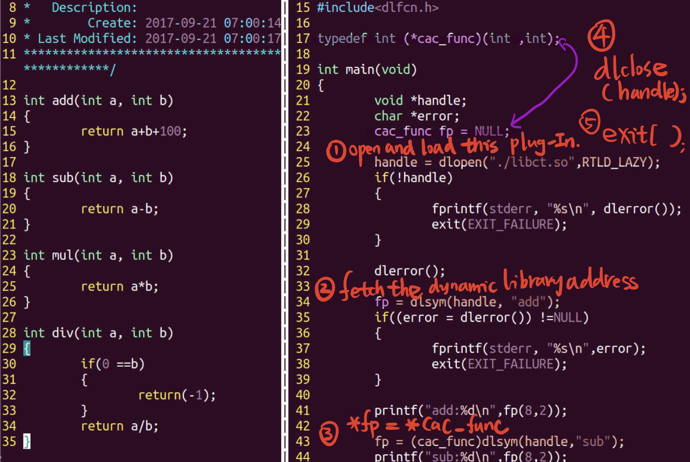
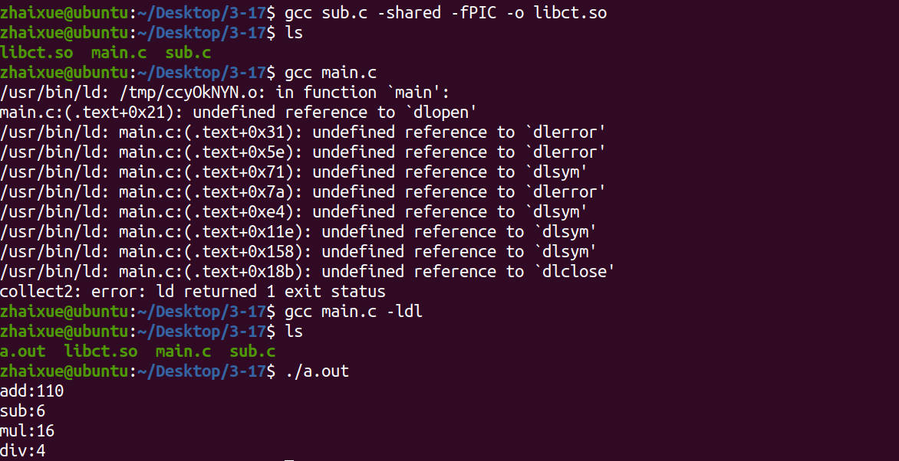
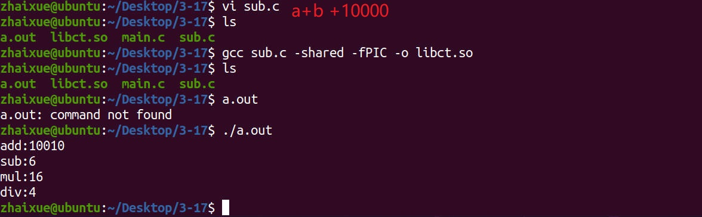

# 3.17 Develop a Plug-In

## The Essence of Plug-In

• The logic framework of the main program remains unchanged, and each business is loaded in the form of a dynamic link library  
• After the software is released, it does not need to be recompiled, and the function can be updated and the value of the software can be added in the form of a plug-in  

• The external module symbols referenced by the main program framework are loaded and relocated as dynamic link libraries at runtime

## Explicitly Load Dynamic Libraries

### Open The Dynamic Library

• **void *dlopen (const char *filename, int flag);**  
• Return an operation handle **void *Handle = dlopen(“./libct.so”, RTLD_LAZY);**  
• RTLD_LAZY: Parsing dynamic library encountered undefined symbols does not exit, but continues to use  
• RTLD_NOW: Exit immediately when undefined symbols are encountered  
• RTLD_GLOBAL: Allows to export symbols, which can be referenced in other dynamic libraries later  

### Fetch Dynamic Object Address

• **void *dlsym (void *handle, char *symbol);**
• According to the dynamic link library handle and symbol, return the address corresponding to the symbol  
• Generally, it is necessary to define a pointer of a symbol type and save the address corresponding to the symbol  
• **void (* funcp) (int , int); ** 
• **funcp = (void(*)(int, int )) dlsym(Handle, “myfunc”);**  

### Shut Down Dynamic Library

• **int dlclose (void *Handle); ** 
• This function decreases by one to the reference count of the shared library. When the reference count is 0, the shared library will be unloaded from the system  

### Dynamic Library Error Function

**• const chat *dlerror (void); ** 
• When the dynamic link library operation function fails, dlerror will return an error message; if there is no error, the return value is NULL  
• System call header file: #include<dlfcn.h>  

## Implement a Calculator Plugin

**Directly change some functions in the libct.so, the a.out can directly load the new function and run. Because the Plug-In(Dynamic Library) only be loaded into program when it is at runtime.** 

