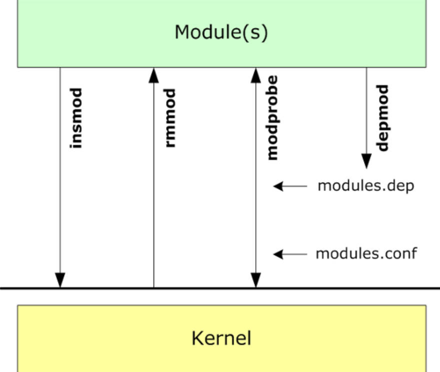
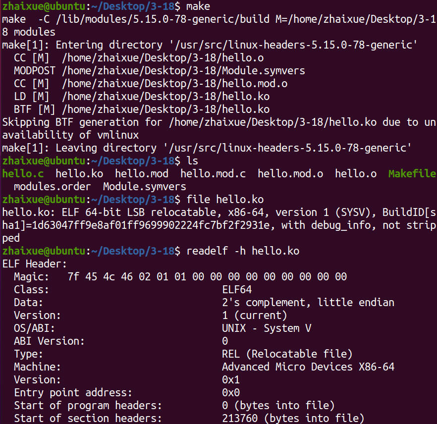
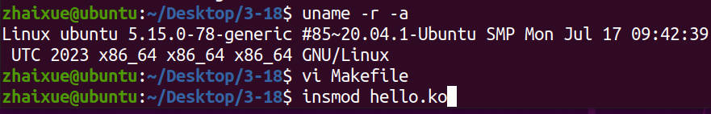
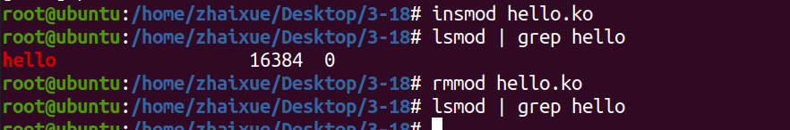
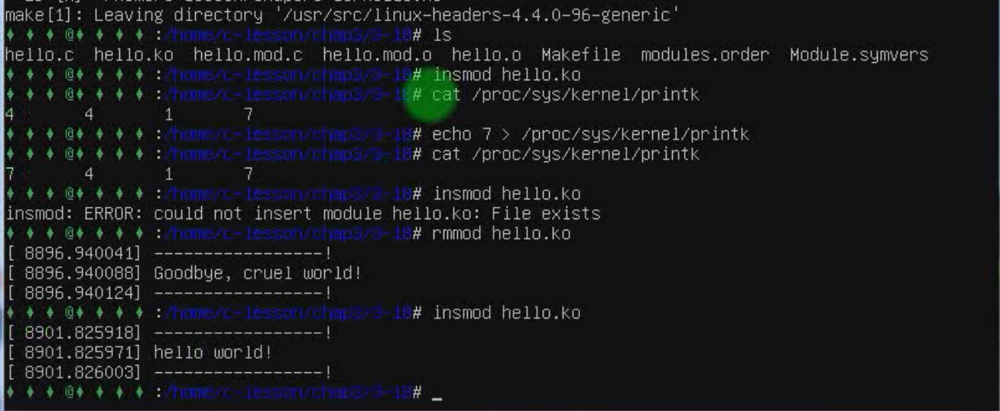
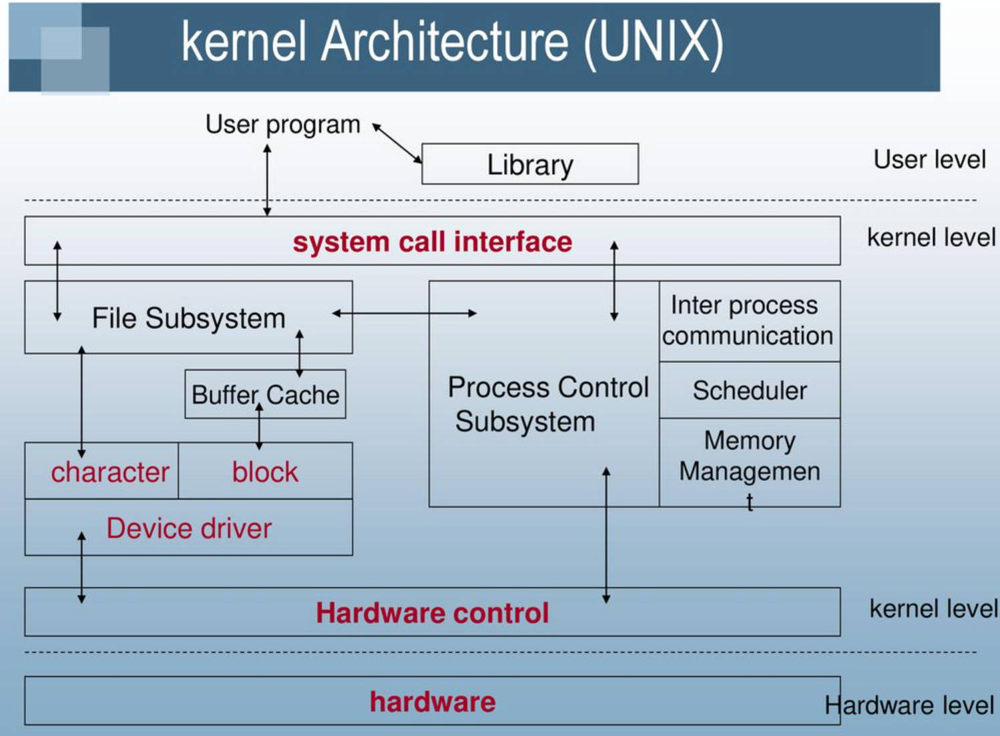

# 3.18 Kernel Modules Loading Mechanism

•$ insmod hello.ko  
• Dynamic Linker 

The Entry point address of hello.ko is 0, So hello.ko needs relocate when Program at runtime.

**Ctrl + Alt + F1**, make the Ubuntu UNI go into the Command Line

## Program - Kernel - Hardware

## Module loading implementation

### done by the system call init_module

​	•Kernel/module.c/init_module  
​	• Copy to kernel: copy_module_from_user  
​	• Address space allocation: layout_and_allocate  
​	• Symbol resolution: simplify_symbols  
​	• Relocations: apply_relocations  
​	• execute: complete_formation  

## Kernel Modules and Plugins

Same point
	• Both are dynamically linked and loaded into memory at runtime of program  
	• Space allocation, symbol resolution, relocation  

difference
	• One runs in kernel space and one runs in user space   
	• The kernel module does not depend on the C library, so the linking and relocation process is completed by itself  
	• The application depends on the **ld linker** of the C standard library to complete the **dynamic library link**  