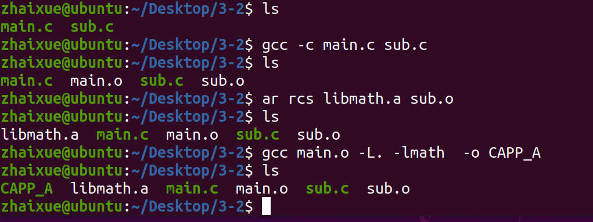

# 3.2 GCC Command Options

## GNU编译器套件

## GNU Compiler Collection

## Call Different Tools with Options

•-E: pre-processing, will call the cpp preprocessor
•-s: Generate assembly files, GCC merges precompilation and compilation, and calls ccl program to complete
•-c: generate object files 
•--verbose: Sow all details when generate object files

## Compilation Process Control

| Options | Description                                                  |
| ------- | ------------------------------------------------------------ |
| -E      | Preprocess, but don't generate files: gcc –E main.c -o main.i |
| -C      | When preprocessing, do not delete annotation                 |
| -S      | Only activate preprocessing and compilation, generate assembly code |
| -c      | Compile the source file to object file without linking       |
| -o      | Output the target name, the file compiled by GCC by default is a.out |
| -M      | Show the dependencies between files                          |
| -MD     | Save the results of "-M" into .d file                        |
| -MM     | "-M" results without dependencies generated by #include <files.h> |

## Compile Option Settings

| Options   | Description                                                  |
| --------- | ------------------------------------------------------------ |
| -g        | Generate debug information when compiling                    |
| -static   | Prohibit the use of dynamic libraries                        |
| -share    | Dynamic Library                                              |
| -Ldir     | Imply where is the Library                                   |
| -llibname | Specifies the library to use when compiling. gcc -lname main.c, use libname.a library when compiling |
| -Idir     | Specify the header file search path                          |
| -shared   | Generate a shared object file.  **$gcc -shared -fPIC**       |
| -w        | no warnings                                                  |
| -Wall     | Warning all                                                  |
| -std=C99  | Specify the C standard to use                                |

## Example: Use Source Files to generate the Static Library

## **Cross Compilation: X86 and ARM**

Coding on the X86 platform and generate the object files that can be used on the ARM Linux Platform (Chips)
which we call it as Embedded job.

$arm-linux-gnueabi-gcc
Installation $apt install gcc-arm-linux-gnueabi
