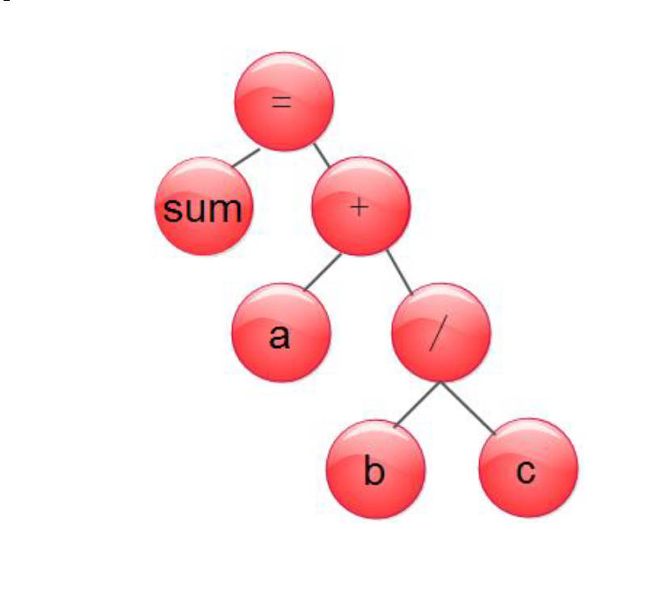
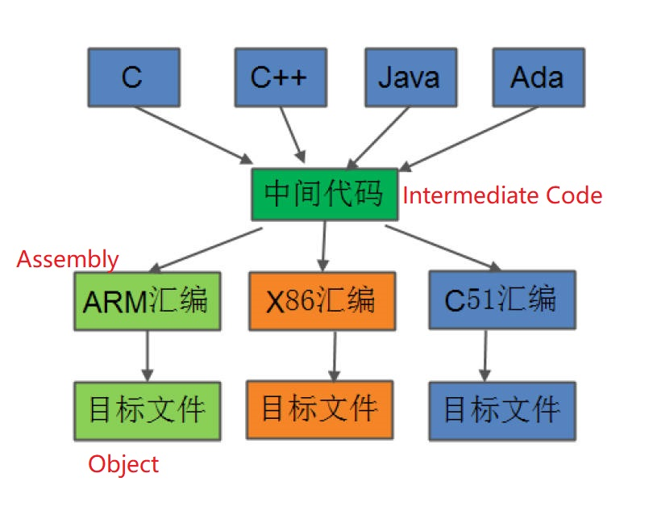

# 3.4 From Source Files to Assembly Code

## Syntax Tree Analysis



## From Syntax tree to Intermediate Code

Source Code:

```
int main() {
    int a = 10;
    int b = 20;
    int sum = a + b;
    return sum;
}
```

Intermediate Code:

```
1: allocate a, 4           ; Allocate 4 bytes of memory for variable a
2: store 10, a             ; Store the value 10 into variable a
3: allocate b, 4           ; Allocate 4 bytes of memory for variable b
4: store 20, b             ; Store the value 20 into variable b
5: load a, t1              ; Load the value of variable a into temporary register t1
6: load b, t2              ; Load the value of variable b into temporary register t2
7: add t1, t2, t3          ; Add the values in t1 and t2 and store the result in t3
8: store t3, sum           ; Store the value in t3 into variable sum
9: load sum, t4            ; Load the value of variable sum into temporary register t4
10: return t4              ; Return the value in t4 as the result of the main function
```

