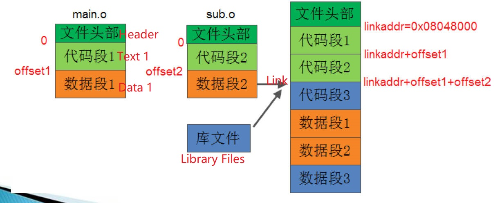
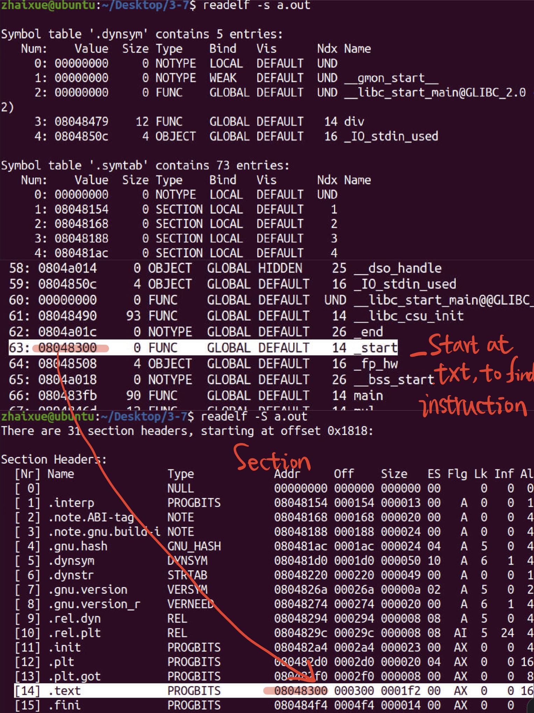
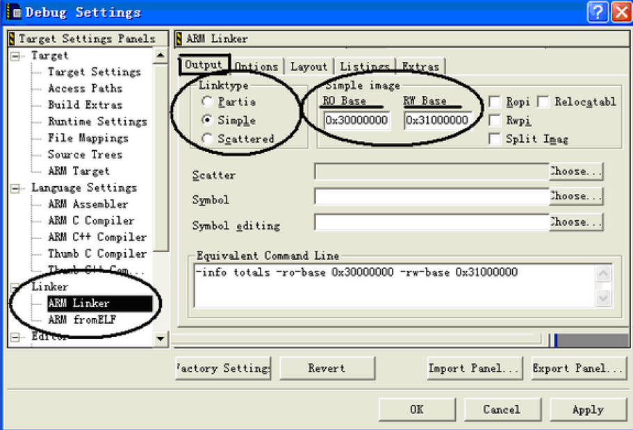

# 3.7 Linking: Allocate Address


### Linking

​	•Purpose: Merge and assemble all relocatable object files into an executable object file

### The main steps

​	Address space allocation
​	Symbol resolution: strong symbols and weak symbols
​	reset

## Linking Process

### Allocate Address

​	Scan all target files, and obtain the code segment and data segment information of each file from each file header table: size, address, etc.

​	Starting from the specified link address, merge the same-type segments of each target file in the order of code section: text segment, and bss segment. After that,  recalculate the length and position of each segment.



After Linking, create the Global Symbols Table in Object file.


## Linking Script

The gcc compiler is built into the linker /usr/lib/scripts/: $ ld -verbose
C-Free IDE: Default script path: mingw\mingw32\lib\ldscripts

```
OUTPUT_FORMAT(“elf32-littlearm”, “elf32-bigarm”, “elf32-littlearm”) ；//File type
OUTPUT_ARCH(“arm”) ；输出可执行文件的运行平台为arm // the output object files is work on ARM 
ENTRY(_start) ；程序入口地址 // the Entry of Program
SECTIONS ；各段描述 // Description of the Segments
{ 
	. = 0x60000000; ；代码段起始地址 // Start Address
	.text: { *(.text)} ；代码段描述：所有.o文件的 //Code
	.text . = 0x60200000; ；数据段的起始地址  // Code Start position at Memory
	.data: { *(.data)} ；数据段描述 //Data Description
	.bss : { *(.bss)} ；BSS段描述 //BSS Description
}
```

**Embedded development**, especially bare Chip, system, and assembly development, must be linked to the specified location of the memory according to the different hardware configurations of the development board. It is necessary to explicitly specify the link script, or even write the link script by yourself.


## Default Linking Address of Memory

Linux-gcc: ：**0x08048000**

ARM-Linux-gcc: **0x00010000**


## Example

After Linux gcc linking, The Section of Object files.



After debugging in linux, use **arm-linux-gnueabi-gcc** to compile the new object files which can run on the Embedded ARM Platform. But the Address start from 0x00010000

## How to develop the Chip which without Kernel

### ADS 1.2 software

