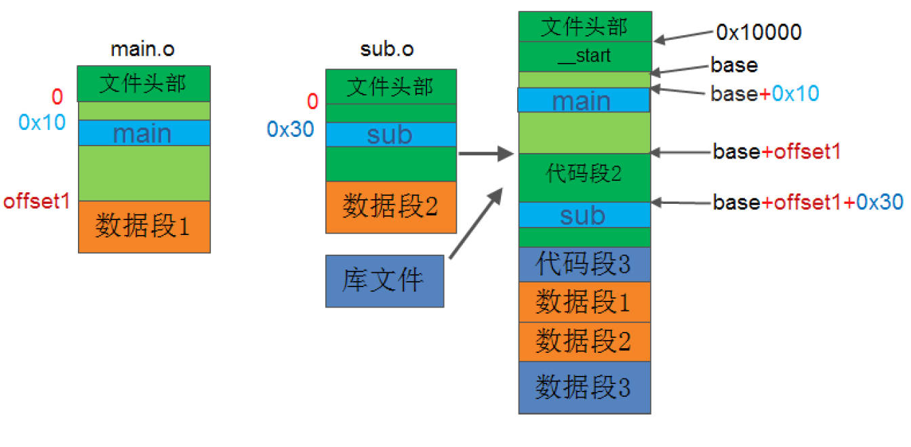
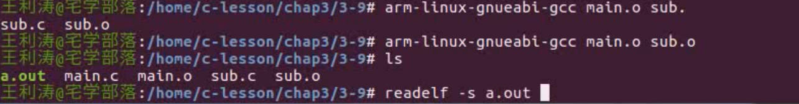
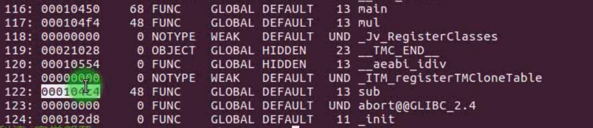
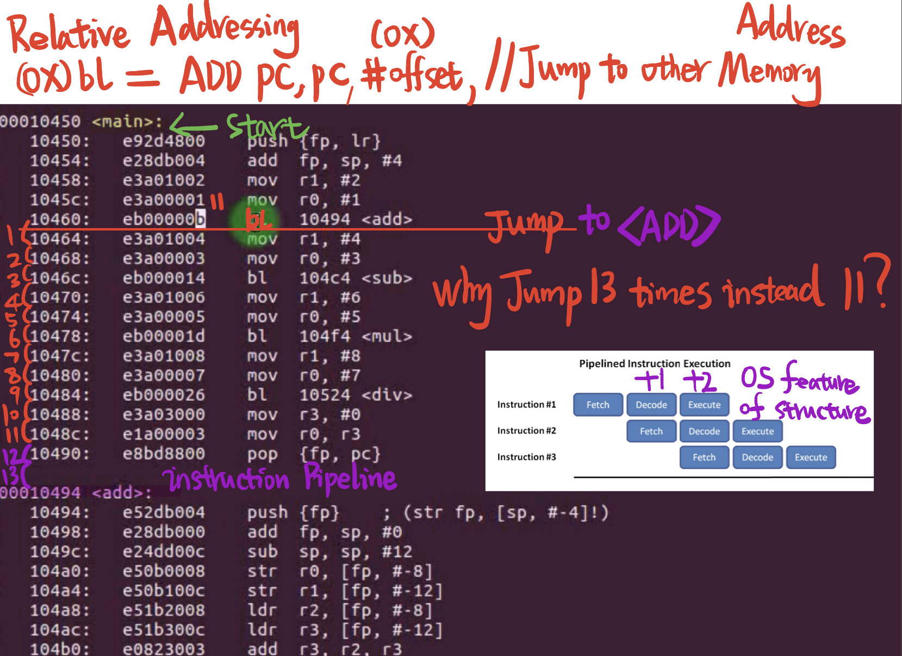

# 3.9 Linking Relocation



## Relocation 

The essence is to correct the symbol address in the instruction
Relocation is the core and most important step in the linking process
Address space allocation and symbol resolution are all for relocation services

## Relocation Table

​	A relocatable ELF file must contain a relocation table
​	Each segment that needs to be relocated has a relocation table that records the symbols that need to be relocated in each segment: such as .rel.text, .rel.data
​	The relocation table itself is also a segment in the Secton, so the relocation table is also called a relocation segment

### View relocation table

–$ arm-linux-gnueabi-objdump –r main.o
–$ arm-linux-gnueabi-readelf -r main.o


## Relocation Table Structure

```
struct Elf32_Rel 
{ 
	Elf32_Addr r_offset; /* Address */指定需要重定位的项在代码中的偏移位置 	
	Elf32_Word r_info; /* Relocation type and symbol index */符号表索引
};
```

	modify symbol address


## Modify Symbol Address

​	Read the relocation information of each segment in each object file: relocation table
​	Perform symbol relocation, modify symbol address in instruction
​	Determine the new address of each relocated symbol to form a new symbol table (symtab)

## Address Correction (Relocate the Address for variable)

​	**Relocation address = new segment base address + old segment inside offset**


## Example



After GCC linker, the all symbols in the main.o and sub.o relocated a new address in the memory.



000104c4 is the new address for sub in the executable file, the linker relocates all the symbol into a sequent memory arry.


##  When the main function firstly calls the variable instruction <add>, how to find the appropriate memory location?

de-assembly the object a.out to see the inner structure of the .out file.

```
$ arm-linux-gnueabi-objdump -D a.out
```



1. PC              2.Memory Address 3.Instruction  4.Assembly language