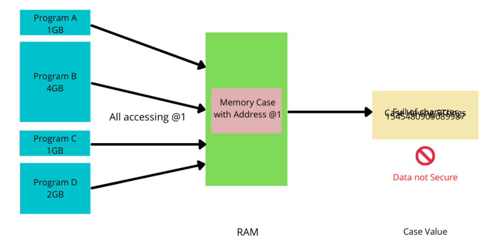

# 4.1 The Relationship Between Program and Memory

## Linux Process Memory Image

Virtual Address Space
• All programs have the same starting address for compilation and linking  
• Different sections in the executable file are loaded into memory with different read and write permissions  
• Linux manages memory through MMU and Page Tables: address mapping, permission management

## The Memory Space of a Linux Process

1. **The kernel space of all processes is mapped to the same physical memory**: In an operating system, the kernel space is the area used to run the core code of the operating system and handle system-level tasks. This sentence means that no matter how many processes are running, their kernel space will be mapped to the same physical memory area. This mapping ensures that all processes have access to the core functionality of the operating system, but also ensures that kernel space is properly isolated to prevent inter-process interference or corruption of kernel code.

2. **The user space of each process is mapped to different physical memory**: User space is the area where each process stores program code, data, and stack. This sentence indicates that the user space of each process will be mapped to a different physical memory area. This isolation ensures that the data and code of each process are independent of each other and will not interfere with each other.

   

3. When the application accesses the kernel space: **System call, Interrupt**

​	

## Linux Process Memory Image

### Address Mapping

• Virtual address is mapped to physical memory through page table/TLB  
• The page table is maintained by the OS and records the mapping relationship between virtual addresses and physical addresses  
• Also set memory permissions through the page table: read, write, executable  

### TLB（Translation Lookaside Buffer）

**TLB table**: TLB is a hardware cache used to accelerate the conversion process of virtual memory addresses to physical memory addresses. It stores a mapping of some recently accessed virtual pages to physical pages for fast lookups and accelerated address translation.  
**Page table**: A page table is a **data structure** maintained by the operating system to store a complete mapping of virtual memory to physical memory. The main function of the page table is to provide translation from virtual memory addresses to physical memory addresses, which contains all page mapping information.  

**Source:**

https://core.vmware.com/resource/how-virtual-memory-translated-physical-memory#section3

### TLB hit

### TLB miss

What happens when a virtual page number is not found in the TLB

### Retrieve from Storage

A TLB miss is not ideal, but the worst-case scenario is data that is not residing in memory but on storage media (flash or disk).

## Address Translation

## Memory Management

### Why use virtual memory?

• Avoid the disadvantages of using physical memory  
• Provide each process with an independent, private address space  
• Protect the space of each process from being destroyed by other processes  
• Memory read and write permission management to ensure the safe operation of the system  

