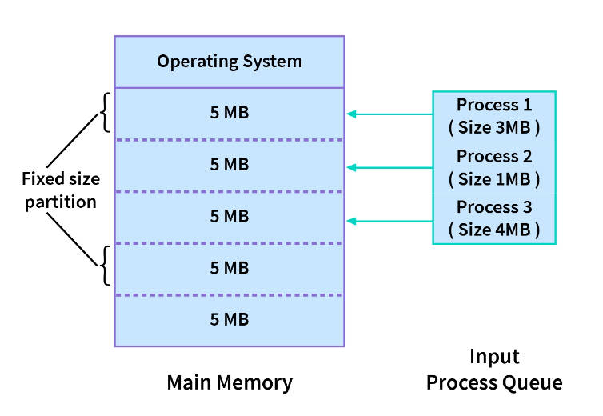
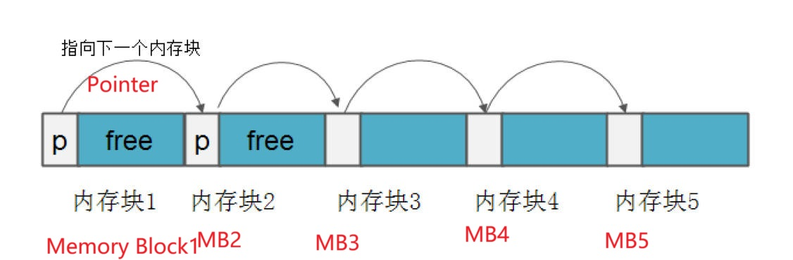
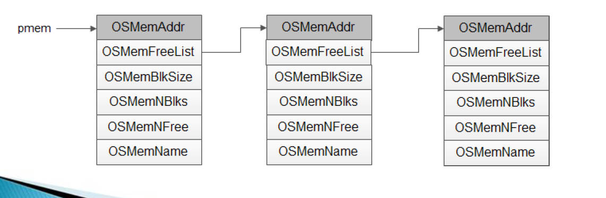
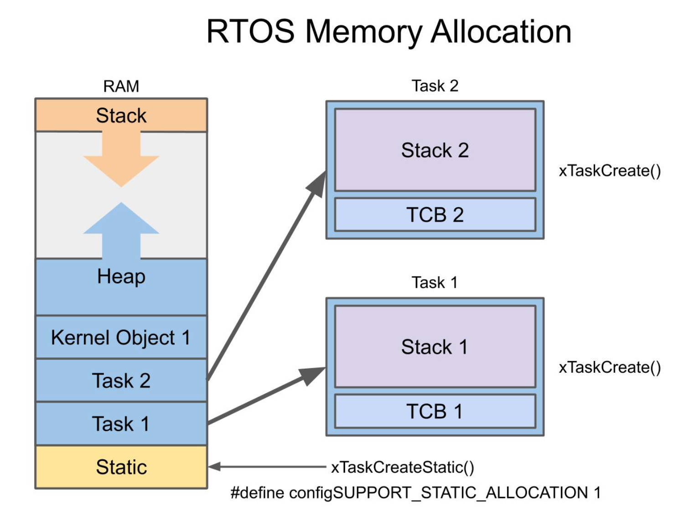
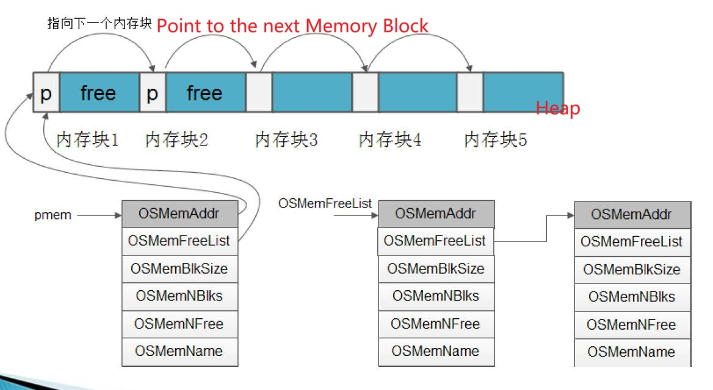
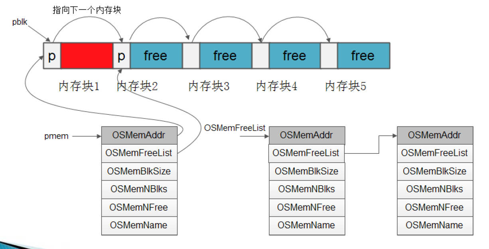
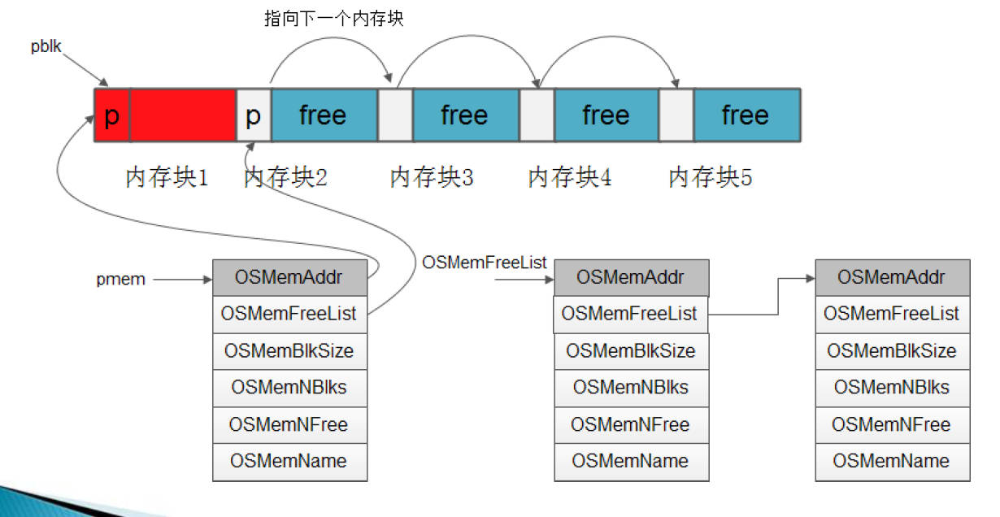
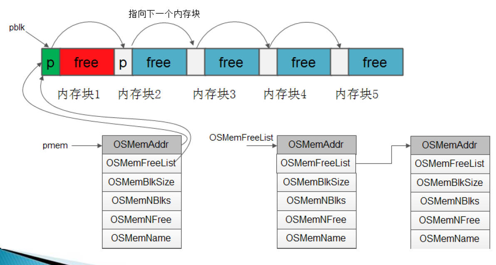

# 4.10 uc/os Heap Memory Management


## Memory Partition



- Divide the heap memory into several regions.    
- Each region is divided into several equally sized memory blocks.    
- The program allocates/frees memory in units of memory blocks  




## Memory Control Block

### Memory Control Block _MEM

• Memory partition is the basic unit of operating system memory management  
• Each memory partition is represented by a memory control block

```c
typedef struct os_mem 
{ 
	/* MEMORY CONTROL BLOCK */ 
	void *OSMemAddr; /* 内存分区指针*/ /* memory partition pointer */
	void *OSMemFreeList; /* 空闲内存控制块链表指针*/ /* Free memory control block linked list pointer */
	INT32U OSMemBlkSize; /* 每个内存快长度*/ /* Each memory fast length */
	INT32U OSMemNBlks; /* 分区内总的内存块数目*/ /* The total number of memory blocks in the partition */
	INT32U OSMemNFree; /* 分区内空闲内存块个数 */ /* The number of free memory blocks in the partition */
	
	#if OS_MEM_NAME_EN > 0u /* This is a preprocessor conditional directive that checks whether the value of the macro OS_MEM_NAME_EN is greater than zero (0u is used to represent an unsigned integer literal 0). This condition determines whether the following code block should be compiled or not.*/
    	INT8U *OSMemName; /* 分区名字*/ 
	#endif 
} OS_MEM;
```


## Memory Control Block Free Linked List

• The os_mem.c\OS_MemInit() function defines and initializes the linked list  
• Each memory control block represents a memory partition  
• Each memory control block is linked into a linked list with pointers  
• The entire linked list represents the entire free memory  
• Define the maximum number of memory control blocks in OS_CFG.H: OS_MAX_MEM_PART  




## *μC*/*OS* Heap Memory

### Code Analysis: Memory Partition

• Initialize dynamic heap memory: OSMemCeate  
• Request a block of memory: OS_MemGet  
• Release a block of memory: OS_MemPut  



### Process 1: Create memory partitions



### Process 2: Apply a Memory Block



### Process3: Release a Memory Block (Before Releasing)

### 

### Process4: Release a Memory Block (After Releasing)



## Defaults

### Rough Memory Management

• The memory block size must be greater than 4 bytes (int 32U), causing memory waste  
• Application memory size cannot exceed the size of the memory block
• When using the requested memory block, you must first know the size of the memory block to prevent out-of-bounds