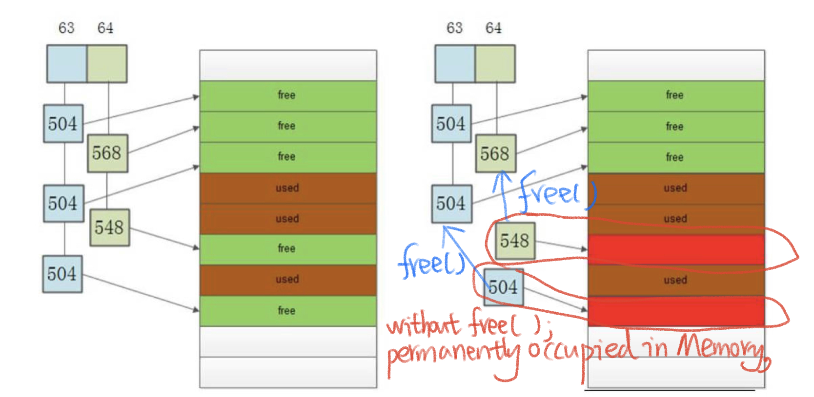
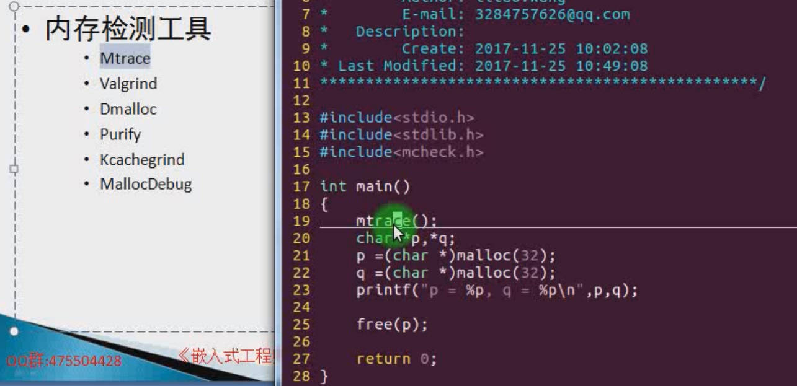
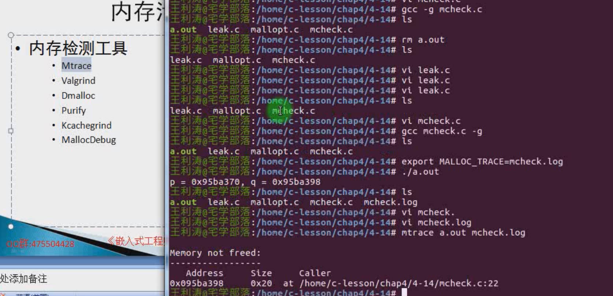
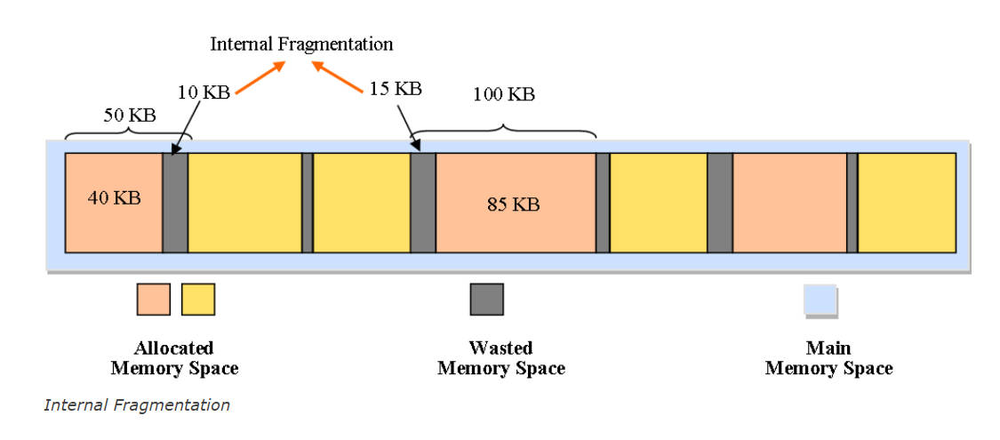
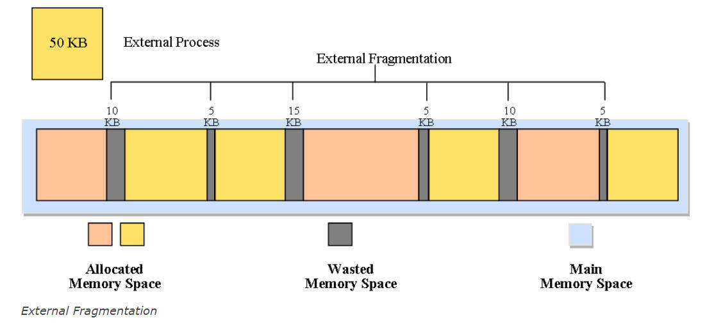
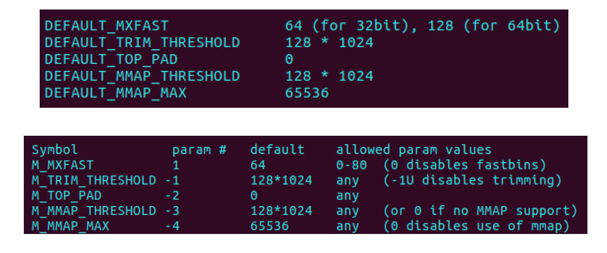
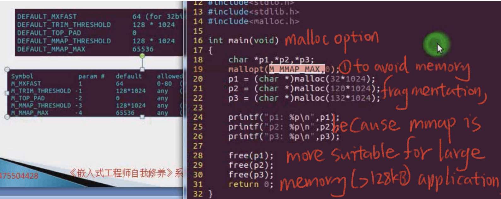
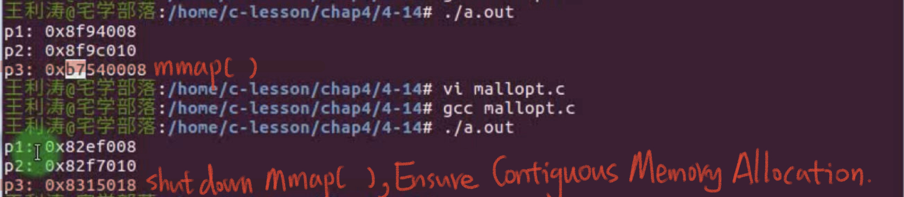

# 4.14 Memory Leaks and Prevention


## Forget to Free malloc()

```c
#include <stdlib.h> 
int main(void)
{ 
	char *p; p = (char *) malloc (32); 
	strcpy(p, “hello”); 
	puts(p); 
	return 0; 
}
```




## Memory Leak Prevention

• **Free** in time after **malloc**  
• code review   
• Use relevant tools to detect  

### Memory Detection Tool

• Mtrace  
• Valgrind  
• Dmalloc  
• Purify  
• Kcachegrind  
• Malloc Debug  






## Generalized Memory Leaks


### Narrow Memory Leak

•Applied memory, but not released, unable to manage this memory  

### Generalized Memory Leak

• The system frequently applies for and releases memory, resulting in more and more memory fragments, making it impossible to apply for large continuous memory  
• Fastbins: While improving memory allocation speed, it will also bring a lot of memory fragmentation





References: https://er.yuvayana.org/memory-fragmentation-in-operating-system/


## Set the Malloc Parameters of glibc

```shell
cd /home/tmp/glibc
```



### Example:

The *mallopt*() function adjusts parameters that control the behavior of the memory-allocation



