# 4.15 Common Memory Errors and Detection

## Memory Error Category

### Memory Out of Bounds/内存越界

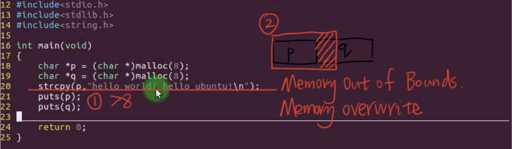

### Memory Overwrite/内存踩踏 

### Double Free/多次释放

### Invalid Pointer/非法指针

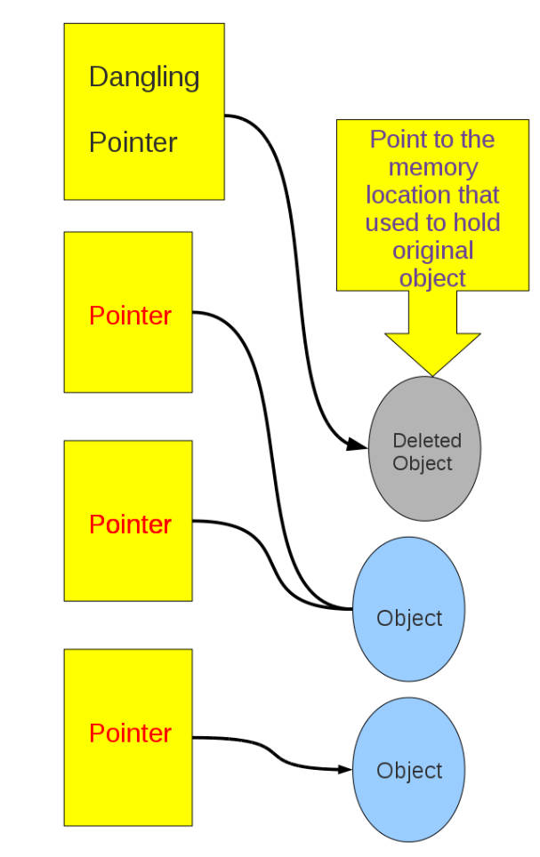

## Use valgrind Memory Detection

### Installation and use

• Download source files  tar vxf valgrind-3.13.0.tar.bz2
• $ ./configure  
•$ make  
•$ make install  
•$ valgrind --tool=memcheck ./a.out  

### Memory detection tool: valgrind

• Memcheck: memory detection  
• Callgrind: program performance analysis, code coverage detection  
• Massif: stack analyzer  
• Cachegrind: Analyze CPU cache hit rate and loss rate for code optimization

#### Memory Detection with memcheck: 

• Memory Leak Detection   
• Memory Overwrite Detection   
• Memory Bounds Checking  

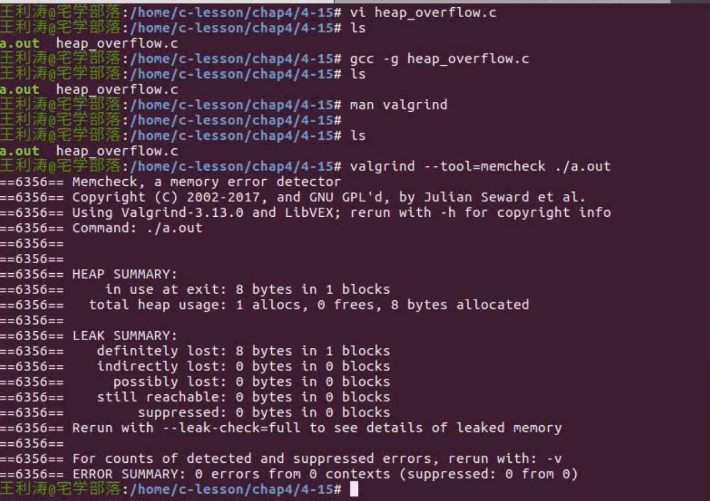

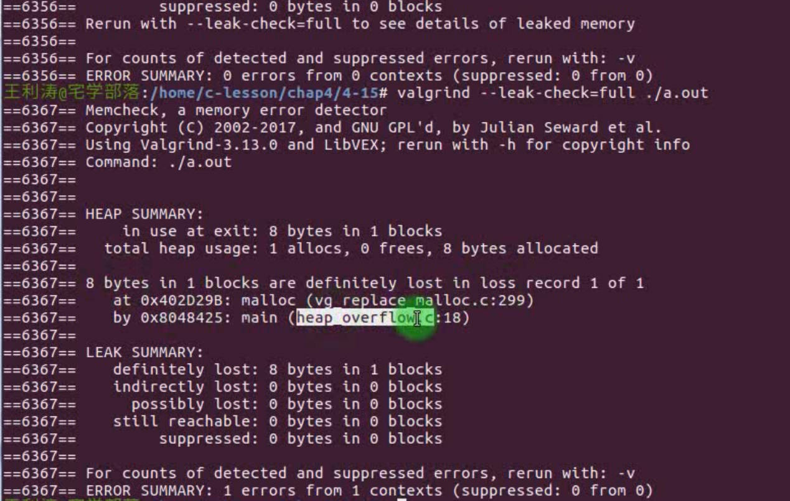

Go to the 18 rows to find the reason of memory leak.

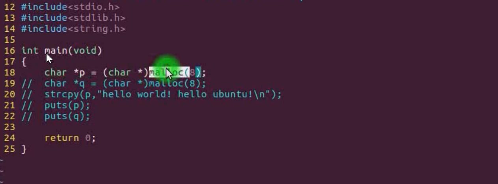

### Valgrind Detects Memory Overwrite

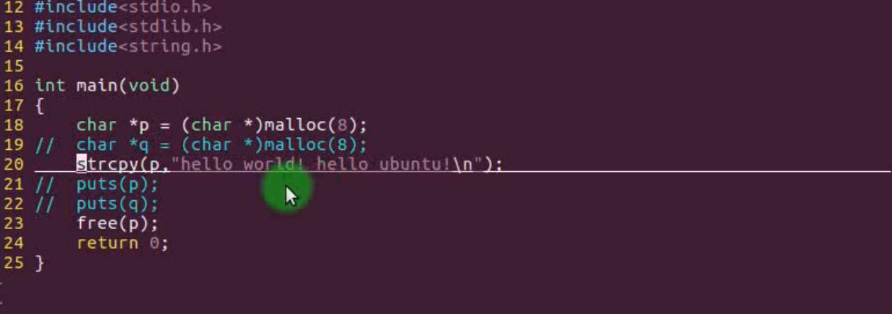

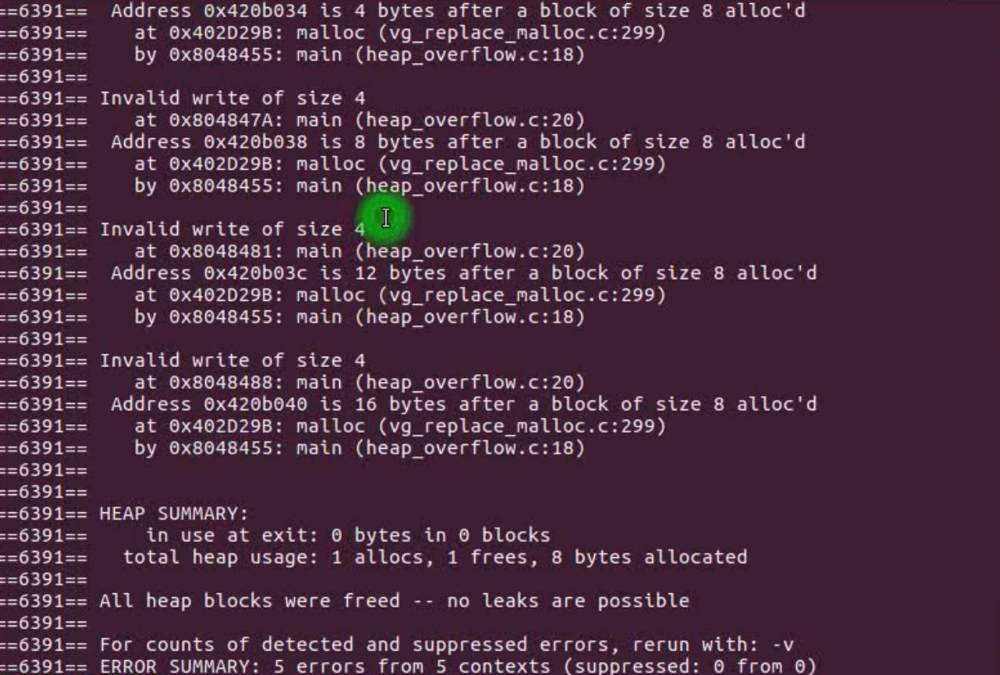

### Valgrind Detect Memory Leaks

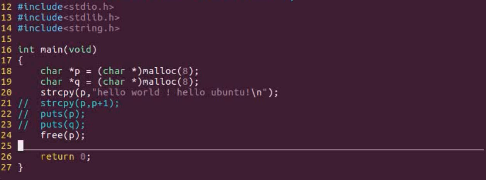

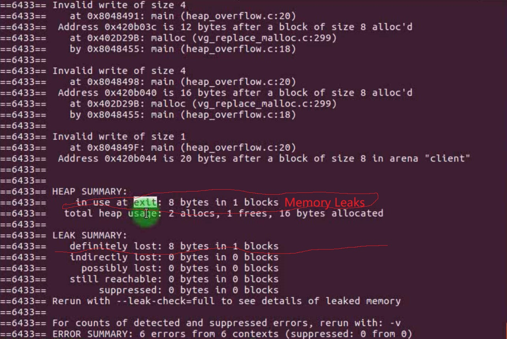

### Valgrind Detect Memory Double Free

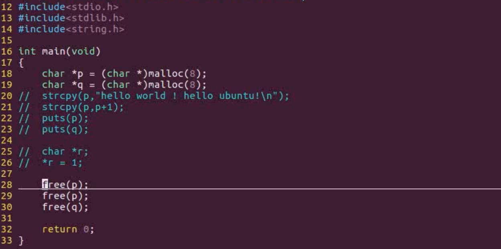

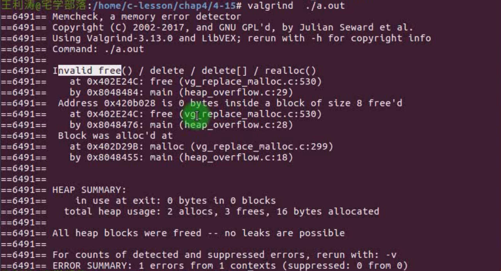