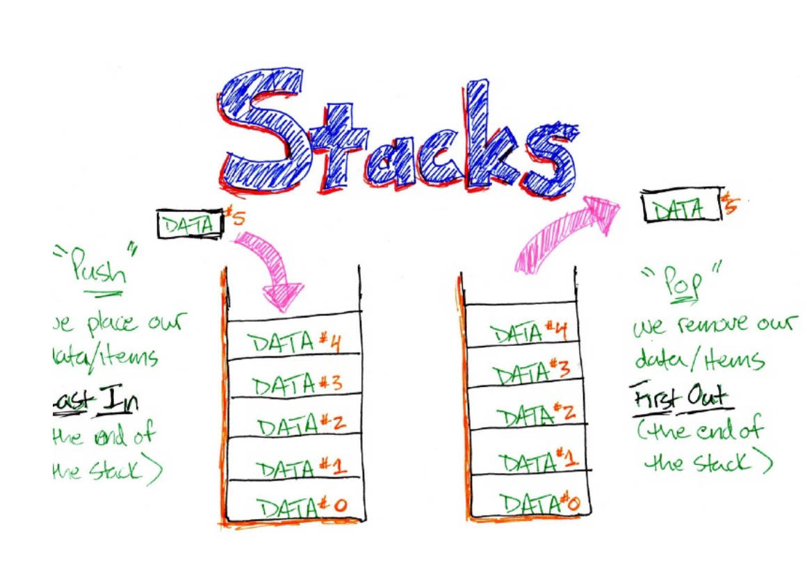
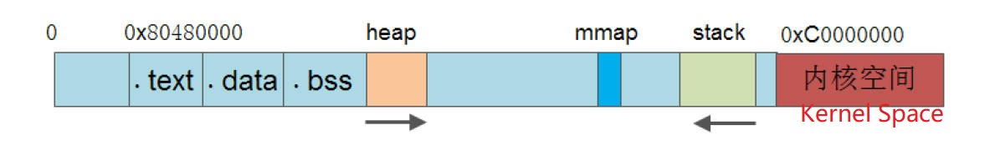
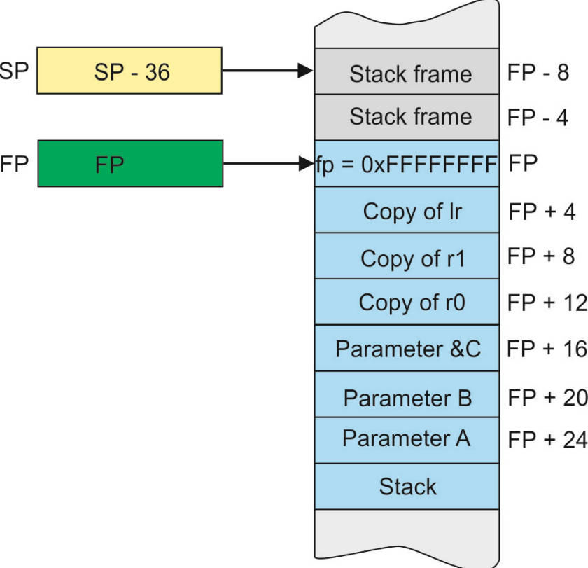
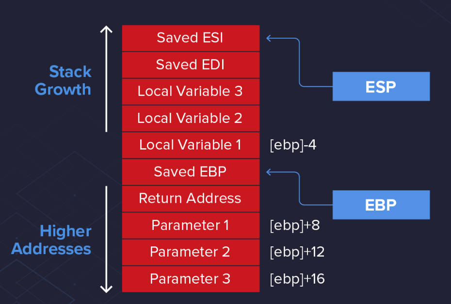
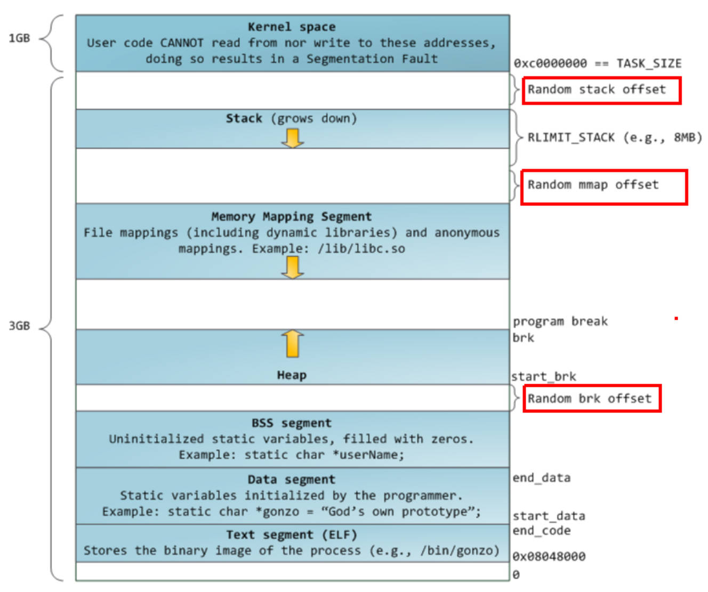
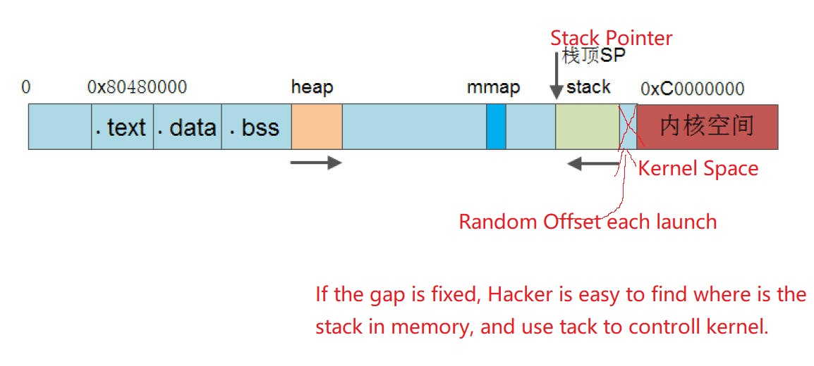
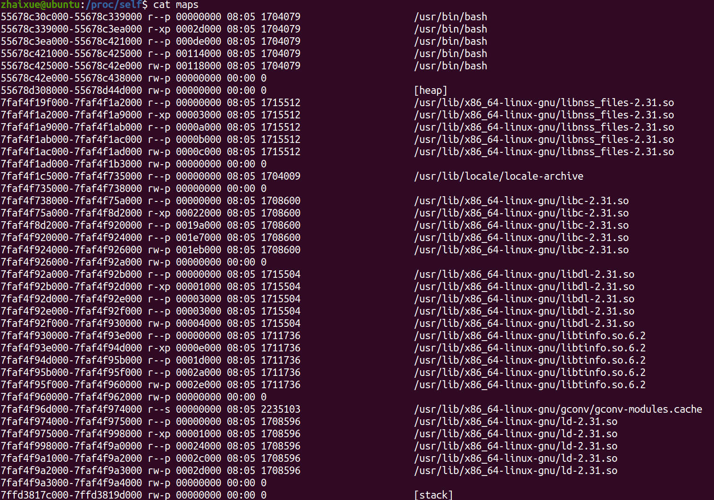

# 4.2 Initialization of the Stack

## What is Stack

### Data Structure

• FILO: first in last out  
• Stack pointer  

### Stack Operations 

• Into the stack: **PUSH**  
• Get out of the stack: **POP**

## The Role of the Stack

### The stack is the basis of C language operation  

**Function call and return:** In C language, function call and return involves the management of local variables, parameter passing and return address. This information is usually stored on the stack. Every time a function is called, the relevant data will be pushed onto the stack, and popped from the stack when the function returns, ensuring the normal execution and return of the function.  

**Local variable storage:** Local variables in C language allocate memory on the stack when the function is called, and release the memory when the function returns. This makes the stack an ideal place to store local variables.  

**Recursion:** Recursion is an algorithm design method in which each recursive call creates a new local environment. The LIFO feature of the stack can easily manage the data of recursive calls.  

**Temporary data storage:** In C language, temporary data, temporary calculation results, etc. are usually stored on the stack for access and manipulation when needed.  

**Pointer operations:** Pointers are an important feature of the C language, and they can be used to refer to data in memory. The stack also plays a key role in handling pointer operations.  

## Stack Initialization 

### Stack Initialization

• DDR/SDRAM/SRAM initialization  
• Initialize the stack pointer: The stack pointer (Stack Pointer) is a **register** used to indicate the current available location in the stack. Initializing the stack pointer means setting the stack pointer to the starting address of the stack so that the stack can be used correctly during program execution. The management of the stack pointer is crucial to ensure the correctness of function calls and returns.

The stack usually grows from high address to low address, so initializing the stack involves setting the starting address of the stack, and determining the size of the stack.   

**Stack Pointers for different Architectures**
• ARM: SP register (R13), FP (R11)  
• X86: ESP (stack top pointer), EBP (stack bottom pointer)

## Kernel Address - Random Offset

### Example:

## The Size of Stack

### Linux Process Stack Size

• View stack size: **$ ulimit -s**  
• Set the stack size: **$ ulimit –s size**  
• Increasing the stack size will increases memory overhead and startup time  

### Stack Overflow

• Within the maximum value, the stack will grow dynamically  
• If the maximum value is exceeded out of the Stack max address, a stack overflow will occur and a segmentation fault will occur  
• Stack overflow instance

### Why do attackers not directly attack the code in the stack, but attack the code that overflows the stack?

Bypass security mechanisms: Many modern operating systems and compilers have implemented various security measures when executing code in the stack, such as address space layout randomization (ASLR), stack protector (Stack Protector), etc. These mechanisms increase the difficulty of directly attacking code within the stack. The stack overflow attack can bypass these mechanisms, and achieve the purpose of bypassing security measures by changing the return address of the function.  

Execution of Arbitrary Code: Stack overflow attacks allow attackers to insert arbitrary malicious code in memory, rather than just modifying existing code on the stack. This allows an attacker to perform any action on the target system, including executing system commands, obtaining sensitive information, establishing remote control, and more.  

Control flow hijacking: Through stack overflow attacks, the attacker can control the execution flow of the program and make it jump to the malicious code inserted by the attacker. This ability to control flow hijacking enables attackers to implement highly customized attacks to more effectively achieve their goals.  

Concealment: Through stack overflow attacks, attackers can hide malicious code in buffer overflow data, making it difficult to be found during normal program execution. This stealth makes attacks more difficult to detect and prevent.  

No need to modify the original code: The attacker does not need to modify the source code of the program directly, but only needs to find and exploit buffers with insufficient input validation, overflow them and control the execution of the program.  