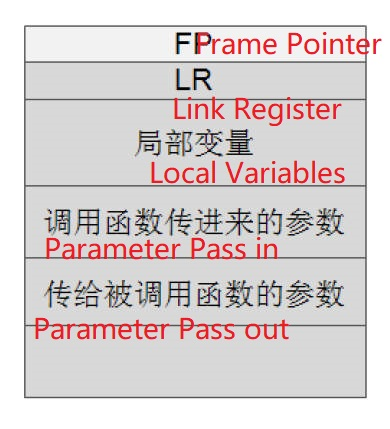

# 4.3 Stack Management: Function Call

## The Role of the Stack

### Save Function Context (Variables, Parameters) 

• Caller stack frame address: FP(Frame Pointer)  
• Return address: LR(Link Register)  

## Stack Frame

• Including Frame Pointer(FP)  
• There are multiple levels of calling functions (recursive) in a program
• Each layer  needs to save the return address, parameters, etc.
• Each layer has a stack structure called a stack frame
• Use FP(R11) to point to the bottom of the stack frame of the previous function
• Multiple stack frames constitute the process's call stack 

### Function Call

• Stack frame base address, return address preservation  
• Function returns: stack frame released  

## ARM Assembly Instructions

**PUSH {FP, LR};** **FP/LR->STACK** **SP->LR**    

**POP {FP, PC};** **[SP]->PC, [SP+4]->FP**  

[SP] reads an top from stack, which is the Frame pointer. Loading FP to the PC, PC execute it and jumps to the Previous  Stack Frame.

## Example:

### Push:

### POP:

