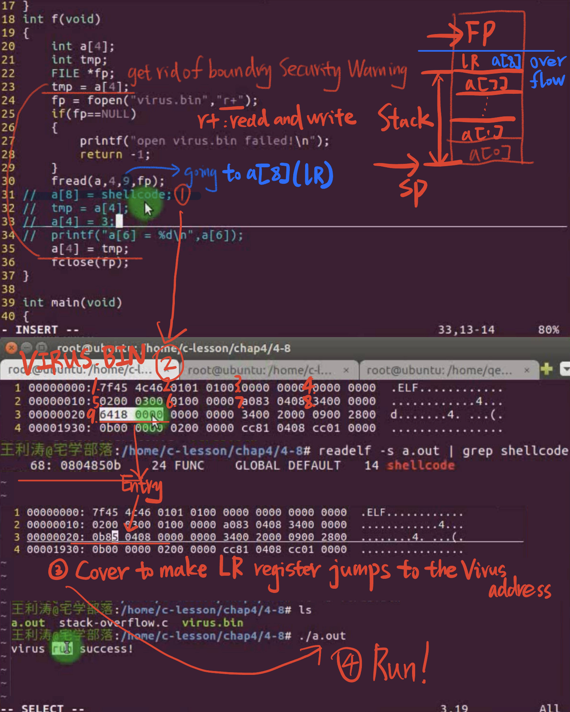
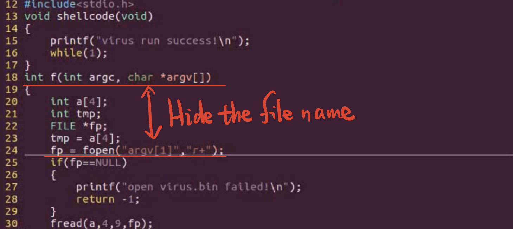

# 4.8 Example of Stack Overflow Attack


```
#include<stdio.h>
void shellcode(void)
{
	printf("virus run success!\n");
	while(1);
}
int f(int argc, char *argv[])
{
	int a[4];
	int tmp;
	FILE *fp;
	tmp = a[4];
	fp = fopen(argv[1],"r+");
	if(fp==NULL)
	{
		printf("open virus.bin failed!\n");
		return -1;
	}
	fread(a,4,9,fp);
//	a[6] = shellcode;
//	tmp = a[4];
//	a[4] = 3;
//	printf("a[6] = %d\n",a[6]);
	a[4] = tmp;
	fclose(fp);
}

int main(int argc, char * argv[])
{
	f(argc,argv);
	printf("hello world!\n");
	return 0;
}

```

```
size_t fread(void *ptr, size_t size, size_t count, FILE *stream);
```

- `ptr`: This is a pointer to the memory location where the data read from the file will be stored. In your case, it's `a`, which is presumably an array or a pointer to a memory location where you want to store the data.  
- `size`: This parameter specifies the size (in bytes) of each element to be read from the file. In your case, it's `4`, which indicates that each element being read is 4 bytes in size.  
- `count`: This parameter specifies the number of elements to read from the file. In your case, it's `9`, which means you want to read a total of 9 elements from the file.  
- `stream`: This is a pointer to the `FILE` structure that represents the file you want to read from. In your case, it's `fp`, which is presumably a file pointer pointing to the file you want to read from.  



