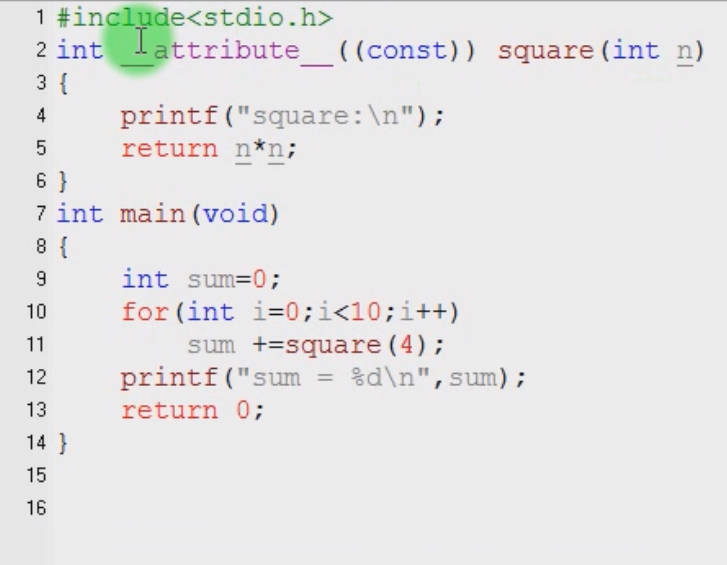
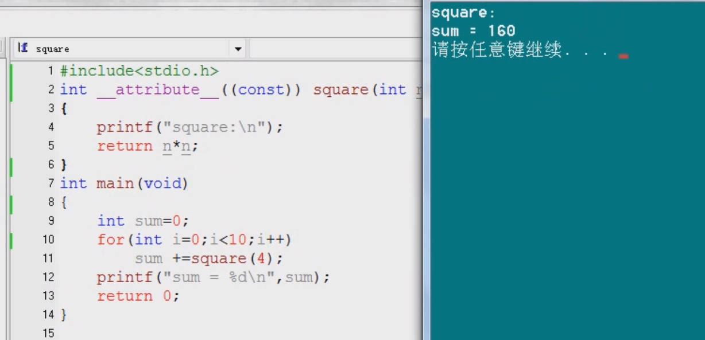

# 5.10 Attribute Declaration:  Const

## Use

​	int func( int a ) _ _ attribute_ _((const))

Use the const to protect the value that be repeatedly called by caller.

 `__attribute__((const))` is a compiler-specific directive that indicates that a function has no side effects and its output is solely determined by its input. It's a tool to provide the compiler with more information for better optimization and to help developers ensure the intended behavior of their code.

## Example

Square(4) is repeatedly called by the caller, so we use _ _ attribute _ _ to save the Square(4) in a specific memory as const, improving the behavior of the compiler.

Square only execute one time, compiler gets the results.

