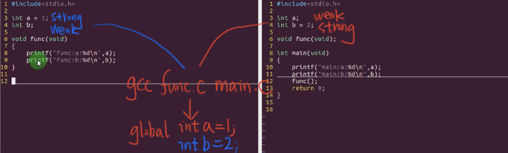
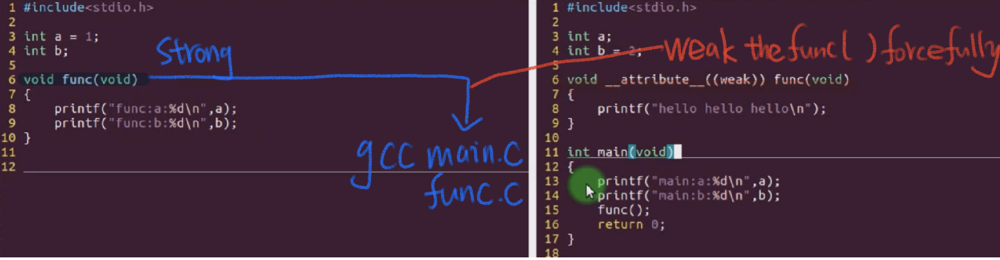
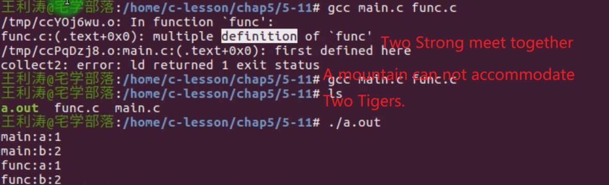
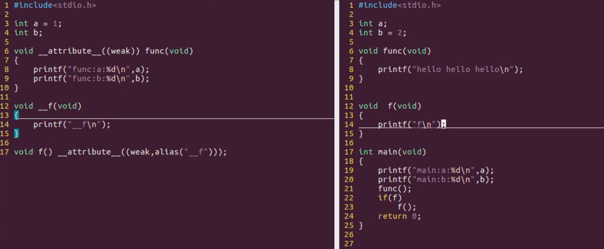
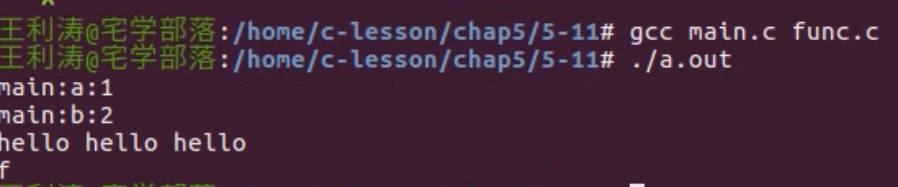

# 5.11 Attribute Declaration: Weak & alias


## Use

```c
void __attribute__((weak)) func(void);
void func(void) __attribute__((weak));
```

## Symbol Choice During the Linking

### Three Scenarios

• Strong Symbol + Strong Symbol  
• strong symbol + weak symbol  
• weak symbol + weak symbol  

### Guidelines

• One mountain cannot accommodate two tigers  
• Strong and weak can coexist  
• Larger size wins  when two strong meets.

## Example








## alias

## /ˈeɪ.li.əs/

Give function another nick name.

```c
void __f();
void f() __attribute__((weak, alias("__f")));
```

__f(): the underlying interface function.

f(): f() is an alias name for __f() and simultaneously set it as the weak function.



