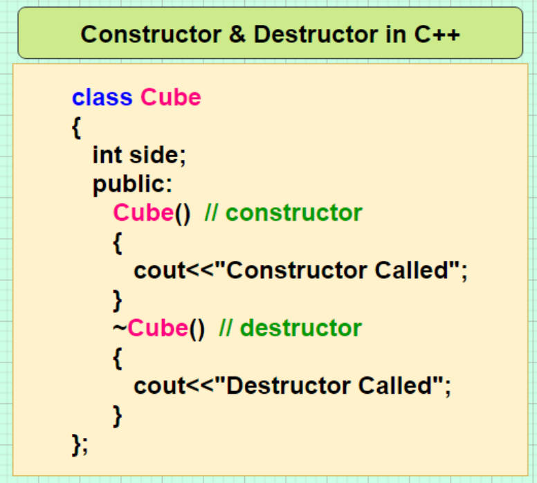

# 5.12 Attribute Declaration: constructor & destructor


```c
__attribute__((constructor)) int init_func(void);
__attribute__((destructor)) int exit_func(void);
```

## Main Function Start

• The real entrance to the program  
• Skip before the main entry  
• After exiting main  

## Constructor

1. You declare a function and mark it with the `__attribute__((constructor))` attribute.
2. When your program starts, before the `main` function is executed, all functions marked as constructors are executed in an unspecified order.
3. These constructor functions are typically used to set up global variables, allocate resources, initialize libraries, or perform any other tasks that need to happen before the main program logic starts.

```c
#include <stdio.h>

// Declare a constructor function
void my_constructor(void) __attribute__((constructor));

// The constructor function
void my_constructor(void) {
    printf("Constructor function called!\n");
}

int main() {
    printf("Main function started.\n");
    return 0;
}
```

In this example, when you run the program, the constructor function `my_constructor` will be executed before the `main` function starts. This can be useful for setting up the environment, initializing data structures, or performing other pre-main tasks.

## Destructor

These destructor functions are typically used to release resources, perform cleanup on global variables, close files, deallocate memory, or perform any other tasks that need to happen before the program terminates.

```c
#include <stdio.h>

// Declare a destructor function
void my_destructor(void) __attribute__((destructor));

// The destructor function
void my_destructor(void) {
    printf("Destructor function called!\n");
}

int main() {
    printf("Main function started.\n");
    // Some program logic here...
    printf("Main function finished.\n");
    return 0;
}
```

In this example, when your program is about to exit (after the `main` function finishes), the destructor function `my_destructor` will be executed. This allows you to perform cleanup operations, such as closing open files, freeing allocated memory, or releasing other resources that your program might have acquired during its execution.

## Similar to CPP Class Constructor & Destructor

Reference: https://www.mygreatlearning.com/blog/constructor-in-cpp/

Reference: https://www.runoob.com/cplusplus/cpp-constructor-destructor.html

