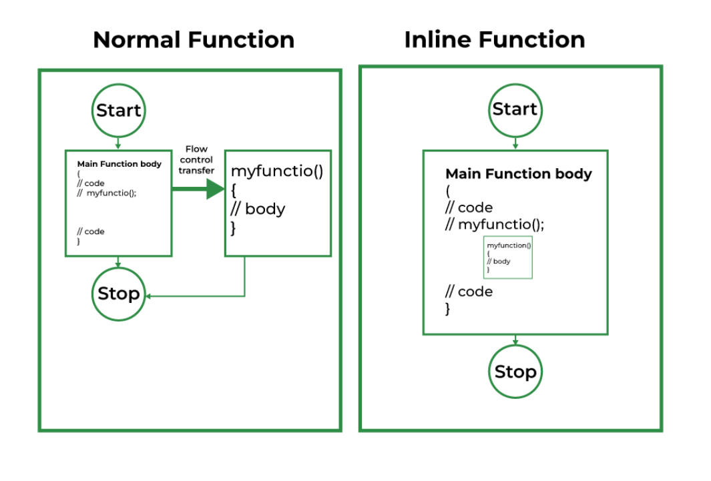
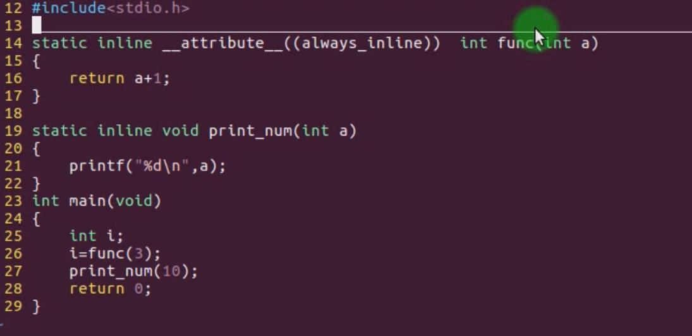
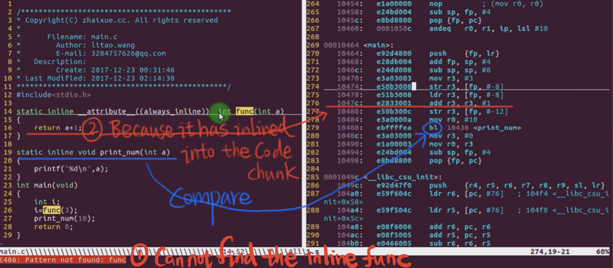

# 5.13 Attribute Declaration: noinline & always_inline


## What is the inline function?



### Function Call Overhead

• Save the current function scene  
• Jump to calling function execution  
• Restore the current function scene  

### Inline Function

• Reduce the overhead caused by function calls


## noinline & always_inline

```c
static inline __attribute__((noinline)) int func();
static inline __attribute__((always_inline)) int func();
```

1. `static inline __attribute__((noinline)) int func();`

   This macro defines a function named `func` with the following attributes:

   - `static`: This keyword specifies that the function has internal linkage. It means that the function is only visible within the translation unit (source file) where it's defined.  
   - `inline`: This keyword suggests to the compiler that it should attempt to inline the function's code at the call site rather than generating a regular function call. Inlining can improve performance by reducing the overhead of function calls.
   - `__attribute__((noinline))`: This attribute specifies that the compiler should avoid inlining the function. In other words, it instructs the compiler not to perform inline expansion for this function, even if the `inline` keyword suggests it. This might be used in cases where you want to prevent inlining for optimization or debugging purposes.

2. `static inline __attribute__((always_inline)) int func();`

   This macro defines a function named `func` with the following attributes:

   - `static`: Same as before, it indicates internal linkage.

   - `inline`: Same as before, it suggests that the compiler should attempt to inline the function's code at the call site.

   - `__attribute__((always_inline))`: This attribute enforces the inlining of the function. It instructs the compiler to always inline the function, regardless of its size or other factors that might normally prevent inlining. This can be useful when you want to force inlining for specific functions, even if the compiler would not normally inline them.


## Compiler's Handling of Inline Functions

### Insufficiency of Inline Functions

• increase the size of the code  
•Reduce the cache hit rate, the efficiency of instruction fetching may be reduced, and the execution speed is slow

## Example



```
arm-linux-gnueabi-gcc main.c
arm-linux-gnueabi-objdump -D a.out > 1.s
```

