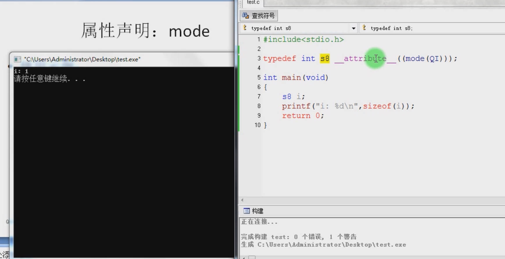
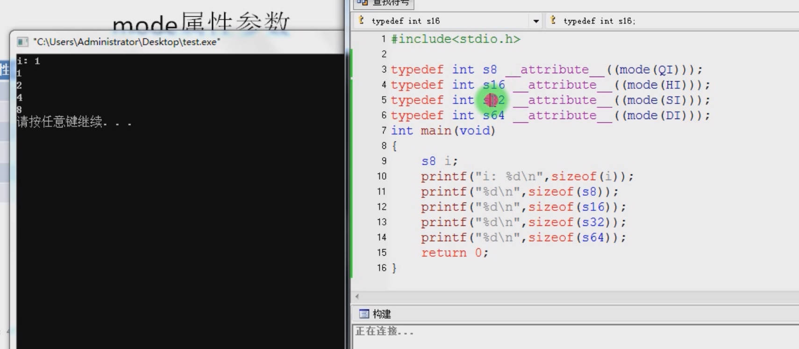

# 5.14 Attribute Declaration: mode


```c
typedef int s8 __attribute__((mode(QI)));
typedef unsigned int us8 __attribute__((mode(QI)));
```

1. **`typedef int s8 __attribute__((mode(QI)));`**

   This line defines a new type named `s8`. The `typedef` keyword is used to create a new name (`s8`) for an existing type (`int`), effectively creating a synonym for the `int` type.

   - `int`: This specifies the original data type that you're creating an alias for.
   - `s8`: This is the new name you're assigning to the `int` type.

   The `__attribute__((mode(QI)))` attribute is attached to this type definition. The `mode` attribute specifies the storage size and type for the new type.

   - `QI`: This mode specifies that the new type should be represented as a "Quad" (8 bits) Integer. In other words, it's specifying that `s8` should be a signed 8-bit integer type.

2. **`typedef unsigned int us8 __attribute__((mode(QI)));`**

   Similar to the first line, this line defines a new type named `us8`, which is an alias for the `unsigned int` type.

   - `unsigned int`: This specifies the original data type (`unsigned int`) that you're creating an alias for.
   - `us8`: This is the new name you're assigning to the `unsigned int` type.

   Again, the `__attribute__((mode(QI)))` attribute is used to specify the storage size and type for the new type.

   - `QI`: This mode specifies that the new type should be represented as a "Quad" (8 bits) Integer. In this case, it's specifying that `us8` should be an unsigned 8-bit integer type.

## Mode Parameter

| Parameter | Description                                                  |
| --------- | ------------------------------------------------------------ |
| QI        | An integer that is as wide as the smallest addressable unit, usually 8 bits. |
| HI        | An integer, twice as wide as a QI mode integer, usually 16 bits. |
| SI        | An integer, four times as wide as a QI mode integer, usually 32 bits. |
| DI        | An integer, eight times as wide as a QI mode integer, usually 64 bits. |
| SF        | A floating point value, as wide as a SI mode integer, usually 32 bits. |
| DF        | A floating point value, as wide as a DI mode integer, usually 64 bits. |

## Example



