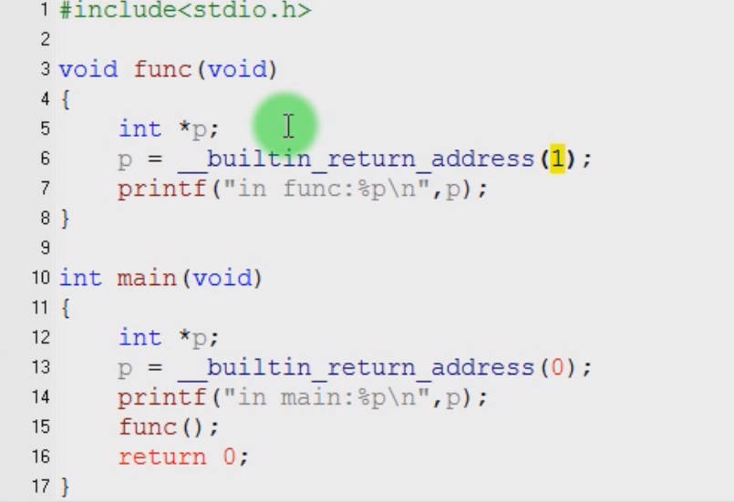
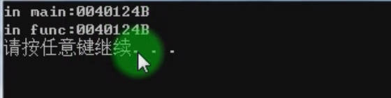
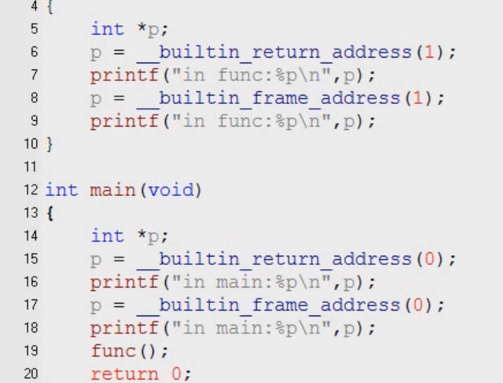
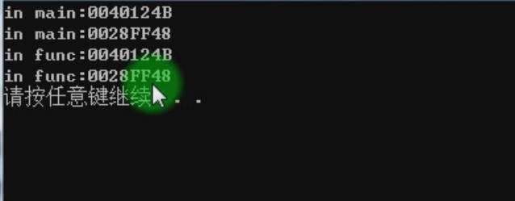
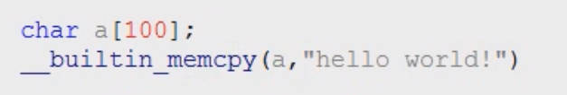

# 5.17 GCC Built-in Functions

## C Standard Build-in Functions

**A built-in function**, also known as a built-in method or built-in procedure, is a function that is already available as part of a programming language's standard library. These functions are pre-defined and come with the language itself, providing essential and commonly used functionalities that developers can directly use without having to write the code for those functionalities from scratch.

1. `print()`: Used to display output on the console.
2. `len()`: Returns the length of a sequence (e.g., string, list, tuple).
3. `str()`, `int()`, `float()`: Used for converting values to string, integer, and floating-point data types, respectively.
4. `max()`, `min()`: Return the maximum and minimum values from a sequence.
5. `abs()`: Returns the absolute value of a number.
6. `range()`: Generates a sequence of numbers.
7. `input()`: Reads input from the user.

**Naming: start with __builtin**

## GCC Common Built-in Functions

### __builtin_return_address (LEVEL)

• returns the return address of the current function or caller  
• 0: Indicates the return address of the current function  
• 1: Indicates the return address of the caller of the current function  

### __builtin_frame_address(LEVEL)

• Returns the stack frame address of the function  
• 0: indicates the current function  
• 1: Indicates the caller of the current function  

## C Standard Library Build-in Function

• Named the same as standard library functions, prefixed with __builtin_  
• Functionally similar to standard library functions  
• Memory-related functions: memcpy, memset, memcmp  
• Mathematical functions: log, cos, abs, exp,  
• String processing functions: strcat, strcmp, strcpy, strlen  
• Printing functions: printf, scanf, putchar, puts  

