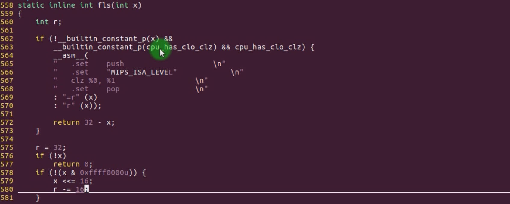

# 5.18 Build-in Function： __builtin_constant_p


```c
__builtin_constant_p(n)
```

• Used to determine whether n is a compile-time constant  
• This function is often used in macros for compilation optimization  

