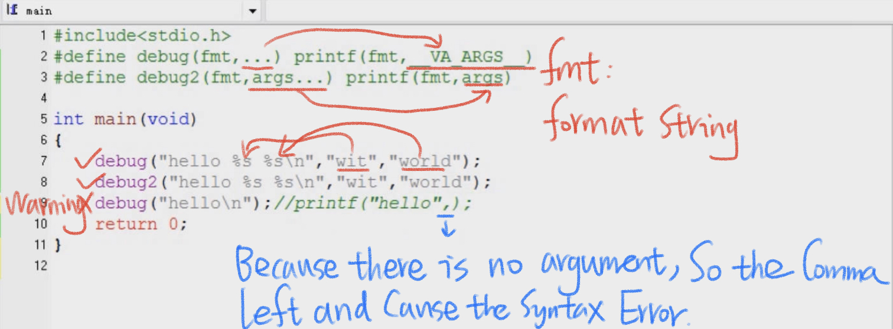
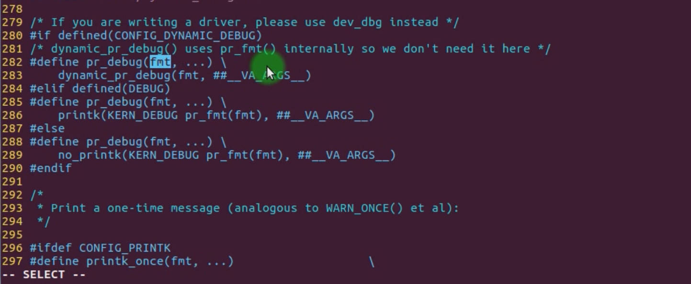

# 5.22 Variadic Parameter Macro


```c
#define debug( fmt,...) printf( fmt, __VA_ARGS__)
#define debug2( fmt, args...) printf(fmt, args)
#define debug( fmt,...) printf( fmt, ##__VA_ARGS__)
```

`fmt` is a placeholder that represents the format string used in the `printf` function. The format string specifies the layout and formatting of the output that `printf` will generate. It includes placeholders like `%d`, `%s`, `%f`, etc., which are replaced by the corresponding values provided as arguments to `printf`.

Here's a breakdown of the macro definition:

- `debug2`: This is the name of the macro.
- `(fmt, args...)`: This part defines the macro parameters. `fmt` is the format string parameter, and `args...` indicates that the macro can take a variable number of arguments (variadic arguments) after the `fmt`.
- `printf(fmt, args)`: This is the code that gets executed when the macro is used. It's using the `printf` function to print formatted output, where `fmt` represents the format string, and `args` are the additional arguments to be inserted into the format string with `%s` different numbers. args will make sure those variadic arguments will map into the format string.



We can modify the `$s` number to check the code chunke.

## Check it in the Linux Kernel

