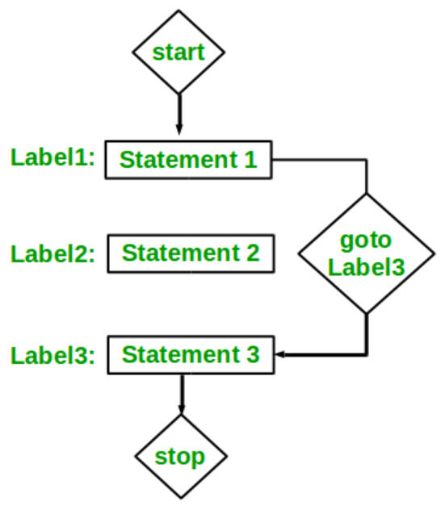

# 5.23 Local Label



```c
__label__ here;
goto here;
------------------------------------------------------------
X: Format String;
goto X;
```

1. `__label__ here;`: This line defines a label named `here`. Labels in C/C++ are used as markers within the code to provide locations for `goto` statements to jump to. The use of `__label__` is a compiler-specific extension that declares the label.
2. `goto here;`: The `goto` statement is used to transfer the control of the program to a labeled statement. In this case, `goto here;` means that the program's execution will jump to the point labeled as `here`.

### Example:

```c
#include <stdio.h>

int main() {
    int num = 42;

    if (num > 0) {
        goto here;  // Jump to the 'here' label
    }

    printf("This won't be printed.\n");

here:
    printf("Jumped to the label 'here'.\n");

    return 0;
}
```

