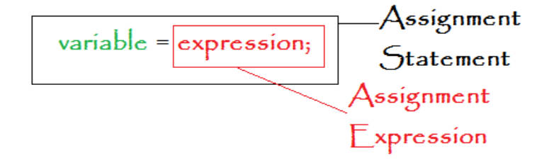
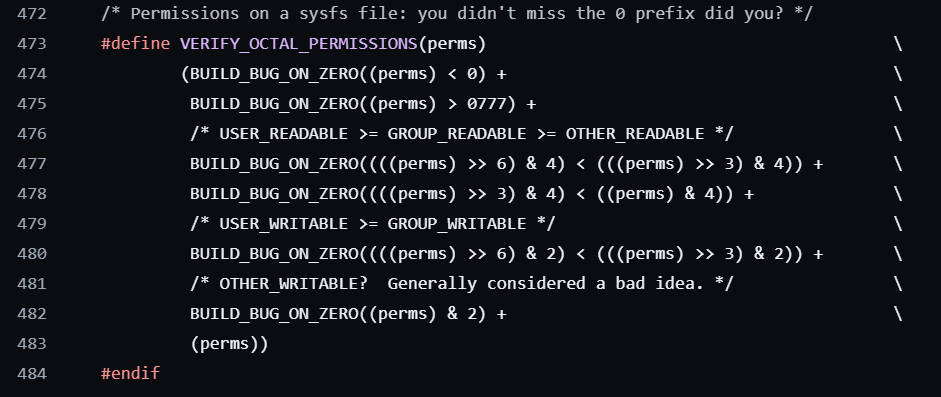

# 5.3 Statement Expression

## Statement Expression

### ({expression;expression2;})

• Allows the use of local variables, loops and jumps within expressions
• Value of Statement Expression: the value of the last expression

## 为什么Linux内核喜欢定义表达式为宏块，来运行函数？

## Why does the Linux kernel like to define expressions as macro blocks to run functions?

References: https://github.com/torvalds/linux/blob/master/include/linux/kernel.h

To avoid functions to call each other, improving the performance. 