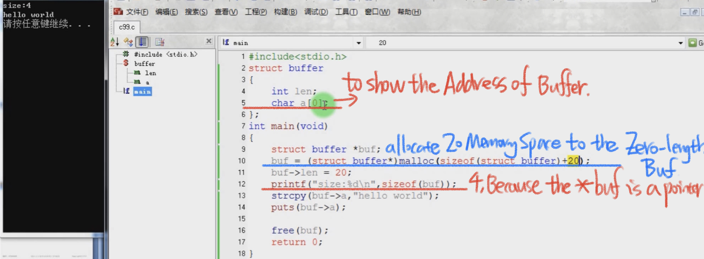
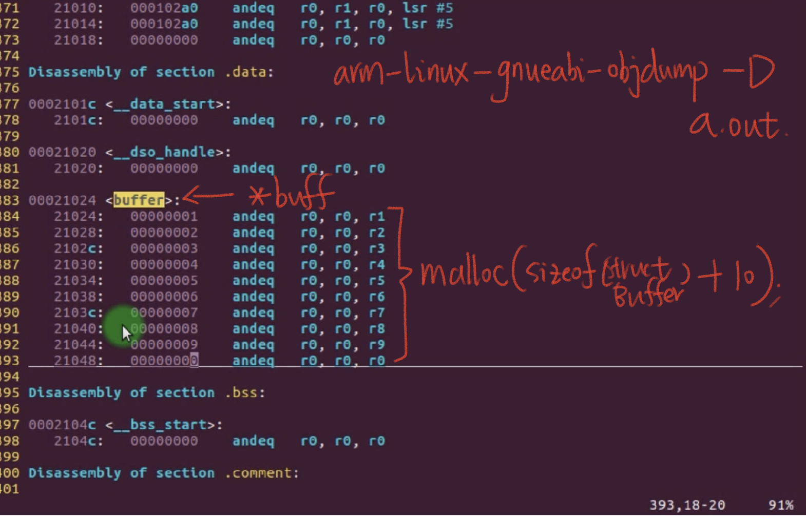

# 5.6 Zero-Length Arrays


```c
struct buffer
{
int len;
char a[0];
};
```

The use of `int a[0]` in the struct definition is a common C programming technique that allows for flexible array members. This technique allows you to allocate additional memory immediately after the struct, essentially creating an array of variable size. 

## Practice



EG: you can see the char a[0] as the char *a, they are return back same address in memory.

## usb.h in Linux kernel about int a[0]

Reference:https://github.com/torvalds/linux/blob/master/include/linux/usb.h  Rows:1605

URB: USB Required Block
ISO: Isochronous

```c
struct urb {
	/* private: usb core and host controller only fields in the urb */
	struct kref kref;		/* reference count of the URB */
	int unlinked;			/* unlink error code */
	void *hcpriv;			/* private data for host controller */
	atomic_t use_count;		/* concurrent submissions counter */
	atomic_t reject;		/* submissions will fail */

	/* public: documented fields in the urb that can be used by drivers */
	struct list_head urb_list;	/* list head for use by the urb's
					 * current owner */
	struct list_head anchor_list;	/* the URB may be anchored */
	struct usb_anchor *anchor;
	struct usb_device *dev;		/* (in) pointer to associated device */
	struct usb_host_endpoint *ep;	/* (internal) pointer to endpoint */
	unsigned int pipe;		/* (in) pipe information */
	unsigned int stream_id;		/* (in) stream ID */
	int status;			/* (return) non-ISO status */
	unsigned int transfer_flags;	/* (in) URB_SHORT_NOT_OK | ...*/
	void *transfer_buffer;		/* (in) associated data buffer */
	dma_addr_t transfer_dma;	/* (in) dma addr for transfer_buffer */
	struct scatterlist *sg;		/* (in) scatter gather buffer list */
	int num_mapped_sgs;		/* (internal) mapped sg entries */
	int num_sgs;			/* (in) number of entries in the sg list */
	u32 transfer_buffer_length;	/* (in) data buffer length */
	u32 actual_length;		/* (return) actual transfer length */
	unsigned char *setup_packet;	/* (in) setup packet (control only) */
	dma_addr_t setup_dma;		/* (in) dma addr for setup_packet */
	int start_frame;		/* (modify) start frame (ISO) */
	int number_of_packets;		/* (in) number of ISO packets */
	int interval;			/* (modify) transfer interval
					 * (INT/ISO) */
	int error_count;		/* (return) number of ISO errors */
	void *context;			/* (in) context for completion */
	usb_complete_t complete;	/* (in) completion routine */
	struct usb_iso_packet_descriptor iso_frame_desc[0];
					/* (in) ISO ONLY */
};
```



Only when this int a [0] is called, the compiler will allocate space for it, which saves memory space