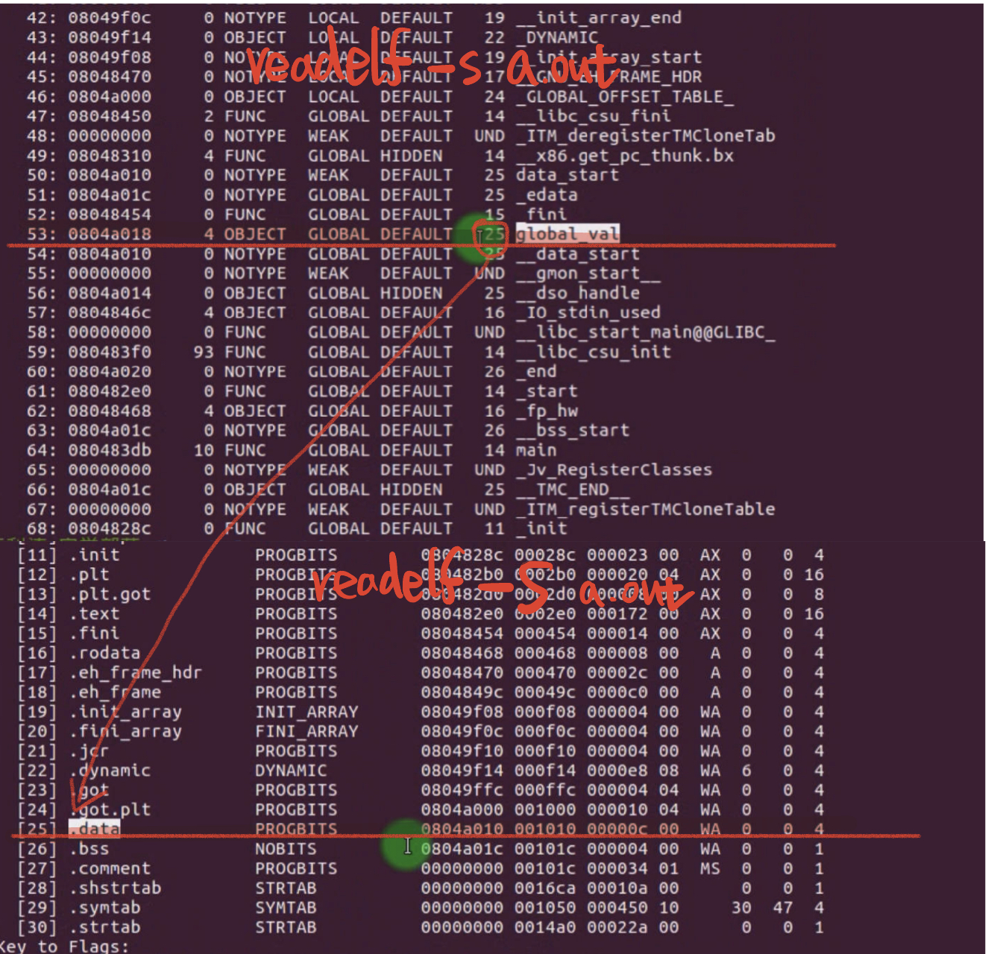
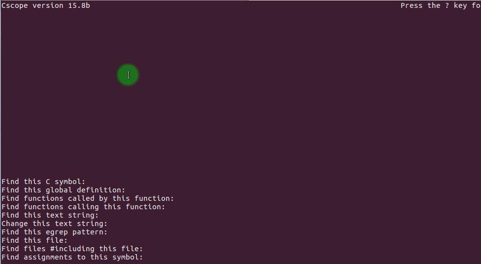
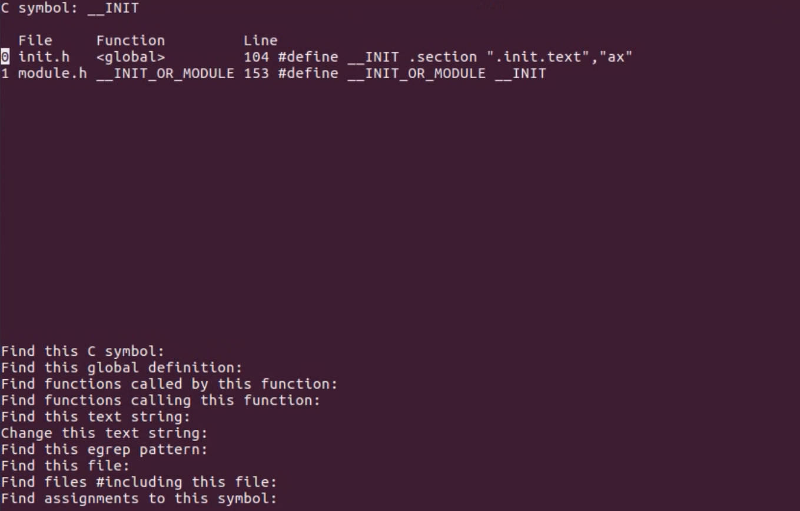
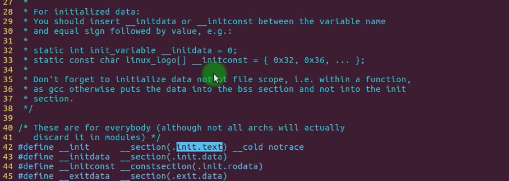
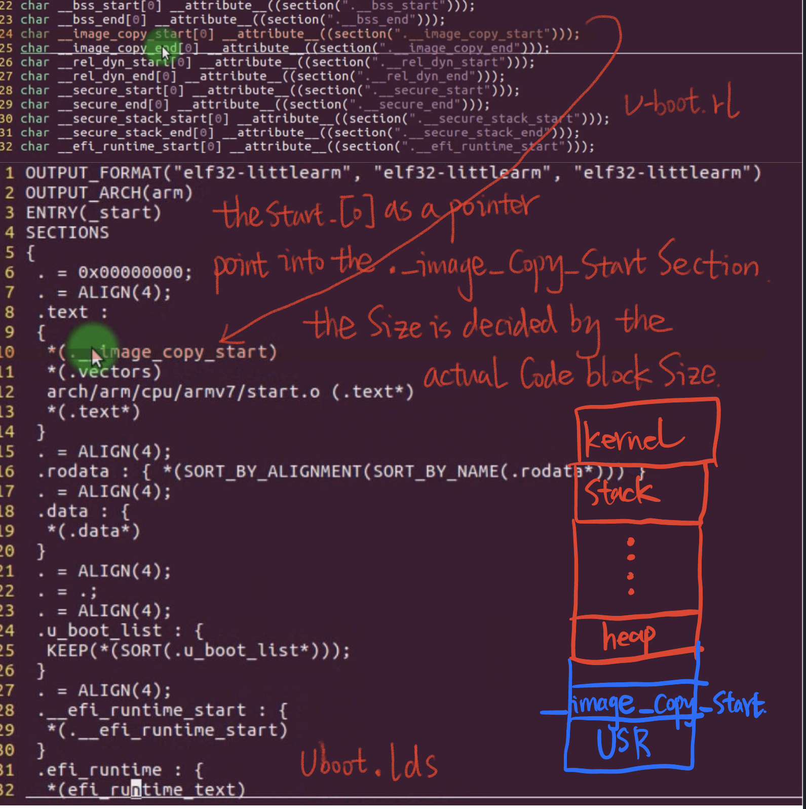

# 5.7 Attribute Declaration

### The main purpose

– Use __attribute__ to declare special attributes of variables and functions  
– instructs the compiler to perform certain aspects of optimization or code inspection  

### Instructions

– Add after the declaration: _ _attribute_ _((ATTRIBUTE))  
– Example: int global_val __attribute __((section(“.data”)));  

## Attribute a Variable to a Special Section

## __init macro in Linux kernel driver

tools: cscope -RK

## U-boot Relocation Process

– Analyze how u-boot copies its own code to RAM  

