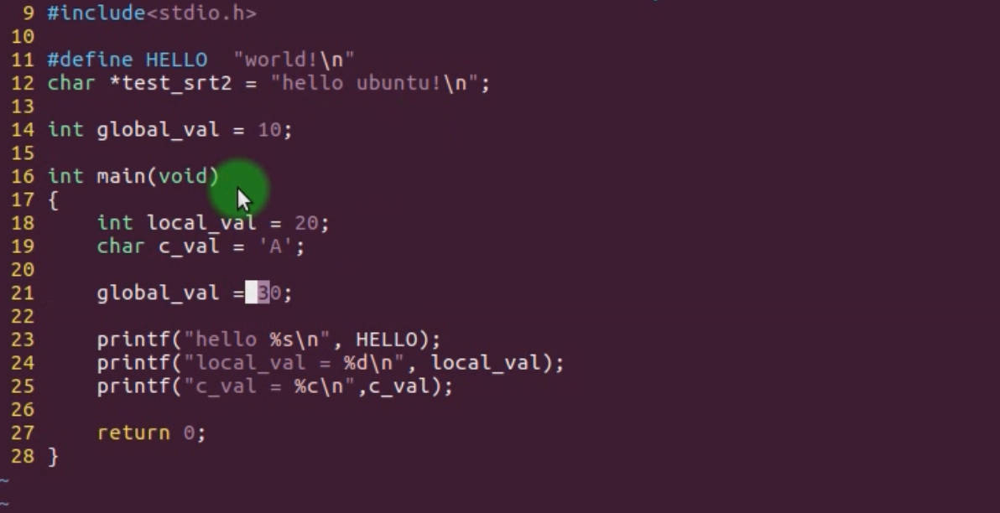
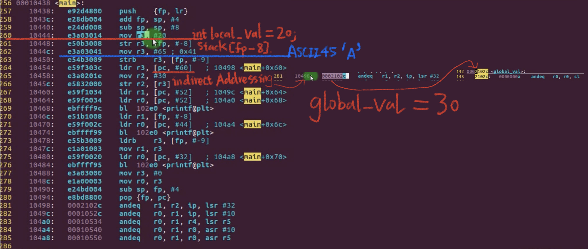
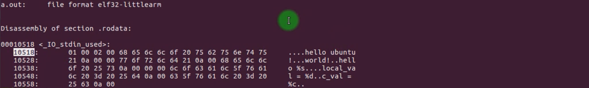
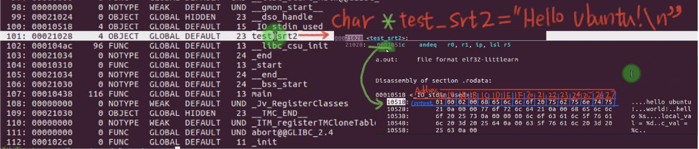
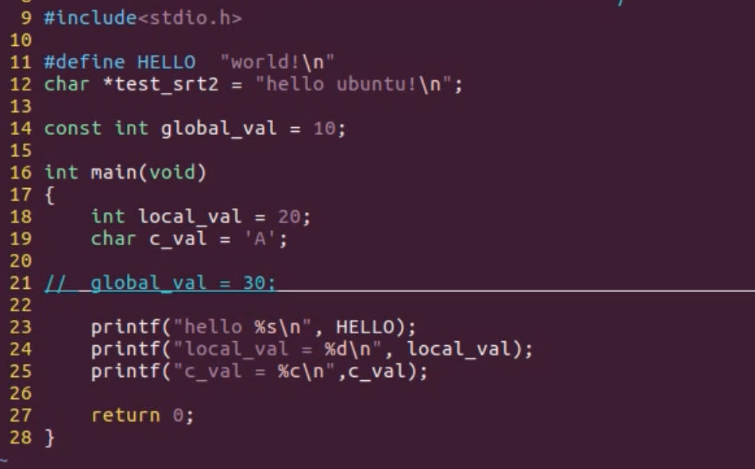
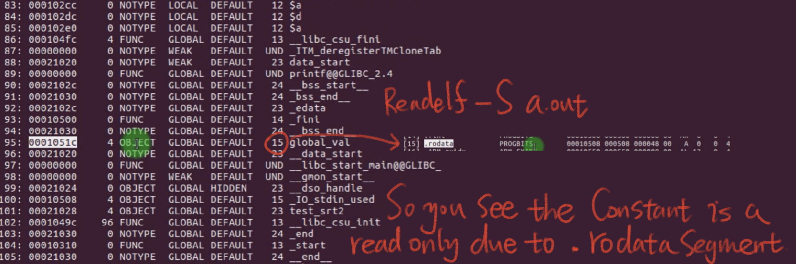
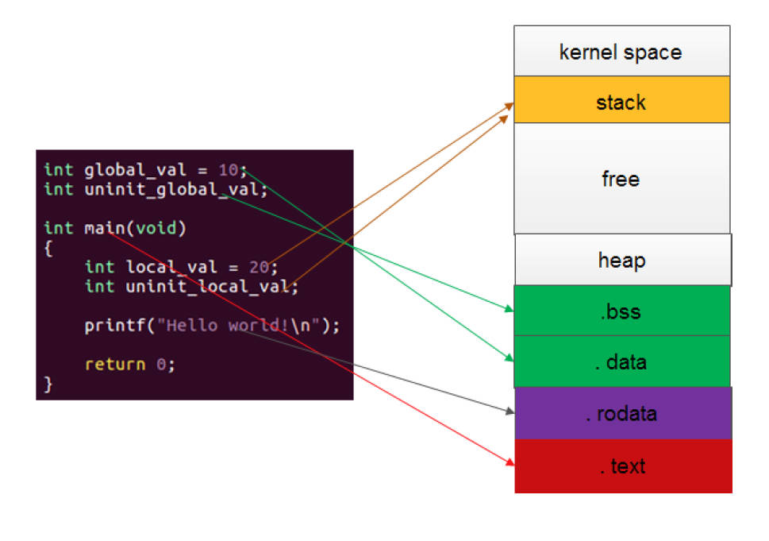

# 6.10 Constant Storage


```c
arm-linux-gnueabi-gcc 6-10.c 
arm-linux-gnueabi-objdump -D a.out
```





```c
arm-linux-gnueabi-objdump -d -j .rodata a.out
```



```
readelf -s a.out // to read the symbol list
```



## Where to store the Const (Read-Only) in the Segment?



```
readelf -s a.out
```



## Summary

