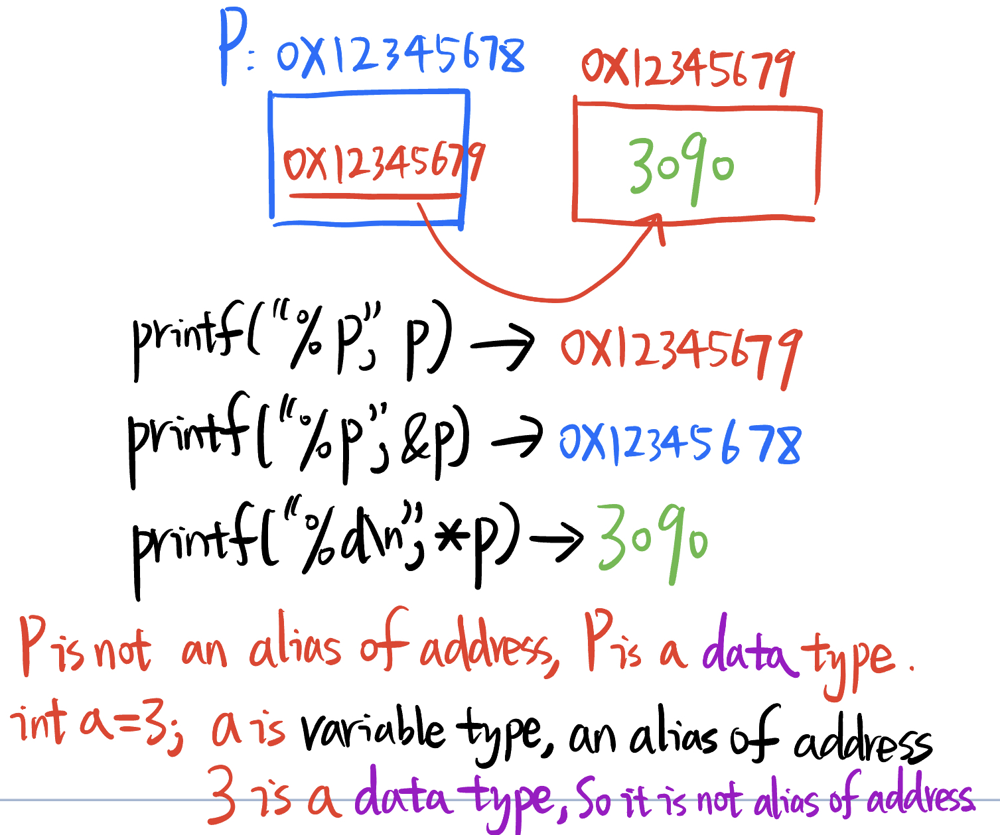

# 6.11 From Variables to Pointer


## What is the Heap Used for?


heap is used as the dynamic storage allocation area at program runtime.

Reference: https://iq.opengenus.org/dynamic-vs-static-memory-allocation-in-c/

## Memory Classification According to Runtime

### Dynamic Storage Allocation:

- Dynamic storage allocation involves the allocation of memory at runtime, which means that the size and location of memory are determined during the execution of a program.
- This type of memory allocation is particularly useful when you need to work with data structures that can grow or shrink during program execution, such as linked lists, arrays with variable sizes, or objects created using dynamic memory allocation functions like `malloc` (in C/C++) or `new` (in C++).
- Dynamic memory allocation allows for efficient utilization of memory, as memory is allocated only when needed, and it can be released when no longer required, preventing memory wastage.
- However, improper management of dynamic memory can lead to issues like memory leaks (unreleased memory) or fragmentation (unused memory fragments scattered throughout the heap).

### Static Storage Allocation:

- Static storage allocation involves reserving memory for data and variables at compile-time or before program execution begins. The size and location of memory are determined during the compilation phase and are typically fixed throughout the program's execution.
- In statically allocated memory, the memory layout is determined in advance, and the program's variables are assigned specific memory addresses that are known at compile-time.
- This type of memory allocation is commonly used for global variables, static variables, and constants, as well as for data structures with a fixed size and known at compile-time, such as arrays with a constant size.
- Static storage allocation is generally more efficient in terms of access times because the memory addresses are known in advance, but it can be less flexible than dynamic allocation when dealing with data structures that need to grow or change in size.


## Pointer is a data type From Derived Data types


## What type is it when Storage?

```c
#include<stdio.h>


int i  = 10;
int *p = &i;

int func(void)
{
	return 0;
}


int main(void)
{
	i  = 20;
	*p = 30;
	return 0;
}
```


 Reference: https://www.geeksforgeeks.org/function-pointer-in-cpp/

```c++

// C++ program to implementation
// Function Pointer
#include <iostream>
using namespace std;
 
int multiply(int a, int b) { return a * b; }
 
int main()
{
    int (*func)(int, int);
 
    // func is pointing to the multiplyTwoValues function
 
    func = multiply;
 
    int prod = func(15, 2);
    cout << "The value of the product is: " << prod << endl;
 
    return 0;
}
```

## Pointer Type

```c
#include <stdio.h>
int main(void)
{
int * p;
char * q;
printf("%d\n", sizeof (int *));
printf("%d\n", sizeof (char *));
printf("%d\n", sizeof (long *));
return 0;
}
```

no matter which data type the Pointer point to, the address is 32bits under STM32, so the pointer size is decided by the length of the address, the pointer size always be 4 Bytes.

## Pointer == Address?



Distinguish Data type and Variable Type

References: https://vitalflux.com/data-variables-types-uses-in-data-science/


## Example : Assembly Layout to distinguish Indirect Addressing & Direct Addressing


## Why use pointers?

• Anonymous access to dynamic memory  
• Parameter passing (array, structure, large buffer)  
• The implementation of dynamic data structures such as linked lists and trees cannot be achieved without pointers  
• String pointer  
• Function pointer  