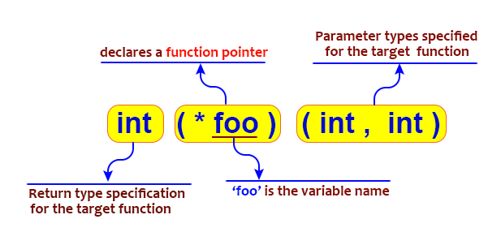
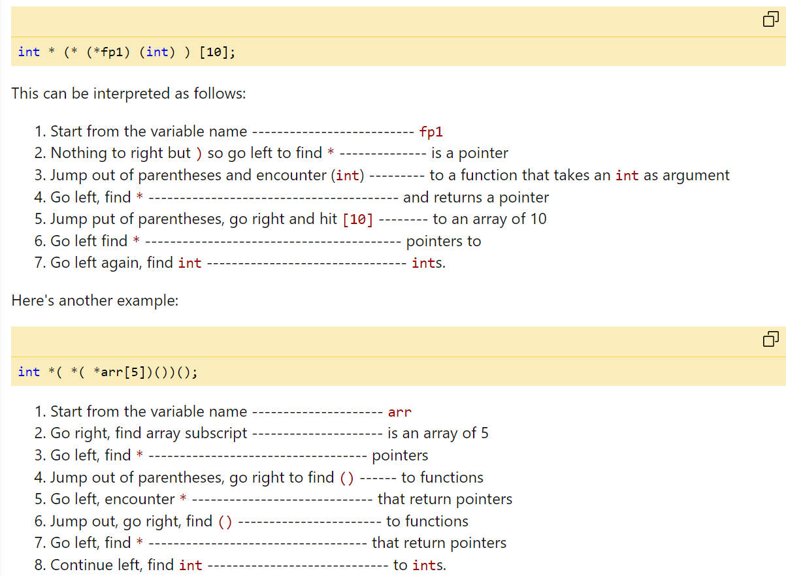

# 6.12 Complex Pointer Declaration 


## Pointer Type Classification

### Function Pointer 

Reference: https://www.w3resource.com/c-programming/c-pointers-and-functions.php



```c
int myFunction() {
    return 42;
}

int main() {
    int (*foo)(); // Declare a pointer to a function returning int
    foo = myFunction; // Assign it to myFunction
    int result = foo(); // Call the function through the pointer
    printf("%d\n", result); // This will print "42"
    return 0;
}
```

### Object Pointer

```c
–char *
–int *
–long *
–struct *
```

### void *

1. **Void**: "Void" is a keyword in C and C++ used to represent the absence of a type. It's often used as the return type of functions that don't return a value (e.g., `void` functions).
2. `*`: The asterisk `*` is used to declare a pointer.

So, `void*` is a pointer that doesn't have a specific data type associated with it. It can be used to point to objects of different data types, and it's often used when you want to work with data in a more generic or flexible way.

```c
#include <stdio.h>

int main() {
    int x = 42;
    double y = 3.14;

    void* ptr;

    ptr = &x; // Store the address of x in a void pointer
    printf("Value of x: %d\n", *(int*)ptr); // Cast back to int* to dereference

    ptr = &y; // Store the address of y in the same void pointer
    printf("Value of y: %lf\n", *(double*)ptr); // Cast back to double* to dereference

    return 0;
}
```

## Pointer Operator

### Operators related to pointers

• Pointer declaration: int *  
• Address operator: &  
• Indirect access operator: *  
• Post-increment and decrement operators: ++, --  
• Member selection operators: ., ->  

#### **Dot Operator (`.`)**: This operator is used to access members of a structure or a class when you have an instance of that structure or class. It is used with an object or variable of the structure or class type. Here's the syntax:

```c
struct MyStruct {
    int value;
    char name[20];
};

struct MyStruct instance;
instance.value = 42;
strcpy(instance.name, "Hello");

printf("Value: %d\n", instance.value); // Accessing the 'value' member
printf("Name: %s\n", instance.name);   // Accessing the 'name' member
```

#### **Arrow Operator (`->)**: This operator is used to access members of a structure or a class when you have a pointer to that structure or class. It is often used when dealing with a pointer to access the Function name.

```c
truct MyStruct {
    int value;
    char name[20];
};

struct MyStruct *ptr = malloc(sizeof(struct MyStruct));
ptr->value = 42;
strcpy(ptr->name, "Hello");

printf("Value: %d\n", ptr->value); // Accessing the 'value' member using '->'
printf("Name: %s\n", ptr->name);   // Accessing the 'name' member using '->'

free(ptr); // Don't forget to free dynamically allocated memory when done
```

### Operator Precedence:

• Level 1: [] () . -> ++ --  
• Level 2: ++ -- * &  
• SHE -> name  

## Guidelines for Reading Complex Pointer Structure

### 右左法则

### From right To left guideline

The right-left rule: Start reading the declaration from the innermost parentheses, go right, and then go left. When you encounter parentheses, the direction should be reversed. Once everything in the parentheses has been parsed, jump out of it. Continue till the whole declaration has been parsed.

首先从最里面的圆括号（未定义标识符）看起，然后往右看，再往左看。每当遇到圆括号时，就应该掉转阅读方向。一旦解析完圆括号里面所有的东西，就跳出圆括号。重复这个过程直到整个声明解析完毕。

References: https://blog.csdn.net/Diligent_wu/article/details/123335432

### The right-left rule [Important]

References: https://www.codeproject.com/Articles/7042/How-to-interpret-complex-C-C-declarations



## Practice

1. `*p++;`: This expression increments the pointer `p` and then dereferences it. It's equivalent to `*(p++)`, meaning it first increments the pointer `p` and then accesses the value it pointed to before the increment.
2. `&p++;`: This is not valid. You cannot increment the address of a pointer like this. The `&` operator is used to obtain the address of a variable, but you cannot apply the increment operator (`++`) directly to it.
3. `&stu.a`: This takes the address of the member `a` of the structure `stu`. It's used to get a pointer to that specific member within the structure.
4. `int *a[10];`: This declares an array of 10 pointers to integers. It's an array where each element is a pointer to an integer.
5. `int (*a)[10];`: This declares a pointer `a` to an array of 10 integers. It's a pointer that can point to an entire array of integers.
6. `int *f(int);`: This declares a function `f` that takes an `int` as an argument and returns a pointer to an `int`.
7. `int (*f)(int);`: This declares a pointer `f` to a function that takes an `int` as an argument and returns an `int`.
8. `int *(*f)[10];`: This declares a pointer `f` to an array of 10 pointers to integers. It's a pointer that can point to an entire array of pointers to integers.
9. `int *(*(*f)(int))[10];`: This is a pointer `f` to a function that takes an `int` as an argument and returns a pointer to an array of 10 pointers to integers. It's a complex declaration that involves function pointers and arrays.