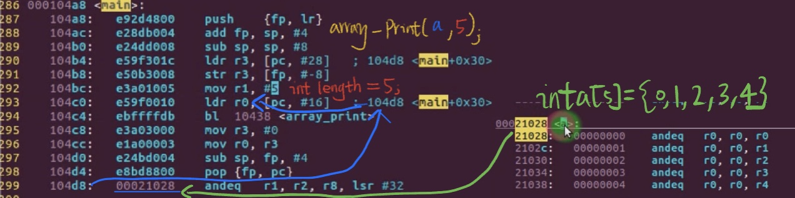
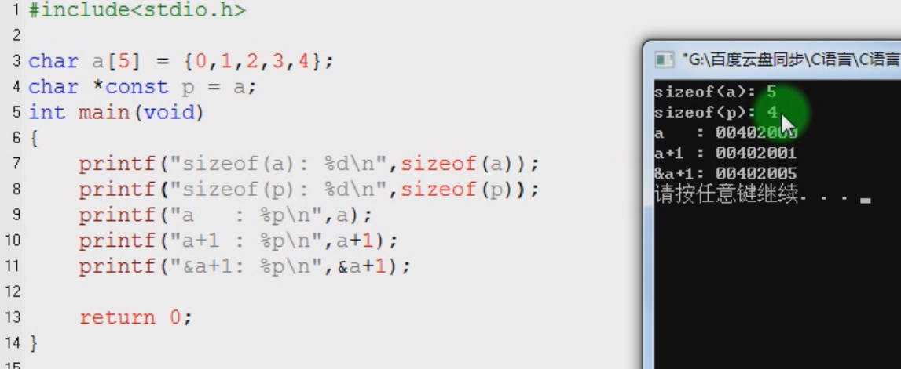
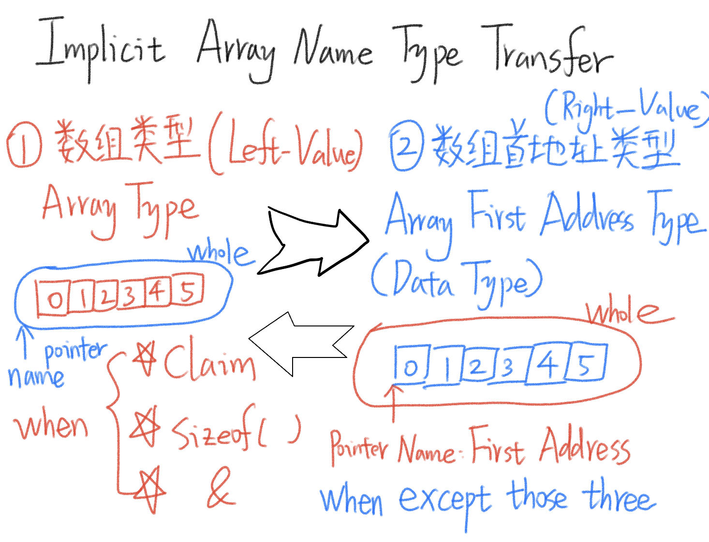
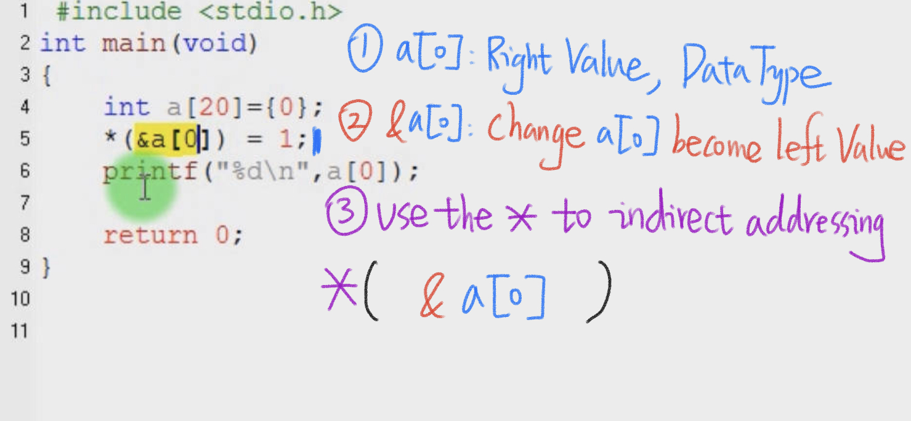

# 6.15 Pointer and Array Name


## Is the array name a constant pointer?

In C and C++, an array name is not a constant pointer, but it can decay into a pointer in certain situations.

**Array Name as a Constant Pointer:** The array name itself is not a constant pointer. It's actually a constant memory address that points to the first element of the array. This address cannot be changed. 

```c
int arr[5] = {1, 2, 3, 4, 5};
int *ptr = arr; // Valid, assigns the address of the first element to ptr
```

**Array Decay to a Pointer:** In most contexts, when you use the array name, it decays into a pointer to its first element. This means that if you pass an array to a function, what the function receives is actually a pointer to the first element of the array.

```c
void someFunction(int arr[]) {
    // ...
}
```

## When the array is a function parameter, the array name == constant pointer?

When an array is used as a function parameter in C or C++, the array name is treated as a pointer to its first element. However, it is not a constant pointer in the sense that you can't modify the address it holds

## Experiment

```c
#include<stdio.h>
int a[5] = {0,1,2,3,4};

void array_print(int array[5], int len)
{
	int i;
	for(i=0;i<len;i++)
		printf("array[%d] = %d\n",i,array[i]);
}

int main(void)
{
	int i;
	int *p = a;
	array_print(a,5);
}
```

 

So you can see the array name is sent as an address of a continuous array.

## Array Name Type

• char a[5];  
• char *const p;  
• Array name type: char [5]  
• Pointer constant type: char *const  
• &a type: char(*)[5]  



1. `a+1`:
   - `a` is an array of `char` with 5 elements, so `a+1` means moving one `char` (1 byte) ahead in memory from the address of `a[0]`.
   - The address of `a[0]` is `00402000` (the actual address may vary depending on your system).
   - Therefore, `a+1` is `00402001`. This is why you see `a+1 : 00402001` printed twice.
2. `&a+1`:
   - `&a` is the address of the entire array `a`, which is `00402000`.
   - When you add `1` to it, you are moving ahead by the size of the entire array, which is `5 * sizeof(char)` or `5` bytes.
   - So, `&a+1` is `00402005`. This is why you see `&a+1 : 00402005` printed.

## Implicit Conversion of Array Names

### The address of the first element of the array

• Pointer is an r-value, which means the pointer is a data type only exists on the right side of the equal symbol  
•  we can use asterisk * to use the pointer p on the right side: int *p = a;

```c
int a[20];
int b[4][20]

int *p = a; // a is converted to &a[0]
int (*q)[20] = a; // a is converted to &b[0]
```

```c
int a[5] = {...}; //declaration 

int main ()
{
	int a [5] = {1, 3, 5, 7, 5}; // Compile Failed, due to now the int a[5] is a left  Value.
}
```



## When the a[0] array is a right value, how to change it into writable left value?

