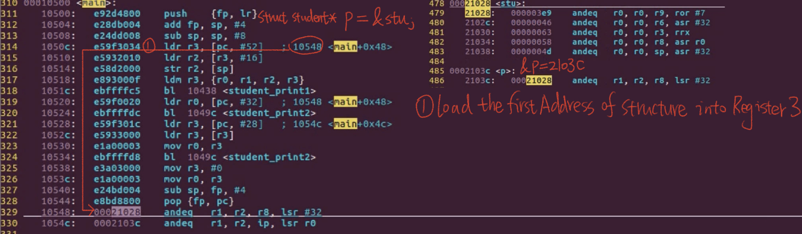
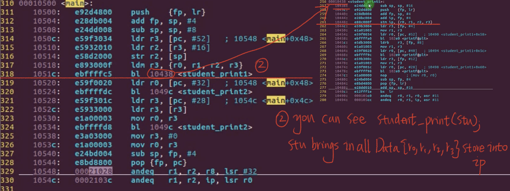
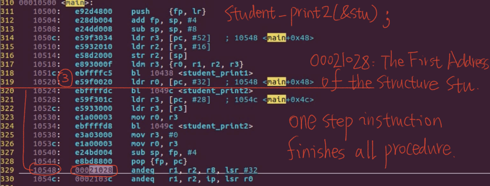
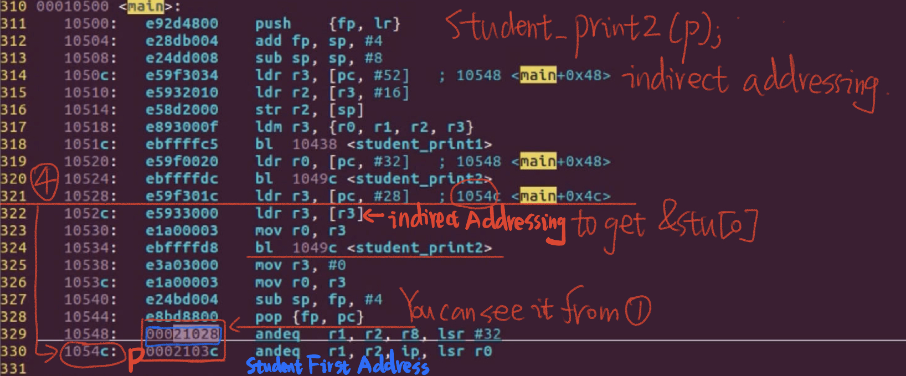

# 6.17 Pointer and Structure


## Operators Related to Pointers and Structures

**Member access operator (.)**: The member access operator (.) is used to access members of a structure or class directly. Here's an example in C++:

```c
#include <iostream>
using namespace std;

struct Student {
    int rollNumber;
    string name;
};

int main() {
    Student student;
    student.rollNumber = 101;
    student.name = "John";

    cout << "Roll Number: " << student.rollNumber << ", Name: " << student.name << endl;

    return 0;
}

```

**Member indirect access operator (->)**: The member indirect access operator (->) is used to access members of a structure or class through a pointer. Here's an example in C:

```c
#include <stdio.h>

struct Student {
    int rollNumber;
    char name[50];
};

int main() {
    struct Student student; 
    struct Student* studentPtr = &student; 

    studentPtr->rollNumber = 101;
    strcpy(studentPtr->name, "Alice");

    printf("Roll Number: %d, Name: %s\n", studentPtr->rollNumber, studentPtr->name);

    return 0;
}
```

**Address of structure members (&stu.num)**: You can use the address-of operator (&) to get the address of a structure member. Here's an example in C:

```c
#include <stdio.h>

struct Student {
    int rollNumber;
    char name[50];
};

int main() {
    struct Student student;
    int* rollNumberPtr = &student.rollNumber;

    printf("Address of rollNumber: %p\n", rollNumberPtr);

    return 0;
}

```


Sure, here are examples for each of the operators you mentioned:

**Member access operator (.)**: The member access operator (.) is used to access members of a structure or class directly. Here's an example in C++:

```c
cppCopy code#include <iostream>
using namespace std;

struct Student {
    int rollNumber;
    string name;
};

int main() {
    Student student;
    student.rollNumber = 101;
    student.name = "John";

    cout << "Roll Number: " << student.rollNumber << ", Name: " << student.name << endl;

    return 0;
}
```

In this example, we create a `Student` struct and access its `rollNumber` and `name` members using the member access operator (.).

**Member indirect access operator (->)**: The member indirect access operator (->) is used to access members of a structure or class through a pointer. Here's an example in C:

```c
cCopy code#include <stdio.h>

struct Student {
    int rollNumber;
    char name[50];
};

int main() {
    struct Student student;
    struct Student* studentPtr = &student;

    studentPtr->rollNumber = 101;
    strcpy(studentPtr->name, "Alice");

    printf("Roll Number: %d, Name: %s\n", studentPtr->rollNumber, studentPtr->name);

    return 0;
}
```

In this example, we create a `Student` struct, a pointer `studentPtr` to the struct, and access its members using the member indirect access operator (->).

**Address of structure members (&stu.num)**: You can use the address-of operator (&) to get the address of a structure member. Here's an example in C:

```c
cCopy code#include <stdio.h>

struct Student {
    int rollNumber;
    char name[50];
};

int main() {
    struct Student student;
    int* rollNumberPtr = &student.rollNumber;

    printf("Address of rollNumber: %p\n", rollNumberPtr);

    return 0;
}
```

In this example, we obtain the address of the `rollNumber` member of the `Student` struct.

**Increment of structure members (++stu.num, stu.num++)**: You can increment structure members just like you would with regular variables. Here's an example in C++:

```c
#include <iostream>
using namespace std;

struct Counter {
    int value;
};

int main() {
    Counter counter;
    counter.value = 5;

    // Increment the value member
    counter.value++; // Increment after using the current value
    ++counter.value; // Increment before using the current value

    cout << "Updated Value: " << counter.value << endl;

    return 0;
}
```

**Indirect access operator (\*stu.p)**: The indirect access operator (*) is used to access the value pointed to by a pointer to a structure member. Here's an example in C:

```c
#include <stdio.h>

struct Student {
    int rollNumber;
    char name[50];
};

int main() {
    struct Student student;
    struct Student* studentPtr = &student;

    studentPtr->rollNumber = 101;
    strcpy(studentPtr->name, "Bob");

    printf("Roll Number (via pointer): %d\n", studentPtr->rollNumber);
    printf("Name (via pointer): %s\n", studentPtr->name);

    return 0;
}
```

### Example

```c
#include <stdio.h>
 
 struct student{
 	int num;
 	char sex;
 	char name[10];
 	int age;
 }; 
 
int main(void)
{
	struct student stu={1001,'F',"jim",20};
	printf("stu.num : %d\n",stu.num);
	printf("stu.sex : %c\n",stu.sex);
	printf("stu.name:%s\n", stu.name);
	printf("stu.age : %d\n",stu.age);
	puts("\n");	

	struct student * p;
	p = &stu;
	printf("(*p).num : %d\n",(*p).num);
	printf("(*p).sex : %c\n",(*p).sex);
	printf("(*p).name:%s\n", (*p).name);
	printf("(*p).age : %d\n",(*p).age);
	puts("\n");
	
	printf("p->num : %d\n",p->num);
	printf("p->sex : %c\n",p->sex);
	printf("p->name:%s\n", p->name);
	printf("p->age : %d\n",p->age);
	puts("\n");		
	return 0; 
}
```

### Example:  Structure  Nesting  & Pointer

```c
#include <stdio.h>
 struct scores{
 	unsigned int chinese;
 	unsigned int english;
 	unsigned int math;
 };
 struct student{
 	unsigned int stu_num;
 	unsigned int score;
 }; 
struct teacher{
	unsigned int work_num;
	unsigned int salary;
};
struct people{
	char sex;
	char name[10];
	int age;
	struct student *stup;
	struct teacher ter; 
};
int main1(void)
{
	struct student stu={1001,99};
	struct teacher ter={8001,8000};
	struct people jim ={'F',"JimGreen",20,&stu,0};
	struct people jack ={'F',"Jack",50,NULL,ter};		
	struct people *p;
	p = &jim;
	printf("Jim score:%d\n",jim.stup->score);
	printf("Jim score:%d\n",p->stup->score);
	
	p = &jack;
	printf("Jack salary:%d\n",jack.ter.salary);
	printf("Jack salary:%d\n",p->ter.salary);
	return 0; 
}
int main(void)
{
	struct student stu={1001,99};
	struct teacher ter={8001,8000};
	struct people a[2]={{'F',"JimGreen",20,&stu,0 }, {'F',"JackMa",50,0,ter }};
	struct people *p;
	p = a;
	printf("Jim score:%d\n",a[0].stup->score++);
	printf("Jim score:%d\n",++p[0].stup->score);
	printf("Jim score:%d\n",p->stup->score++);
		
	printf("Jack salary:%d\n",a[1].ter.salary++);
	printf("Jack salary:%d\n",p[1].ter.salary++);
	printf("Jack salary:%d\n",(p+1)->ter.salary++);
	return 0;
}
```

## Implementation of Structure Pointer 

### Function Parameter Passing

#### Structure variables as function parameters  

Structures (also known as structs in some programming languages) allow you to group multiple variables of different data types under a single name. Each variable inside a structure is called a member or field. Using structure variables as function parameters involves passing an entire structure (or an instance of it) to a function as an argument.

```c
#include <stdio.h>

// Define a structure
struct Point {
    int x;
    int y;
};

// Function that takes a structure as a parameter
void printPoint(struct Point p) {
    printf("x = %d, y = %d\n", p.x, p.y);
}

int main() {
    // Create a structure variable
    struct Point myPoint = { 10, 20 };

    // Call the function with the structure as an argument
    printPoint(myPoint);

    return 0;
}

```

#### Structure Pointer as Function Parameter  

Structure pointers, as the name suggests, are pointers that point to structures. They are often used when you want to pass a reference to a structure to a function rather than making a copy of the entire structure. This is particularly useful when dealing with large data structures or when you want to modify the original data inside the function.

```c
#include <stdio.h>

// Define a structure
struct Point {
    int x;
    int y;
};

// Function that takes a pointer to a structure as a parameter
void modifyPoint(struct Point *p) {
    p->x += 5;
    p->y += 5;
}

int main() {
    // Create a structure variable
    struct Point myPoint = { 10, 20 };

    // Call the function with a pointer to the structure
    modifyPoint(&myPoint);

    // The original structure has been modified
    printf("x = %d, y = %d\n", myPoint.x, myPoint.y);

    return 0;
}
```

### Example:

```c
#include<stdio.h>

struct student{
	unsigned int num;
	char sex;
	unsigned int chinese;
	unsigned int english;
	unsigned int math;
};

void student_print1(struct student stu)
{
	printf("num : %d\n", stu.num);
	printf("num : %c\n", stu.sex);
	printf("Score : %d\n", stu.chinese);
}

void student_print2(struct student* stup)
{
	printf("num : %d\n", stu->num);
	printf("num : %c\n", stu->sex);
	printf("Score : %d\n", stu->chinese);
}

struct student stu = {1001,'F',99,88,77};
struct student *p = &stu;

int main(void)
{
	student_print1(stu);
	student_print2(&stu);
	student_print2(p);
	return 0;
}
```







