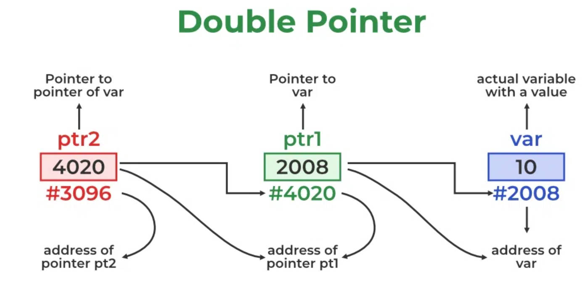
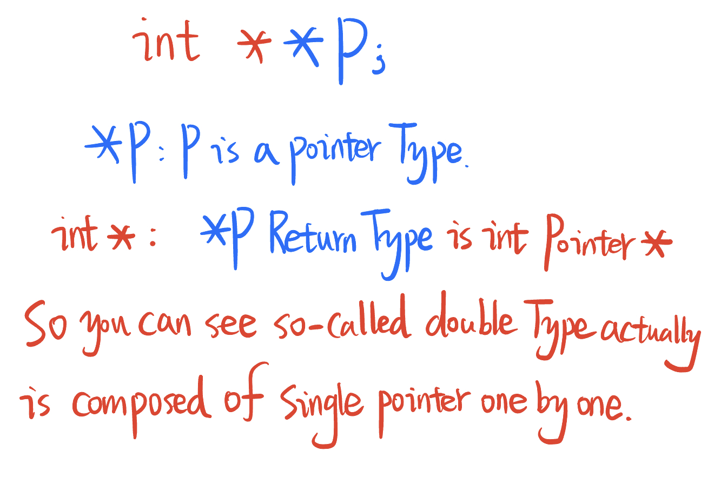
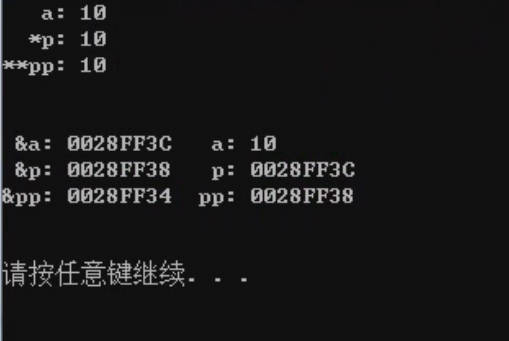
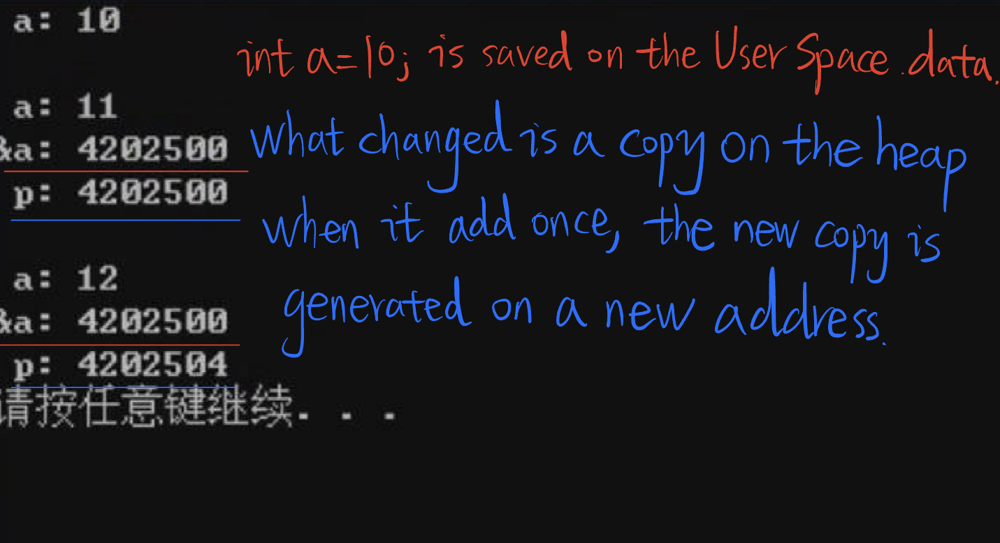
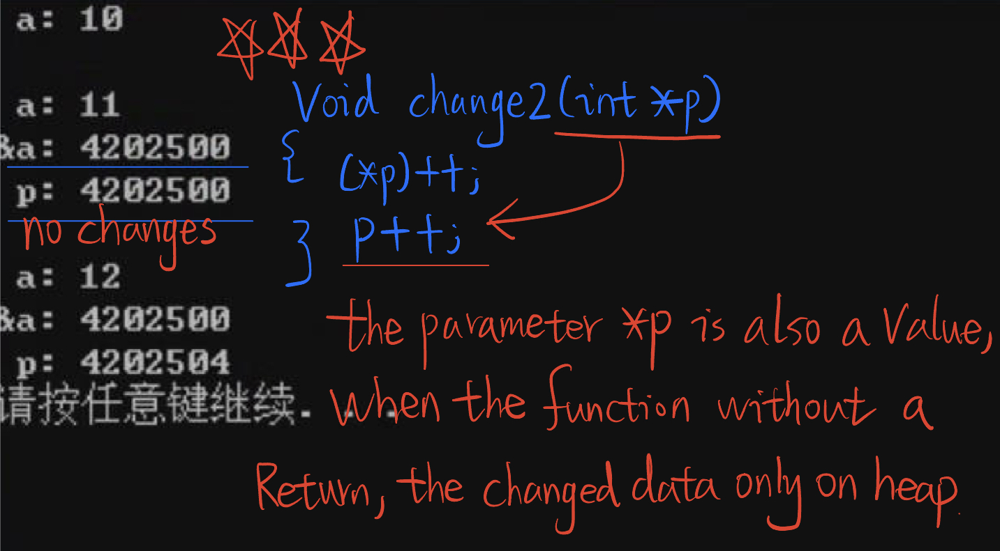
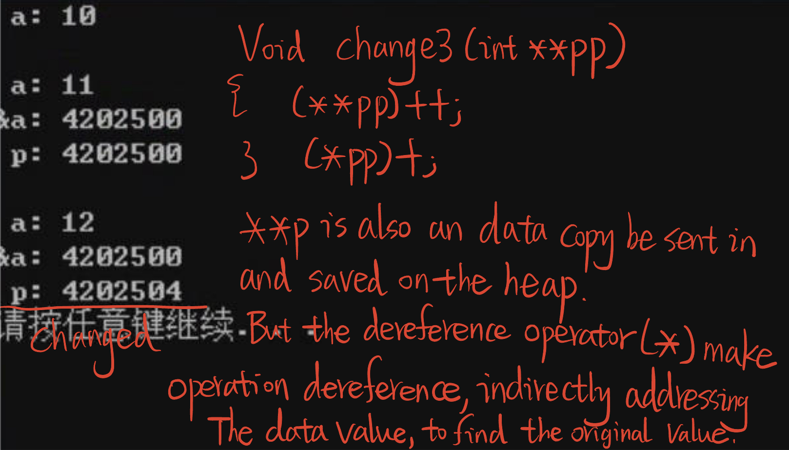
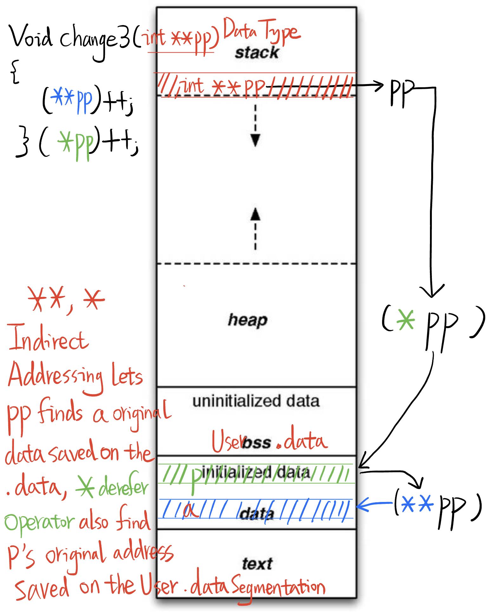

# 6.18 Double Pointer: Modify the Pointer Variable


## Double Pointer

References: https://www.geeksforgeeks.org/c-pointer-to-pointer-double-pointer/



### Example

```c
#include <stdio.h>
int main(void)
{
	int a = 10;
	int *p = &a; int *p = &a;
	int **pp = &p; int **p =&p; 
	printf("   a: %d\n",a);
	printf("  *p: %d\n",*p);
	printf("**pp: %d\n",**pp);
	puts("\n");
	
	printf(" &a: %p   a: %d\n",&a,a);
	printf(" &p: %p   p: %p\n",&p,p);
	printf("&pp: %p  pp: %p\n",&pp,pp);
	puts("\n");
	
	return 0;
} 
```





## Where are double pointers mainly used?

• Modify pointer variable value  
• Passing parameters through pointer array

```c
#include <stdio.h>
 
 void change(int i)
 {
	i++;
 }
 void change2(int *p) //Pointer Variables
 {
 	(*p)++;
 	p++;
 } 
 void change3(int **pp)
 {
 	(**pp)++;
 	(*pp)++;
 }
  
int a = 10; // .data
int *p = &a; //global variable so it save on the segmentaion .data
int main(void)
{
	change(a); //Can not change the original a value because the change() without return. The a copy is saved on the heap .data, the copy .a is changed but without return, the a original value on the .data is not change. After this change() function is executed, the occupied memory is terminated and recycled by compiler, preparing for next funcion.  
	printf(" a: %d\n",a);
	puts("");
	 
	change2(p); // can change a's original value, because the p is a pointer, Directly point to the original value.
    //Pointer Vatiable.
	printf(" a: %d\n",a);
	printf("&a: %d\n",&a);
	printf(" p: %d\n",p);
	puts("");
	
	change3(&p);
	printf(" a: %d\n",a);
	printf("&a: %d\n",&a);
	printf(" p: %d\n",p);			
	return 0;
} 

```







## Summary: 

Operate `*` in the function body using the arguments, indirectly addressing to the original value which saved on the user space, .data.

