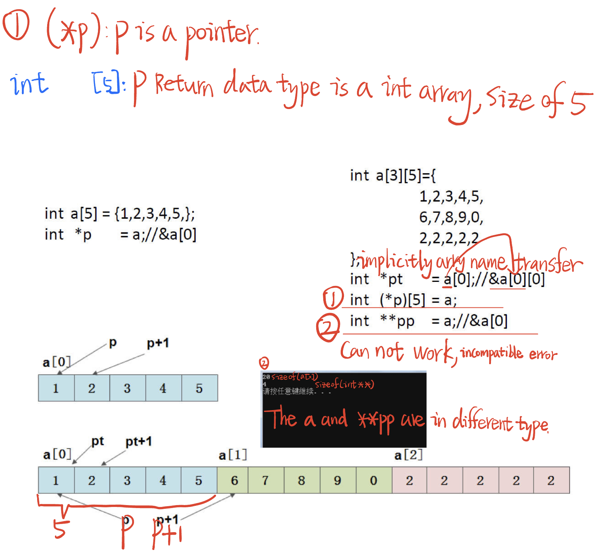

# 6.20 Double Pointers: Two-dimensional Array


## Use Pointer to Access the Array

```c
#include <stdio.h>
void array_print1(int a[],int len);
void array_print(int(*a)[5],int len)
{
	int i,j;
	for(i=0;i<len;i++)
	{
		for(j=0;j<5;j++)
			printf("%d ",a[i][j]);
		printf("\n");
	}
	puts(""); 
}

int a[3][5]={
	1,2,3,4,5,
	6,7,8,9,0,
	2,2,2,2,2
};
int main(void)
{
	int i,j;
	
	int (*p)[5]; // a is 5 size, p is also a 5 size, data size coherence.
	p = a;//&a[0]
	for(i=0;i<3;i++)
	{
		for(j=0;j<5;j++)
			printf("%d ",p[i][j]);
		printf("\n");
	}
	puts("");
	
	// the p and the pp are both 5 int inside, data type coherence.
	int (**pp)[5] = &p; // *p's indirect addressing
	for(i=0;i<3;i++)
	{
		for(j=0;j<5;j++)
			printf("%d ",(*pp)[i][j]); // *p's indirect addressing
		printf("\n");
	}
	puts("");
		
	int *pt = a[0];//&a[0][0]	
	for(i=0;i<3;i++)
	{
		for(j=0;j<5;j++)
//			printf("%d ",pt[5*i+j]);
			printf("%d ",*(pt+i*5+j));
		printf("\n");
	}
	puts("");	 

	array_print(a,3);//&a[0]	
	
	return 0;
}
```



## When an array is used as a parameter, the format of the parameter type

| Argument     | Parameter                                   |
| ------------ | ------------------------------------------- |
| int a[5]     | f( int a[ ], int len) / f( int *p, int len) |
| int *a[5]    | f( **p) / f( int *a[] )                     |
| int (*p)[5]  | f( int *a[] )                               |
| int a[4] [5] | f( int (*p)[5] )                            |
| int **p      | f( int **p )                                |

`int *a[5]`: This declares an array of 5 pointers to integers. In other words, it's an array where each element is a pointer to an integer. You can think of it as an array of 5 separate integer pointers.

`int (*a)[5]`: This declares a pointer to an array of 5 integers. In this case, you have a single pointer that points to the beginning of an array containing 5 integers.

Example usage:

```c
int arr[5] = {1, 2, 3, 4, 5};
int (*a)[5] = &arr; // Declares a pointer to an array of 5 integers and initializes it with the address of 'arr'
```

In summary, the difference lies in the grouping of the asterisk (*). In "int *a[5]", the asterisk is associated with each element of the array, making it an array of integer pointers. In "int (*a)[5]", the asterisk is associated with the entire variable, making it a pointer to an array of integers.