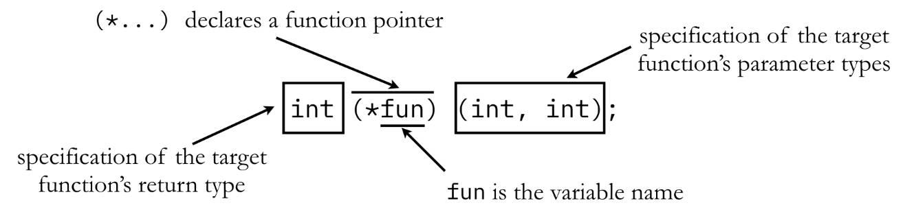
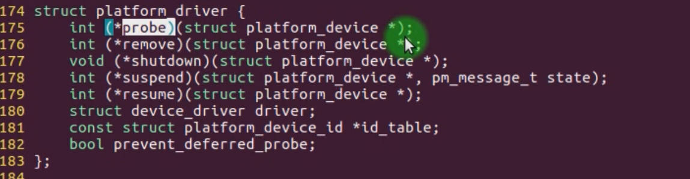

# 6.21 Pointer Function & Function Pointer


## Pointer Type

**Object Pointer**:

An object pointer is a pointer that points to data objects, such as variables or instances of a class. It is used to access and manipulate the data stored at a specific memory location.

```c
int x = 10; // Declare an integer variable
int *ptr = &x; // Object pointer pointing to 'x'

// Access the value of 'x' using the pointer
int value = *ptr;
```

**Function Pointer**:

A function pointer is a pointer that points to functions instead of data. It allows you to call functions dynamically at runtime by using the pointer.

```c
#include <stdio.h>

// Define two functions with the same signature
void add(int a, int b) {
    printf("Addition: %d + %d = %d\n", a, b, a + b);
}

void subtract(int a, int b) {
    printf("Subtraction: %d - %d = %d\n", a, b, a - b);
}

int main() {
    // Declare a function pointer type for functions with two integer parameters
    typedef void (*Operation)(int, int);

    // Declare function pointers and initialize them with the functions
    Operation operationPtr1 = add;
    Operation operationPtr2 = subtract;

    // Use the function pointers to call the functions dynamically
    operationPtr1(10, 5); // Calls 'add'
    operationPtr2(10, 5); // Calls 'subtract'

    return 0;
}
```

In this example, we define two functions, `add` and `subtract`, both of which take two integer parameters. We then declare a function pointer type `Operation` that represents functions with this signature. We create two **function pointers**, `operationPtr1` and `operationPtr2`, and initialize them with the addresses of the `add` and `subtract` functions, respectively. Finally, we use these function pointers to call the functions dynamically, resulting in different operations being performed based on which function pointer is used.

**void\* Pointer**:

A `void*` (void pointer) is a generic pointer that can be used to point to data of any data type. It doesn't have a specific data type associated with it, which makes it versatile but requires explicit casting when dereferencing.

```c
int x = 10;
double y = 3.14;

void *genericPtr; // Declare a void pointer

// Point it to an integer
genericPtr = &x;
int *intPtr = (int *)genericPtr; // Cast it to the appropriate type
printf("Value of x: %d\n", *intPtr);

// Point it to a double
genericPtr = &y;
double *doublePtr = (double *)genericPtr; // Cast it to the appropriate type
printf("Value of y: %lf\n", *doublePtr);

```

## Function Pointer: Function Pointer & Pointer to Function

### Function Pointer

References: https://w3.cs.jmu.edu/kirkpams/OpenCSF/Books/csf/html/FunctionPointers.html



A function pointer refers to a pointer variable pointing to a function. It allows you to store and call the addresses of functions, thereby dynamically selecting and calling different functions at runtime. Function pointers are usually used to implement callback functions, function tables (function pointer arrays), functions in dynamically loaded modules, etc.

#### Using templates for function pointers

```c
•Definition: int (*fp)( );  
•Initialization: fp = func;  
•Use: (*fp)( );  
•Simplified use: fp();  
```

#### Implicit Conversion of Function Names

##### Function name essence

Function name: pointer to the function, that is, the entry address of the function 

##### Implicit Conversion

```c
int func(int, int);
int (*fp) = func; // func is converted to &func
(***fp)(1,2); // Multiple indirect accesses, equivalent to *fp, fp
```

**Function Pointer has a special law, no matter how many time it dereference (*) the Function first address, Function always returns It's own value.**

### Pointer  to Function

A pointer function refers to a function that returns a pointer, that is, the return type of a function is a pointer type. This kind of function is usually used to return dynamically allocated memory, return function pointers, or return values of other pointer types.

```c
int* myPointerFunction() {
    int* ptr = malloc(sizeof(int));
    *ptr = 42;
    return ptr;
}

int main() {
    int* result = myPointerFunction(); // Call a pointer function to obtain a dynamically allocated integer pointer
    printf("Value: %d\n", *result);
    free(result); // Release the allocated Memory
    return 0;
}
```

#### Pointer to Function Declaration: 

```c
int *func(int a, int b); // the return type is the int *
```

## Pointer to Function Practice in Linux 4.4

```shell
cd /home/linux-4.4/drivers/gpio
```



