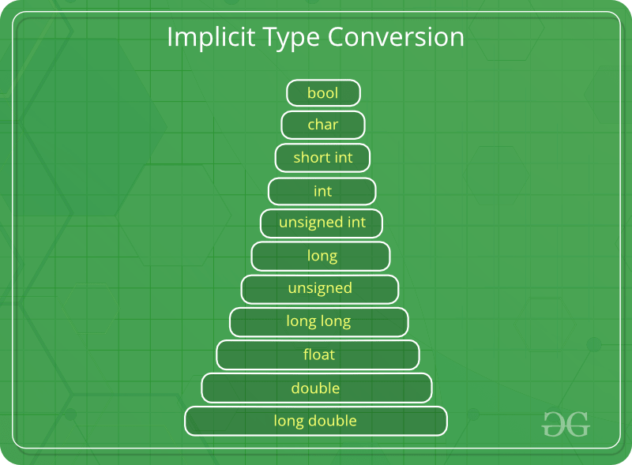
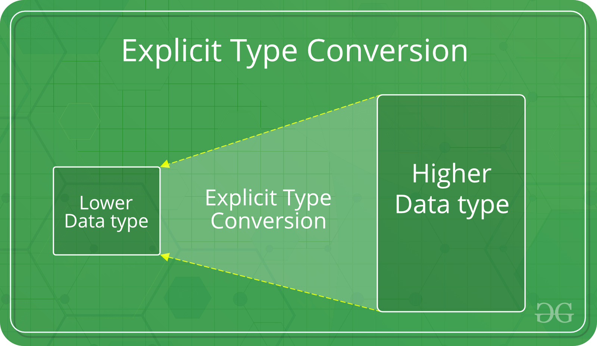
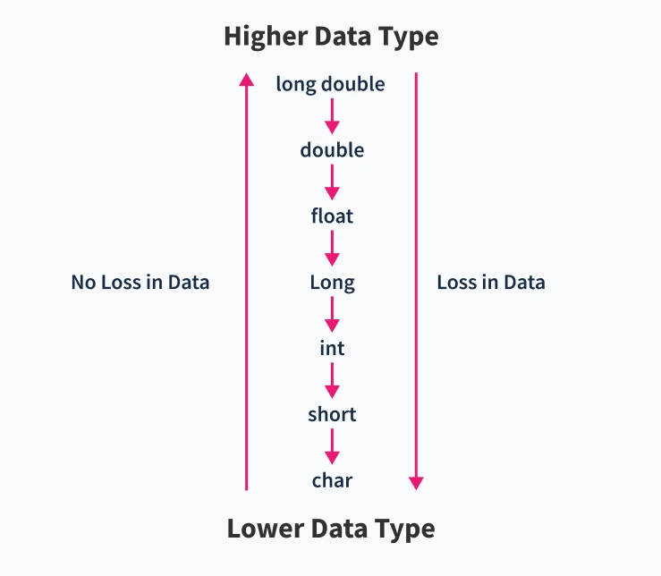
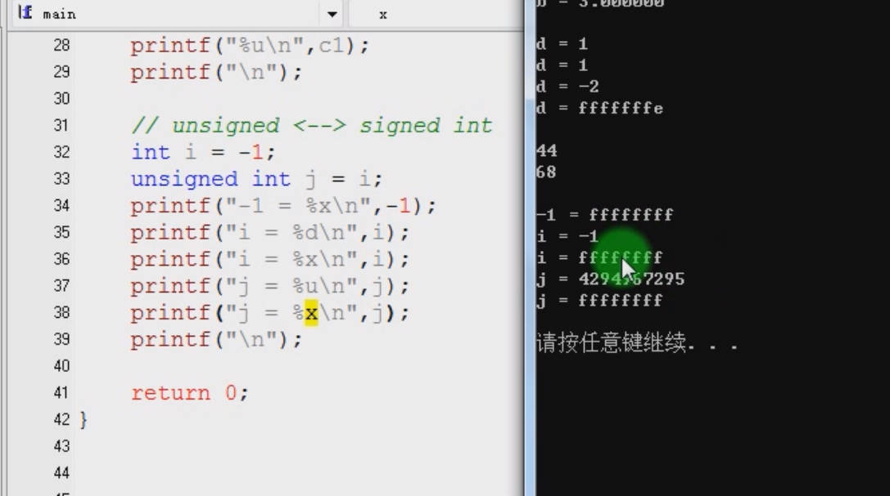

# 6.6 Data Type Conversion


```c
#include<stdio.h>

int main1(void)
{
	signed char a = -10;
	unsigned char b = 2;
 	unsigned char c;
 	
    c = a + b;
    
	if(c > 0)
		printf("c > 0\n");
	else
		printf("c < 0\n");
	return 0;
} 

int main(void)
{
	int a = -2;
	unsigned int b = 3;
	if( a < b)
		printf("a < b\n");
	else
		printf("a > b\n");
	return 0;
} 
```

### Why Type Conversion

• Hardware requirements for computer CPU to perform calculations  
• The type, size and storage method must be the same  

### Method

• Implicit type conversion  

```c
int x = 10; // integer x
    char y = 'a'; // character c
 
    // y implicitly converted to int. ASCII
    // value of 'a' is 97
    x = x + y;
```


• Explicit type conversion

```c
 int sum = (int)x + 1;
```



## Explicit type Conversion

### Automatic Conversion

• Different data types in arithmetic, logical, and assignment expressions  
• Function formal parameter type mismatch  
• The function return value type does not match the function parameter type  

### Conversion Rules

• Low precision->high precision signed->unsigned  
• signed->unsigned  
• char -> short -> int -> unsigned -> long -> double -> long double  
• char -> short ->int ->long ->long long ->float ->double ->…  

Goals: to prevent the loss of accuracy 



## Common Errors Caused by the Explicit Type Conversion 

• char—int: The value remains unchanged and the storage format changes.  
• int—char: truncation  
• signed—unsigned: The value changes, but the storage format does not change.  


