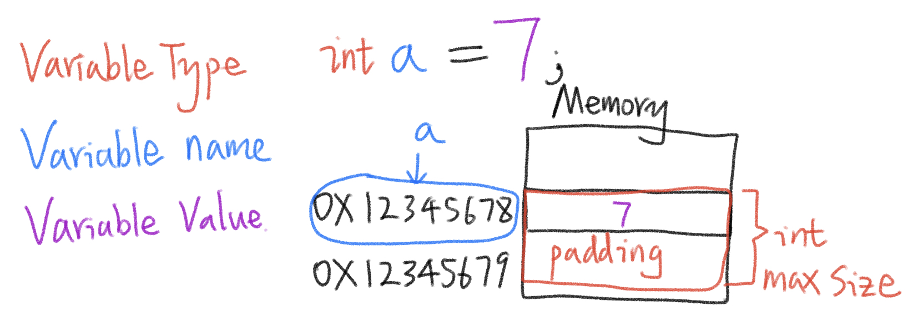
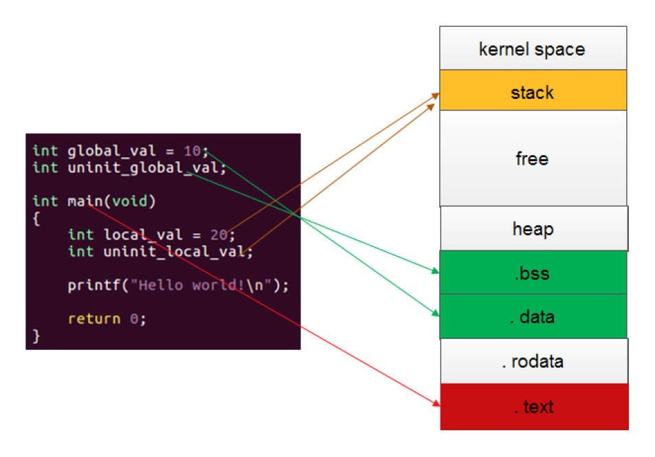
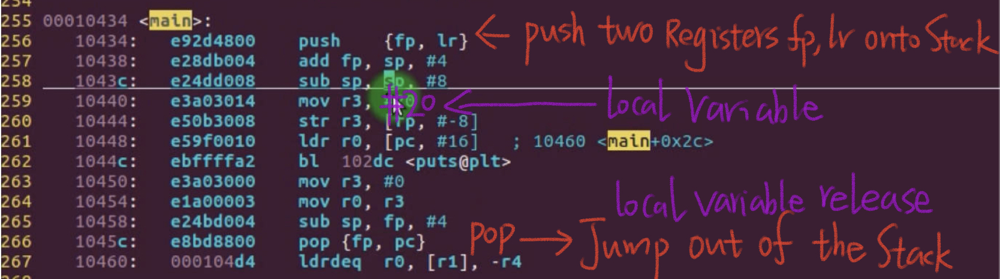
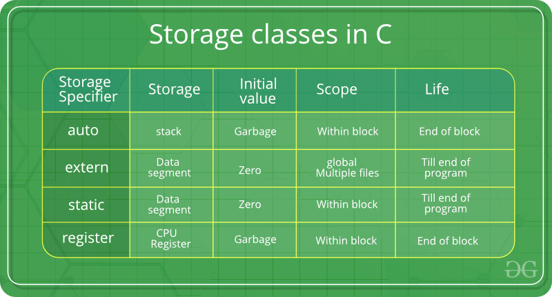

# 6.9 The Essence of the Variable


## Storage Attribute

•Different types of data storage
•Storage from an assembly perspective

### Assembly instructions: DCB, DCD

In assembly language, when compiler stored a value, there are three elements should be considered: Address, Size, Content.

#### DCB (Define Constant Byte):

- DCB is an assembly language directive used to define and allocate constant byte values in memory.
- It is typically used when you want to reserve a specific number of bytes for storing data, and you provide the actual byte values to be stored.
- DCB is commonly used for defining strings, character arrays, or any data that can be represented as a sequence of bytes.

```assembly
myString:
    DCB 'Hello, World!',0   @ Define a null-terminated string
```


#### DCD (Define Constant Doubleword):

- DCD is another assembly language directive used to define and allocate constant data, but it is typically used for larger data types like 32-bit (4-byte) integers or floating-point values.
- Like DCB, DCD allows you to specify the actual values to be stored in memory.

```assembly
myArray:
    DCD 42                 @ Define a single 32-bit integer
    DCD 1234               @ Define another 32-bit integer
    DCD -5678              @ Define a negative 32-bit integer
```


## Define Variables and Assign Values

**Variable name: the alias of the memory address(0x)**
**Variable type: the max size of the allocated memory**
**Variable Value: the Content of the address in the memory**



## How Variable Stored in the Memory





Explain:

1. `push {fp, lr}`:
   - This instruction pushes two registers onto the stack: `fp` (frame pointer) and `lr` (link register). It's a common practice to save these registers on the stack before modifying them within a function. This ensures that their original values can be restored when needed.
2. `mov r3, #20`:
   - This instruction moves the immediate value 20 into register `r3`. In other words, it assigns the value 20 to the `r3` register.
3. `str r3, [fp, #-8]`:
   - This instruction stores the value in register `r3` into memory at an address calculated as `[fp - 8]`. Here, `fp` is the frame pointer, and it's common to use it to access variables stored in the function's stack frame. `-8` is an offset from the `fp`, indicating that the value will be stored 8 bytes before the location pointed to by the frame pointer.
4. `pop {fp, pc}`:
   - This instruction is used to restore the values of two registers from the stack: `fp` and `pc` (program counter). This is often seen at the end of a function to clean up the stack and return control flow to the calling function.
   - Restoring `fp` is essential for maintaining the correct stack frame, and restoring `pc` is necessary for returning from a subroutine to the calling code.

## **C storage class specifiers**

`auto`:

- The `auto` keyword is rarely used in modern C/C++ programming because it's the default storage class for local variables. It implies that the variable's storage duration is automatic, meaning it is allocated when the function is called and deallocated when the function exits.

```c
void someFunction() {
    auto int x = 10; // 'auto' is optional here; 'x' is automatically auto
    // 'x' is allocated when someFunction is called and deallocated when it exits.
}
```

`register`:

- The `register` keyword suggests to the compiler that a variable should be stored in a CPU register for faster access. However, modern compilers are often better at optimizing variable storage than programmers, so the use of `register` is usually unnecessary.

```c
register int counter = 0;
```

`volatile`:

- The `volatile` keyword tells the compiler that a variable's value can change unexpectedly, and therefore, the compiler should not optimize or cache accesses to it. This is often used for memory-mapped hardware registers or variables that can be changed by an external event or interrupt. This keyword usually used as to track sensor data flowing.

```c
volatile int sensorValue;
// 'sensorValue' may change due to external factors, so the compiler should not optimize it aggressively.
```

`static`:

- The `static` keyword has various uses depending on the context. When applied to a local variable, it makes the variable retain its value between function calls. When applied to a global variable, it restricts the variable's scope to the file it's declared in.

```c
void incrementCounter() {
    static int counter = 0;
    counter++;
    printf("Counter: %d\n", counter);
}
```

`extern int i;`:

- The `extern` keyword is used to declare a variable that is defined in another source file. It tells the compiler that the variable `i` is defined elsewhere, and the **linker** should resolve its reference.

```c
include"XXX.h"
..............
extern int i; // Declaration to use 'i' defined in another file
printf("The value of i is: %d\n", i);
```

## Summary

•The goal of defining variables: to facilitate the reading and writing of data in memory  
•The compiler allocates appropriate storage space and address to the data in memory through the variable type  
•The essence of a variable name: an alias for a storage space in memory  
•You can read and write this memory space through the variable name  
•Variable modifiers(C Storage Classes Specifier) can change the storage method and scope of variables  



References: https://www.examtray.com/tutorials/last-minute-c-programming-storage-classes-tutorial