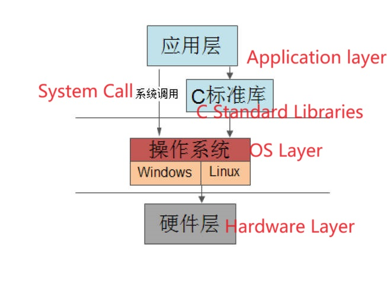
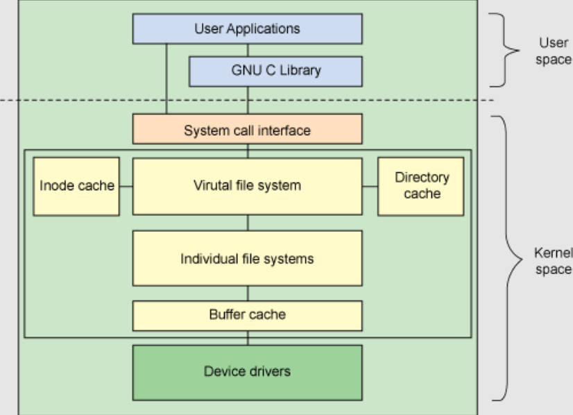
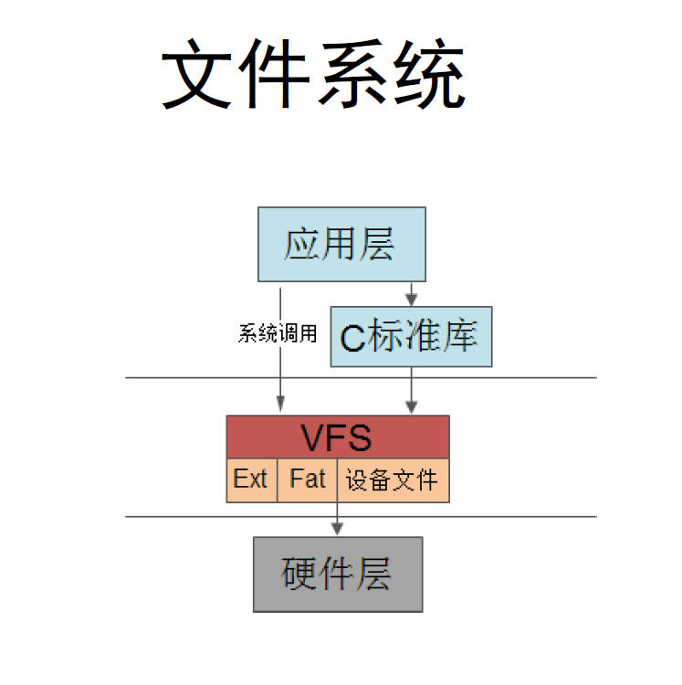
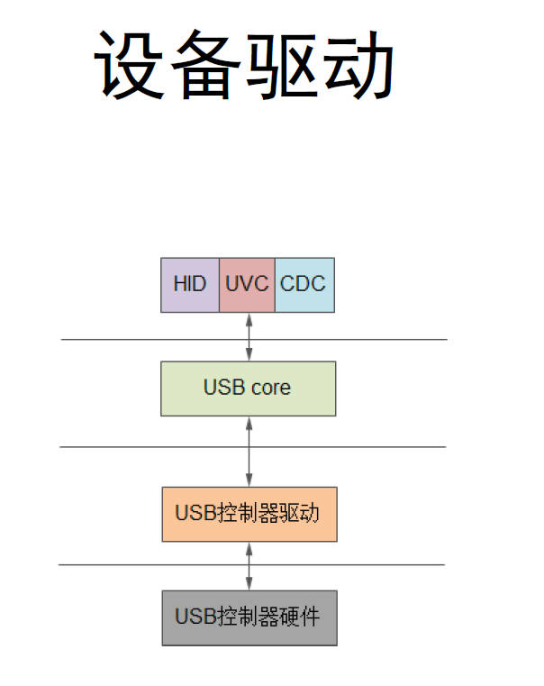
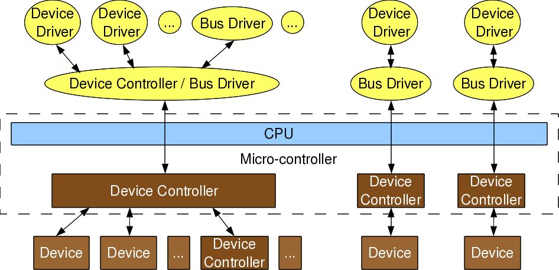

# 7.13 Code Reusability and Layered Ideology

## Code Reusability

1. **Functions (Functions)**:

   - **Functions** in computer programming are blocks of code that perform a specific task or operation. They are designed to be reusable and can take input values (parameters) and produce output. Functions help in breaking down a program into smaller, more manageable parts, making the code easier to read and maintain.

2. **Libraries (Libraries)**:

   - **Libraries** in computing refer to collections of pre-written code or functions that can be reused in various programs. These libraries contain commonly used routines, data structures, and algorithms. Developers can include libraries in their code to save time and effort by leveraging existing solutions.

3. **Framework: MVC (Framework: Model-View-Controller)**:

   - MVC

      stands for 

     Model-View-Controller

      and is a design pattern commonly used in software development. It divides an application into three interconnected components:

     - **Model**: Represents the data and the business logic of the application.
     - **View**: Handles the presentation and user interface components.
     - **Controller**: Acts as an intermediary between the Model and View, managing user input and updating the Model and View accordingly. Frameworks based on MVC help in organizing and structuring code in a systematic way.

4. **Operating System (Operating System)**:

   - An **Operating System (OS)** is a fundamental software component that manages computer hardware and provides a foundation for running applications and programs. It handles tasks like process management, memory management, file system management, and device management. Popular operating systems include Windows, macOS, Linux, and Android.

5. **Computer Systems (Computer Systems)**:

   - **Computer Systems** refer to the combination of hardware and software that work together to perform computing tasks. A computer system typically includes the central processing unit (CPU), memory, storage devices, input/output devices, and an operating system. It encompasses the entire infrastructure required for computing, from personal computers to large-scale data centers.

     

## Code Reusability: Layer and API

**Basic Concepts**

- **Division according to requirements**: Each layer implements its own functionality, and communication between layers occurs through interfaces.

- **Each layer encapsulates the layer below it**: Each layer encapsulates (or wraps) the layer beneath it, providing services to the layer above.

- **Each layer exposes an interface**: Each layer defines an interface that allows the layer above to reuse its services.

- **Interfaces may not necessarily be fixed or immutable**: Interfaces may be subject to change and are not always static.

**Benefits of Layering**

- **Code Reusability**
- **Clear Software Hierarchy for Easy Maintenance**
- **Compatibility: Adaptable to Different Platforms and Devices**
- **Scalability: Easy Expansion of Functionality**

## Computer System Layering

### Computer Software and Hardware System 

• Application Layer, Operating System(OS layer), Hardware Layer   
• C Libraries and System Calls

## The Layers on the Linux Kernel

**System Framework**

- **File Systems**: VFS, EXT, YAFFS, CRAMFS
- **Device Driver Model**: device, driver, bus
- **Input Subsystem**: Mouse, Keyboard, Remote, Sensors
- **MTD**: Block Device Read/Write, Algorithms
- **Process Scheduling**
- **Memory Management**

## Implementation of the Layering 

### Object Orientated Programming 

• Through object-oriented features such as encapsulation, inheritance, and polymorphism  
• Encapsulate and implement code reuse through interfaces that between the layers.