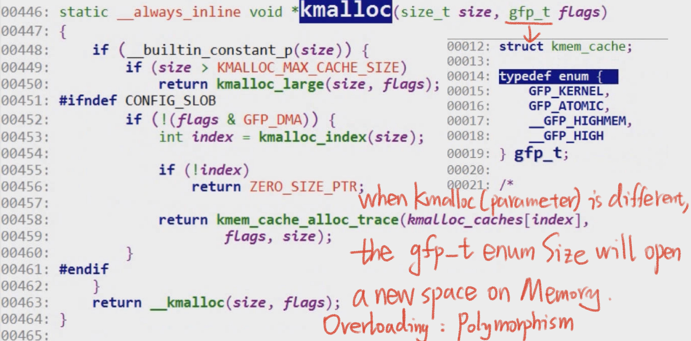
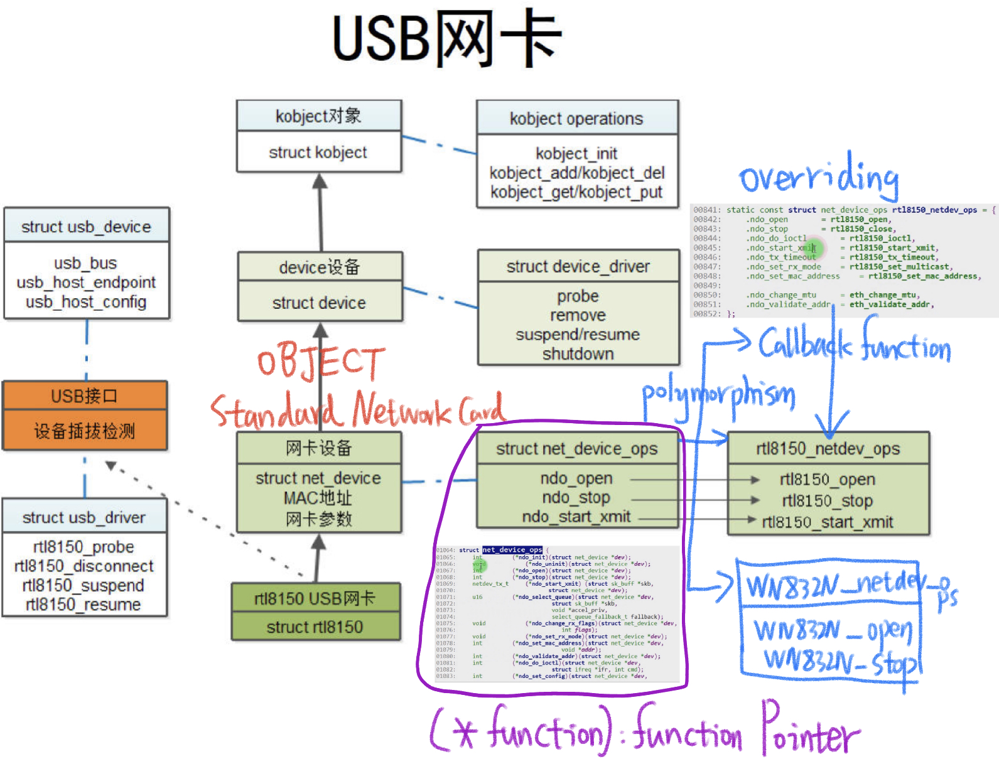

# 7.19 Object-Oriented Ideology of the Linux kernel: Polymorphism


## Polymorphism: Realize in C language

### Compile-time polymorphism: overloading

Kmalloc function



### Runtime polymorphism: overriding

#### Callback Function

A callback function in C is a function that is passed as an argument to another function and is intended to be called by that function at a later point in time. Callbacks are commonly used in event-driven programming and asynchronous programming. 

```c
#include <stdio.h>

// Define a function that takes a callback function as an argument
// (*callback) is a function opinter to select specific function later on
void performOperation(int x, int y, int (*callback)(int, int)) {
    int result = callback(x, y);
    printf("Result: %d\n", result);
}

// Define a callback function that adds two numbers
int add(int a, int b) {
    return a + b;
}

// Define another callback function that subtracts two numbers
int subtract(int a, int b) {
    return a - b;
}

int main() {
    int num1 = 10;
    int num2 = 5;

    // Use the performOperation function with the add callback
    performOperation(num1, num2, add);

    // Use the performOperation function with the subtract callback
    performOperation(num1, num2, subtract);

    return 0;
}
```

How a Driver Designed?



**Device Driver: Use callback function to override the Virtual Function in the Class, this whole processing happened at run time!**