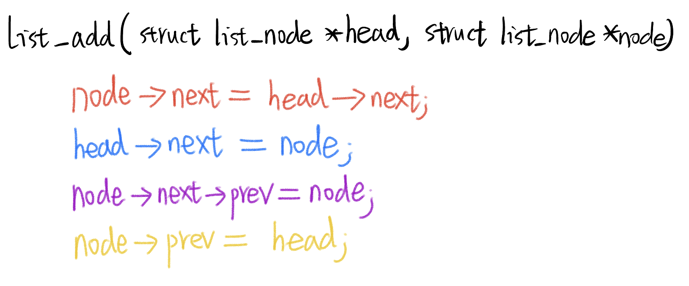

# 7.5 Doubly Linked List


## The Definition of the Doubly Linked List

A doubly linked list is a data structure in computer science that consists of a sequence of elements, each of which contains a value and two references or pointers. Unlike a singly linked list, which has references to the next element in the sequence, a doubly linked list has references to both the next and the previous elements. This bidirectional connection allows for more efficient traversal in both directions, making it useful for various applications, including implementing data structures like queues and deques. Each element in a doubly linked list is called a "node," and it contains not only the data but also references to the next and previous nodes, which allows for easy insertion and deletion of elements at various positions within the list.


```c
// Node of a doubly linked list
 
struct Node {
    int data;
   
    // Pointer to next node in DLL
    struct Node* next;
   
    // Pointer to previous node in DLL
    struct Node* prev;
};
```

## Example Analysis:

```c
#include<stdio.h>
#include<stdlib.h>

struct list_node{
	int data;
	struct list_node *next;
	struct list_node *prev;
};

int is_list_empty(struct list_node *head)
{
	return (head->next == head || head->prev == head);
}

void list_print(struct list_node *head)
{
	if(head->next == head || head->prev == head) // There is only a HEAD Node.
		printf("list_print:empty list!\n");
	else
	{
		struct list_node *p;
		p = head->next; //initialize the p. P used for Traversal
		for(p;p!=head;p=p->next)
			printf("p->data = %d\n",p->data);		
	 
	}
}
void list_free(struct list_node *head)
{
	struct list_node *p,*q;
	if(head->next != head)
	{
		q = head->next;
		if(q->next == head)
			free(q);  // free the tail of the list
		else // free the body of the list
		{
			p = q->next;
			while(q!=head)
			{
				free(q);
				q = p;
				if(p!=head)
					p = p->next;
				printf("p:%p q:%p\n",p,q);		
			};
		}
	}
	free(head);  // free the HEAD Node
}

void list_add(struct list_node *head,struct list_node *node) // keep the necklace do not break.
{
	 	node->next = head->next;
	 	head->next = node;	 	 
		node->next->prev = node;
		node->prev = head;	
}

void list_add_tail(struct list_node *head,struct list_node *node)
{
	struct list_node *p;
 	if(head->next == head)
 	{
		head->next = node;
		node->prev = head; 	 	
 	 	head->prev = node;
	 	node->prev = head;
 	}
 	else
 	{
		p = head->prev;
 		p->next = node;
 		node->next = head;	
 		node->prev = p;
		head->prev = node; 	 	
    }	
}
void list_delete(struct list_node *head)
{
	struct list_node *p;
	if(head->next == head)
	{
		printf("list_delete:empty list!\n");
	}
	else
	{
		p = head->next; 
		head->next = p->next;
		p->next->prev = p->prev;
		free(p);
	}
}

void list_delete_tail(struct list_node *head)
{
	struct list_node *p;
	if(head->next == head)
	{
		printf("list_delete_list:empty list!\n");
	}
	else
	{
		p = head->prev;	
		p->prev->next = p->next;
		head->prev = p->prev;		
		free(p);		
	}
}

int list_delete_by_id(struct list_node *head,struct list_node *node)
{
	struct list_node *p; 
	
	if(head->next == head)
		printf("list_delete_by_id:empty list!\n");
	else
	{
		p = head->next;
		for(p;p!=head;p=p->next)
		{
			if(p == node) // P arrives at the Node required delete
				break;	//Jump out of the for loop
		}
		if(p==head)
		{
			printf("list_delete_by_id:find no node!\n");
			return -1;
		}
		p->prev->next = p->next;
		p->next->prev = p->prev;
		free(p);
	}

	return 0;	
}

struct list_node *list_foreach(struct list_node *head,int val)
{
	struct list_node *p;
	p = head->next;
	for(p;p->data!=val;p=p->next); //valL: counter.
	return p;
} 

int main(void)
{
	struct list_node *p,*head;
	head = (struct list_node*)malloc( sizeof(struct list_node));
	head->data = 0;
	head->next = head; //This line sets the next member of the head node to point to itself.
	head->prev = head;//This line sets the prev member of the head node to also point to itself. 
	
	p = (struct list_node*)malloc( sizeof(struct list_node));
	p->data = 1;
	p->next = NULL;
	p->prev = NULL;
	list_add_tail(head,p);
	
	p = (struct list_node*)malloc( sizeof(struct list_node));
	p->data = 2;
	p->next = NULL;
	p->prev = NULL;
	list_add_tail(head,p);	
	
	p = (struct list_node*)malloc( sizeof(struct list_node));
	p->data = 3;
	p->next = NULL;
	p->prev = NULL;
	list_add_tail(head,p);	

	p = (struct list_node*)malloc( sizeof(struct list_node));
	p->data = 4;
	p->next = NULL;
	p->prev = NULL;
	list_add_tail(head,p);
	
//	list_delete_by_id(head,head->next);		
//	list_print(head);
	
//	list_delete_(head);
	list_print(head);
	list_delete_tail(head);
	list_print(head);
	list_delete_tail(head);
	list_print(head);
	list_delete_tail(head);	
	list_print(head);
	list_delete_tail(head);
	list_delete_tail(head);

	list_print(head);
	list_delete_tail(head);
	list_print(head);
//	p = list_foreach(head,2);
//	printf("%d\n",p->data);	
 

//	list_free(head);
	return 0;
}
```



