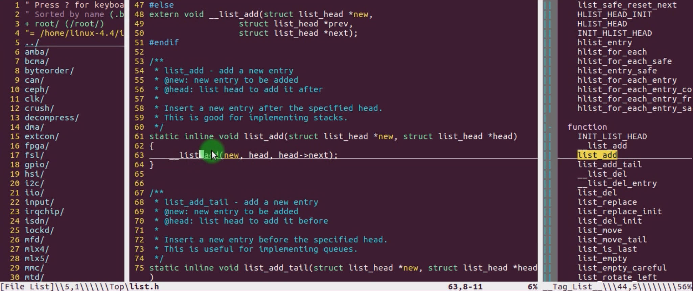
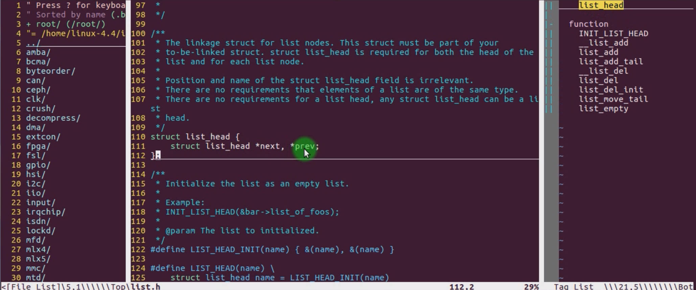
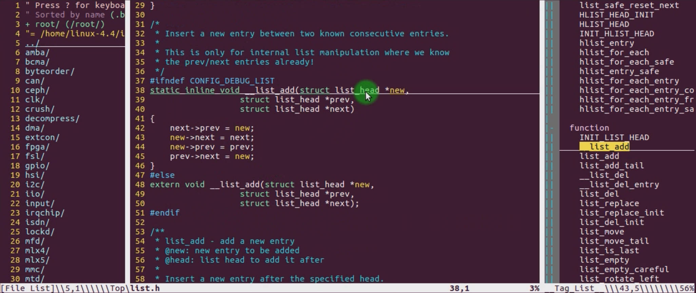
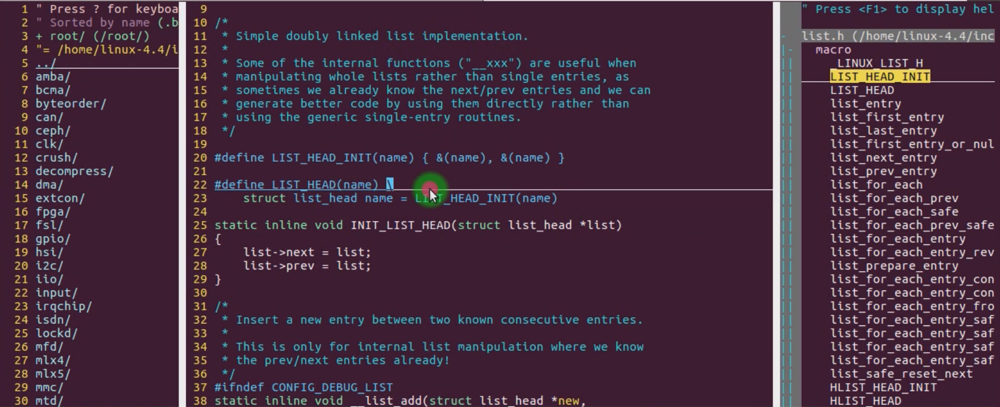
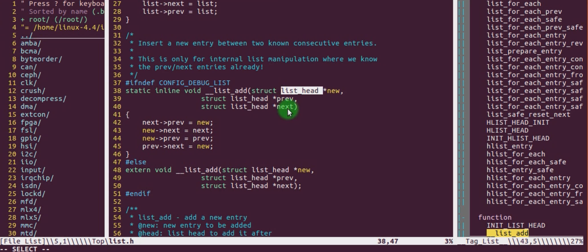
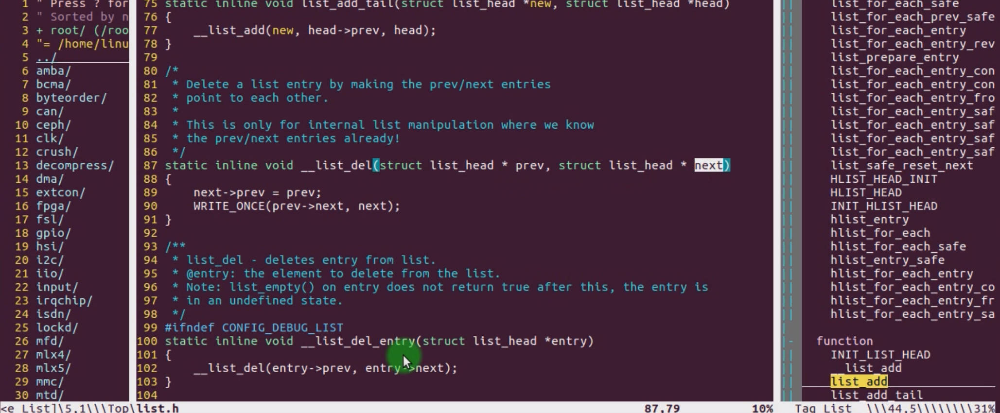

# 7.7 Universal Linked List in the Linux Kernel (1)


## Kernel Linked List

### Circular Doubly Linked List

Circular Doubly Linked List used extensively in processes, files, modules, and device drivers

```c
struct list_node{
    int num;
    struct list_node *prev;
    struct list_node *next; 
};

struct list_head{  // Universal Linked List Template
    struct list_head *prev;
    struct list_head *next;
};

struct device_node{ //device driver
    int num;
    char num[10];
    int age;
    struct list_head node; //implement the universal Linked List Template.
}
```

• you can find it on the directory ：include/linux/list.h、 include/linux/types.h 







## Basic Operation of Linked List

### Initialization



### Add Node



Delete Node

### 