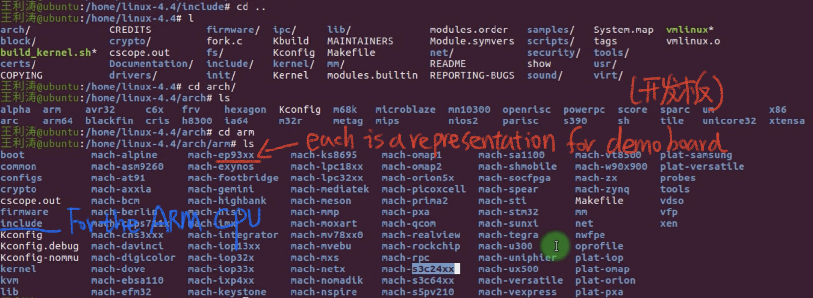
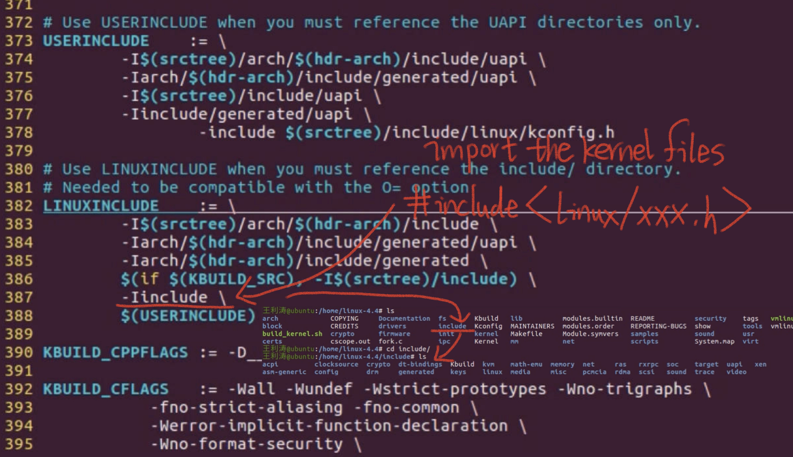
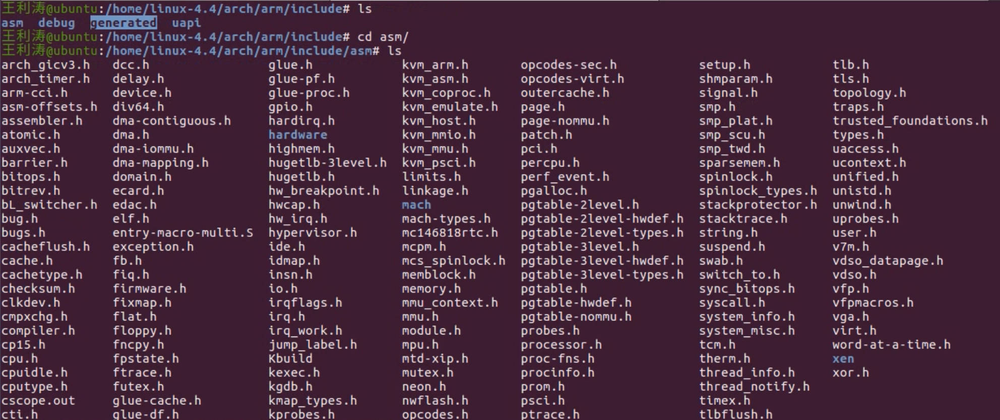

# 8.14 Header Files in the Linux Kernel


## The Header File in the Driver uses the Linux Kernel File

•#include<linux/xx.h>  
•#include<asm/xx.h>  
•#include<mach/xx.h>  
•#include<plat/xx.h>  

## Default Header Files in the Linux Kernel

• Related to CPU architecture: `arch/$(ARCH)/include`  
• Related to board-level platforms:  
»`arch /$(ARCH)/plat-xx/include ` 
»`arch /$(ARCH)/ mach-xx/include`  
• Main directory: include  
• Linux kernel-specific header file directory: `include/linux`



## Examples of Header Files in the Kernel

•`#include <linux/xxxx.h>`  
• Reference：Kernel Makefile  

```ruby
vi makefile //  to check the dependencies between files
```



The compiler will use the dependency to find the Header files.

## Examples of Header Files in the Kernel (2)

• `#include <asm/xxxx.h>`
• Relative directory starting point: `/arch/arm/include`, `/arch/x86/include` , Check the Kernel makefile to find the dependencies of Header Files



## Find the header file where a function is located

• Application:` $ man 3 function`  
• Driver: `$ cd include; grep –rin “func name”`  
• User space header files:  
–/usr/include/linux  
–/usr/include/asm  