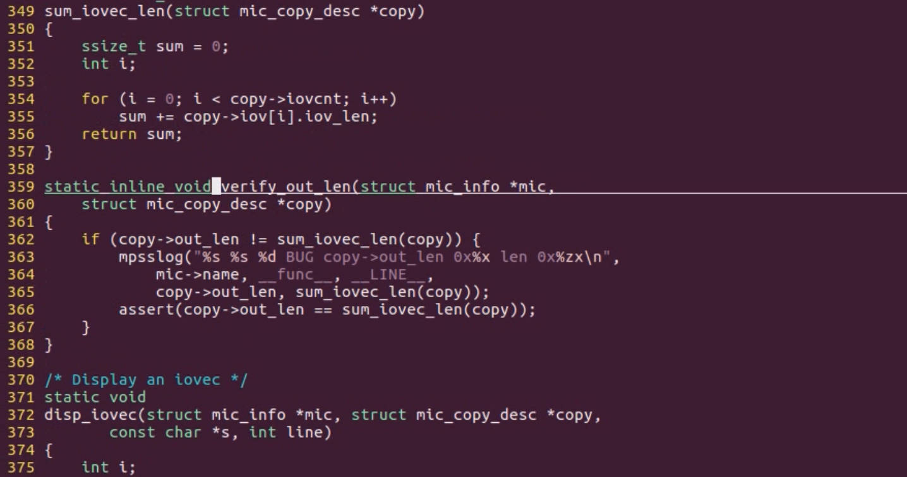

# 8.17 Inline Functions in Header Files

## Inline Function

### What is an inline function

• Functions modified using the `inline` keyword  
•The role of inline functions: the whole code of inline function directly inserted or substituted into the calling place.   
• Usage occasions: Frequently called functions with simple code, increasing efficiency.

## Practical Example: `static inline`

When you combine "static" and "inline," you create a function that is both file-scoped (limited to the translation unit where it's defined) and optimized for direct code inclusion, which can lead to more efficient code. However, there are a few important considerations:

- Use "static inline" for small, frequently called functions, such as accessors, simple calculations, or utility functions.
- Be cautious when applying "inline" to larger functions, as it can lead to code bloat and potential performance issues. The compiler decides whether to inline or not based on its optimization settings.
- Remember that "static inline" functions are not part of the external API of your code and are not meant to be called from other source files. They are intended for internal use within the same translation unit.
- Header files often contain "static inline" function definitions, making them available for inlining in multiple source files that include the header.

### In the Linux Kernel

 Header File like to use the `static inline` function because the `static` limit the function's scope to the Header File itself.  When other Header File uses the same variable name, the `static inline` will help the same variable name re-using without compile error,