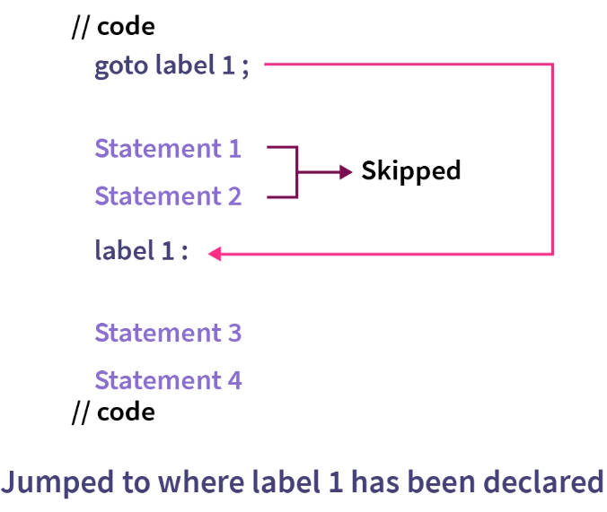
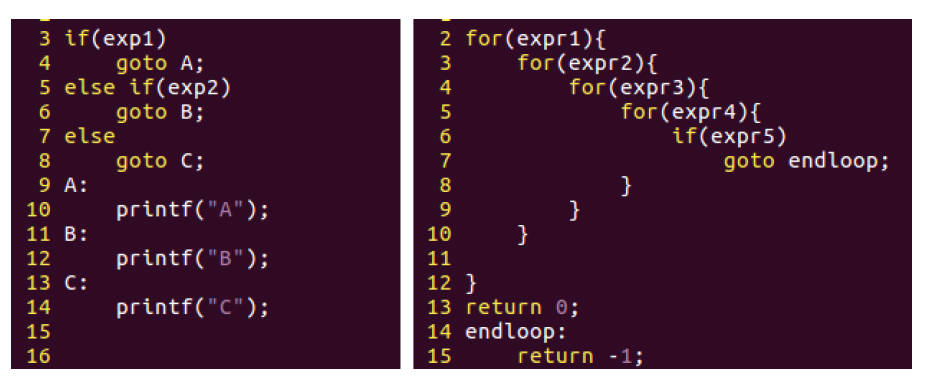
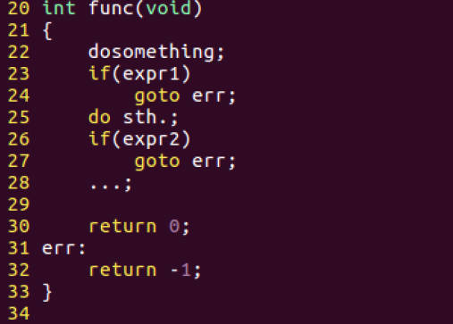
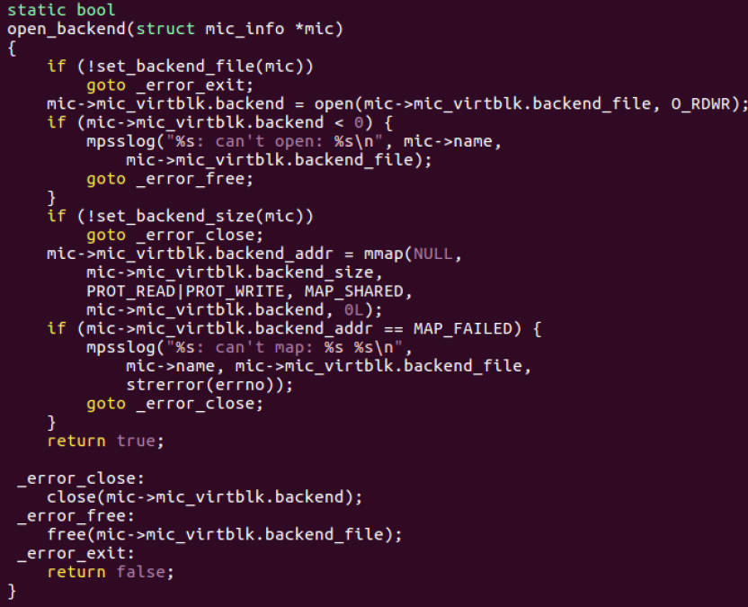

# 8.19 Controversial Keyword : goto


The `goto` statement in programming is considered controversial for several reasons, and its use is often discouraged or even prohibited in many coding standards and best practices. Here are some of the main reasons why `goto` is controversial:

1. **Spaghetti Code:** The use of `goto` can lead to "spaghetti code," where the flow of a program becomes tangled and hard to follow. This is because `goto` allows for unrestricted jumps in the code, making it difficult to understand the logical structure of the program.
2. **Debugging Challenges:** Code that heavily relies on `goto` statements can be challenging to debug. When an error occurs, it can be difficult to trace the sequence of jumps that led to the problem.
3. **Readability and Maintainability:** Code that uses `goto` tends to be less readable and maintainable. It becomes harder for other developers (including your future self) to understand and modify the code.
4. **Structured Programming:** The use of `goto` goes against the principles of structured programming, which advocates for the use of structured control flow constructs like loops and conditionals. Structured programming helps make code more organized and comprehensible.



As you can see, `goto` directly jump to the label1 and keep going on, skipping the statment1 and statement2, which ruining the program structure, which decide the work flow.

## Where is it recommended to use goto?

### Jump directly out of multiple loops



### Handling Function Errors

• Modular design inside the function: Isolate the main logic code and error handling part of the function, making the structure clearer  
• Code reuse: merge multiple exits of a function into one total exit  
• Uniform processing of resources: memory release, locks, handles...  



```c
#include <stdio.h>
#include <stdlib.h>

void cleanupResources(FILE *file, int *dynamicArray) {
    // Close the file if it's open
    if (file != NULL) {
        fclose(file);
    }

    // Free the dynamically allocated memory if it's allocated
    if (dynamicArray != NULL) {
        free(dynamicArray);
    }
}

int main() {
    FILE *file = NULL;
    int *dynamicArray = NULL;

    // Open a file
    file = fopen("example.txt", "r");
    if (file == NULL) {
        perror("Error opening file");
        goto cleanup;
    }

    // Allocate dynamic memory
    dynamicArray = (int *)malloc(sizeof(int) * 10);
    if (dynamicArray == NULL) {
        perror("Error allocating memory");
        goto cleanup;
    }

    // Perform some operations (simulated error)
    int result = 1 / 0; // This will cause an error

cleanup:
    // Use the cleanupResources function to release resources
    cleanupResources(file, dynamicArray);

    return 0;
}
```

## The Use of `goto ` on Linux Kernel


