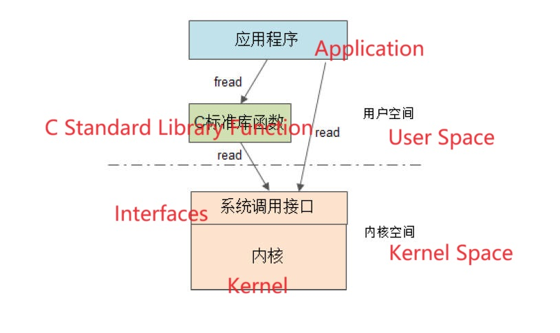

# 8.23 Advanced Module Design: Cross-Platform Design

## Various Platforms

### Windows

•windows7(32bit and 64bit)  
•windows 8.1(32bit and 64bit, desktop, app store, metro )  
•windows phone  

### Linux/Unix

•Mac (32bit and 64bit), iOS(32bit and 64bit, x86, arm)  
•Linux (32bit and 64bit, x86, mips, arm)  
•Android (32bit and 64bit, x86)  

### Embedded RTOS

•uC/OS-II, FreeRTOS, RT-Thread, uCLinux,Vxworks,eCos…  

## Cross-platform Concept

### C Standard Library

• The C language itself is cross-platform: C Standard and C Standard Library  
• System calls: win32 API and Linux POSIX API  

## Cross-Platform Design of Modules

### Type of the Data

• Use standard C language types  
• Sized portable data types  
• Specific kernel data types dev_t, pid_t  
• Platform-specific types: compiler and CPU dependencies such as int  

### Endianness

•  Big endian mode and little endian mode  
• Conversion between big endian and little endian  
• Memory alignment  

### Operating System Related

• Encapsulate everything related to the operating system into a unified interface  
• Hide interface differences between different operating systems  
• The header file path separator uses the universal "/" instead of the "\" under Windows  

### System Platform Related

• It is forbidden to use the extended features of the compiler and try to write according to the C standard  
• Try not to use inline assembly  
• Turn on all warning options and pay close attention to every warning that appears  
• Use **conditional compilation** to be compatible with the features of various platforms  

