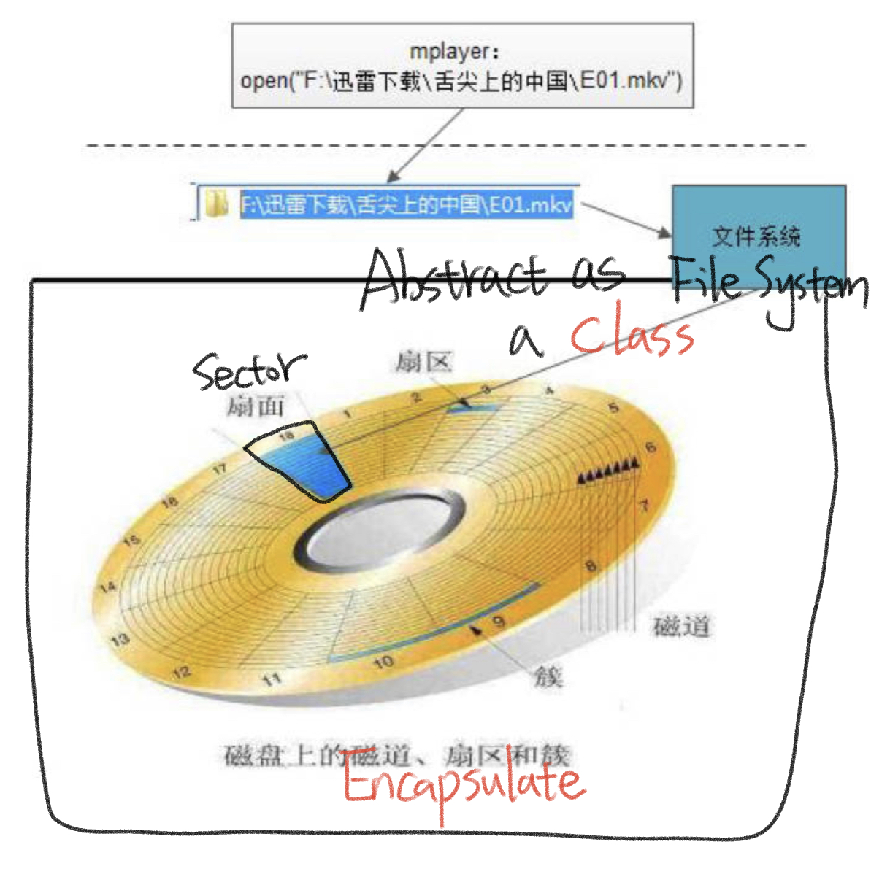
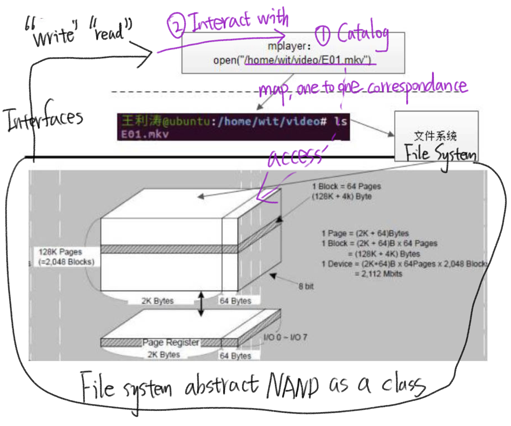
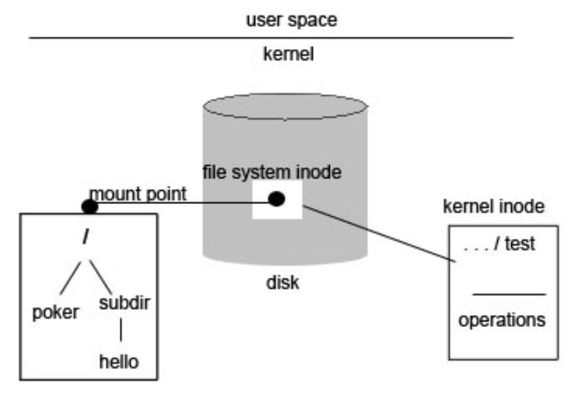
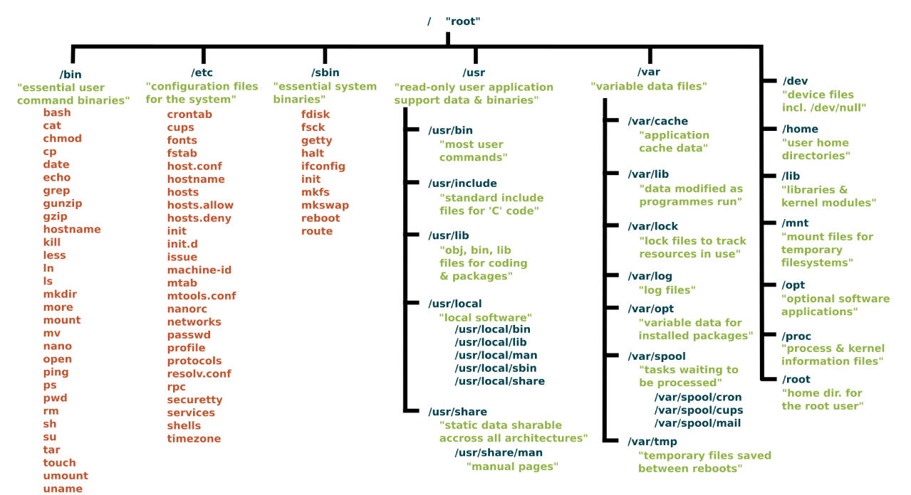

# 9.15 Storage Abstraction: File System

## File System

### Disk Operation Abstraction

#### Disk:

– Magnetic column  
– Track  
– Sector  
– Data Block  

#### Storage Mapping

#### Reading and writing methods

### NAND Flash Abstraction

• Block  
• Page  
• Reading and writing methods  
– row address  
– column address  

## File System Formatting

### Standardize Storage Devices as File System Formats

• Address Management: mapping of files/directories and disk storage addresses  
• Permission Management: file reading and writing, security protection  
• Unified Interface: file system related system calls  

## File System Mounting

• **The file system must be mounted to a certain directory** before it can be used  
• The essence of mount: changing the mapping relationship  

How to understand the Mounting Point: Pointer name, when mounted, Mounting Point are pointing to the new FS.

## Root File System

### Root directory **"/"**

• A root directory created after the Linux kernel is initialized  
• Then the first file system will be mounted: **the root file system** (RootFS)  
• Other partitions, disks, and SDs are first mounted on RootFS and then accessed through the standard file interface.

### root file system

• Some directories required for the Linux kernel to run: mount, command, library  
• **Startup scripts, configuration files, service programs**  
• Binary executable program  
• Libraries, header files  

Busybox, used to create Linux root system.

Reference: https://www.devopsschool.com/blog/linux-tutorials-root-file-systems-in-linux/