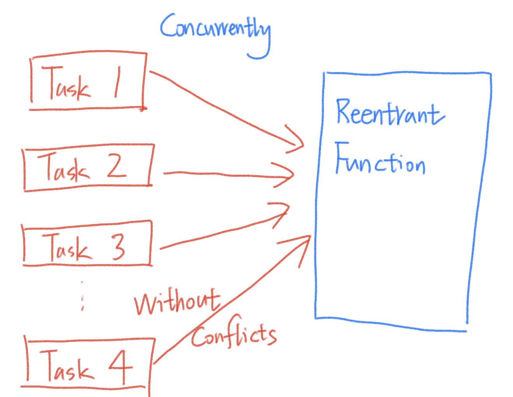

# 9.6 Reentrant Functions


## Function Reentrancy

• Repeatable calls, concurrent calls, and can be interrupted  
• In a multi-task environment, multiple calls will not affect the running results.  
• Generally used in multi-task and multi-process operating environments  



### Example

Here's an example using the pthreads library in C to create two threads that call the reentrant function concurrently:

```c
#include <stdio.h>
#include <pthread.h>

// A reentrant function that takes parameters and doesn't rely on global state.
int add(int x, int y) {
    int c;
    c = x+y;
    return c;
}

void* thread1(void* arg) {
    int result1 = add(5, 3);
    printf("Result 1: %d\n", result1);
    return NULL;
}

void* thread2(void* arg) {
    int result2 = add(10, 7);
    printf("Result 2: %d\n", result2);
    return NULL;
}

int main() {
    pthread_t t1, t2;

    // Create two threads
    pthread_create(&t1, NULL, thread1, NULL);
    pthread_create(&t2, NULL, thread2, NULL);

    // Wait for both threads to finish
    // Two thread simutaneously called add() without conflicts, like the c when used by thread 1 will not effect on the use of the thread 2 concurrently.
    pthread_join(t1, NULL);
    pthread_join(t2, NULL);

    return 0;
}
```


## Non-reentrant Function

Certainly! Let's go through each of the points you mentioned that make a function non-reentrant and provide examples for each one:

1. **Global variables and static local variables are used inside the function:**

   A function is considered non-reentrant if it relies on global variables or static local variables because these variables are shared across multiple calls to the function, which can lead to race conditions.

   ```c
   globalVariable = 0; // Global variable
   
   int nonReentrantFunction() {
       globalVariable++; // Modifies a global variable
       return globalVariable;
   }
   ```

2. **Function returns global variables or static local variables:**

   If a function returns a global or static local variable, it can cause issues because the returned value may be changed by subsequent calls to the function.

   ```c
   static int staticLocalVariable = 0;
   
   int nonReentrantFunction() {
       staticLocalVariable++;
       return staticLocalVariable; // Returns a static local variable
   }
   ```

3. **The malloc/free function is used inside the function:**

   Functions that use dynamic memory allocation and deallocation functions like `malloc` and `free` can be non-reentrant because they manipulate the heap memory, which is typically shared among all threads in a process.

   ```c
   int* nonReentrantFunction() {
       int* dynamicArray = (int*)malloc(10 * sizeof(int)); // Allocates memory on the heap
       // ...
       free(dynamicArray); // Frees memory on the heap
       return dynamicArray;
   }
   ```

4. **Standard I/O functions are used internally in the function:**

   Standard I/O functions like `printf` and `scanf` can be non-reentrant because they can modify global data structures used for file I/O and may not be safe for concurrent use.

   ```c
   void nonReentrantFunction() {
       printf("Hello, world!\n"); // Uses standard I/O
   }
   ```

5. **Other non-reentrant functions are called inside the function:**

   If a function calls other non-reentrant functions that exhibit any of the above behaviors, it can also become non-reentrant.

   ```c
   void anotherNonReentrantFunction() {
       // Calls a non-reentrant function
       nonReentrantFunction();  //Inheritage
   }
   ```

## Reentrant Function

### Application Occasions

• Multi-tasking environment, this function may be called multiple times concurrently.   
• This function may be interrupted by interrupts and task scheduling during execution.  eg. a kind of interrupt is a softIRQ Function.

### Design Principles

• Do not use/return static variables or global variables  
• Does not use standard I/O functions  
• Do not use malloc/free functions  
• Do not call non-reentrant functions  

## Secure Programming Guide

•  Try not to call non-reentrant functions in interrupt functions  


Calling non-reentrant functions in interrupt service routines (ISRs) is generally discouraged for several reasons:

1. **Interrupts Can Occur at Any Time:** ISRs are triggered by hardware or software events and can interrupt the normal flow of a program at any time. This means that an ISR can be invoked even while another instance of the same ISR is still executing. If a non-reentrant function is called from an ISR, it may not handle reentry correctly, leading to unexpected behavior or data corruption.
2. **Race Conditions:** When multiple ISRs or threads call the same non-reentrant function simultaneously, they can race to access and modify shared resources, leading to race conditions. Race conditions can result in data corruption or unpredictable program behavior.
3. **Blocking:** Non-reentrant functions often rely on global or static variables. If an ISR calls such a function, it may block other ISRs or threads from accessing the same function until the first call completes, potentially causing latency or system responsiveness issues.

```c
#include <stdio.h>
#include <unistd.h>
#include <signal.h>

int globalVariable = 0; // Global variable used by the non-reentrant function

// A non-reentrant function that modifies a global variable
void nonReentrantFunction() {
    globalVariable++;
    sleep(1); // Simulate a time-consuming operation
}

// An ISR (interrupt service routine)
void isrHandler(int sig) {
    printf("ISR triggered\n");
    nonReentrantFunction(); // Calling the non-reentrant function
}

int main() {
    // Set up the ISR (signal handler)
    signal(SIGINT, isrHandler);

    printf("Press Ctrl+C to trigger the ISR...\n");

    while (1) {
        // Main program loop
        // ...
    }

    return 0;
}
```

Now, let's consider the following scenario:

1. The main program is running, and `globalVariable` is initially set to 0.
2. The user presses Ctrl+C, triggering the ISR (`isrHandler`).
3. The ISR calls `nonReentrantFunction`, which increments `globalVariable` and sleeps for 1 second to simulate a time-consuming operation.
4. While the ISR is still executing, another Ctrl+C signal is sent (perhaps due to a user's accidental double-click).
5. The second instance of the ISR (`isrHandler`) is invoked before the first one completes. This means that two instances of `nonReentrantFunction` are running simultaneously.
6. Both instances of `nonReentrantFunction` may attempt to modify `globalVariable` concurrently, leading to a race condition and unpredictable behavior. This could result in incorrect values of `globalVariable` and other unexpected issues.